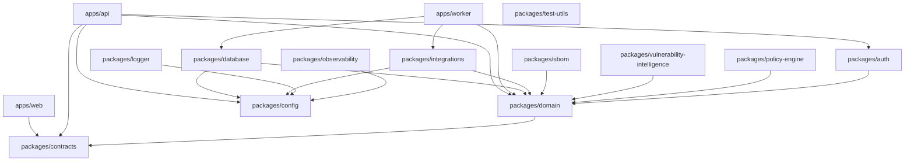

# Component architecture

This document describes internal packages, layers, and allowed dependencies for PatchPilot v0.1. It does not add packages beyond the target layout in [AGENTS.md](../../AGENTS.md) except to name use-case placement (open decision [OD-6](open-decisions.md)).

## Layers

| Layer | Meaning | Lives in | Depends on |
| --- | --- | --- | --- |
| Presentation | HTTP routes, React UI | `apps/web`, `apps/api` handlers | Contracts, auth context types, use cases |
| Application (layer) | Use cases: one orchestration path per operation | `packages/domain` (application services) | Domain ports and entities |
| Domain | Entities, value objects, invariants, ports | `packages/domain` | Nothing in apps or vendor SDKs |
| Adapters | Prisma, BullMQ, MinIO/S3, OSV HTTP, KEV HTTP, Pino, OTel | `packages/database`, `packages/integrations`, `packages/logger`, `packages/observability`, worker wiring | Ports, config, contracts |
| Config | Typed environment | `packages/config` | `process.env` only here |

**Port** = interface. **Adapter** = infrastructure implementation. Domain code depends on ports, not vendor SDKs.

If the diagram is not rendered: apps depend on packages; packages must not depend on apps. `apps/web` uses `packages/contracts` and calls `apps/api` over HTTP; it does not import the API application. Domain and use cases must not import Fastify, Next.js, Prisma, Redis, BullMQ, MinIO, or other vendor SDKs.

## Target packages

| Package | Responsibility |
| --- | --- |
| `packages/domain` | Entities, ports, use cases, error taxonomy |
| `packages/contracts` | DTO and OpenAPI-aligned types shared by web and API |
| `packages/config` | Typed configuration; only reader of `process.env` |
| `packages/auth` | Session verification, password hashing port, CSRF helpers used by the API |
| `packages/database` | Prisma schema, migrations, repository adapters |
| `packages/sbom` | CycloneDX allowlist, parse-on-copy, graph extraction (pure + adapter boundary) |
| `packages/vulnerability-intelligence` | Normalized intel types, matching ports |
| `packages/policy-engine` | Versioned priority calculation; no I/O |
| `packages/integrations` | HTTP and object-storage adapters (OSV, KEV, S3-compatible) |
| `packages/logger` | Pino with canonical redaction |
| `packages/observability` | OpenTelemetry tracing and metrics helpers |
| `packages/test-utils` | Fixtures, fake clocks, org factories |

## Handler and UI rules

`apps/api` handlers:

1. Parse HTTP and validate with Zod.
2. Resolve **authorized organization** from session/membership, not from a client-supplied `organizationId` alone.
3. Invoke a use case.
4. Map result to HTTP using a stable error taxonomy.

They must not contain domain logic or infrastructure SDKs.

`apps/web`:

- Talks only to `apps/api`.
- Next.js route handlers are not a second domain API and must not import Prisma or use cases that skip the API.
- Display **observed facts** and **calculated conclusions** as distinct UI elements.

`apps/worker`:

- Wires queue adapters to the same use cases where possible (parse, correlate, enrich, score).
- Reloads organization scope from persistence before mutating tenant data.

## TypeScript defaults

- Strict mode, `noUncheckedIndexedAccess`, and `exactOptionalPropertyTypes` where already enabled.
- No implicit `any`. Named exports except where a framework requires a default export.
- Opaque IDs are UUIDs ([architecture rules](../../.cursor/rules/architecture.mdc)). Timestamps persist in UTC.

## Shared kernel types

`packages/contracts` may include:

- Resource identifiers (UUID strings)
- Finding list/detail DTOs that already separate facts from conclusions
- Error codes matching the API taxonomy
- Idempotency key type

Contracts must not re-introduce Prisma models into the web app.

## Policy engine isolation

`packages/policy-engine` is deterministic and side-effect free. It receives **observed facts** plus policy definition; it returns **priority**, **contributing factors**, and **policy version**. It does not call OSV, Prisma, or an AI provider ([ADR 0012](../adr/0012-explainable-policy-engine.md)).

## Integration isolation

External systems are reached only through ports ([ADR 0015](../adr/0015-provider-neutral-integrations.md)). Development adapters (fake auth, unrestricted HTTP, plaintext credential stubs) are not selectable when configuration says production.

## Related documents

- [Container architecture](container-architecture.md)
- [Data flow](data-flow.md)
- [Testing strategy](testing-strategy.md)
