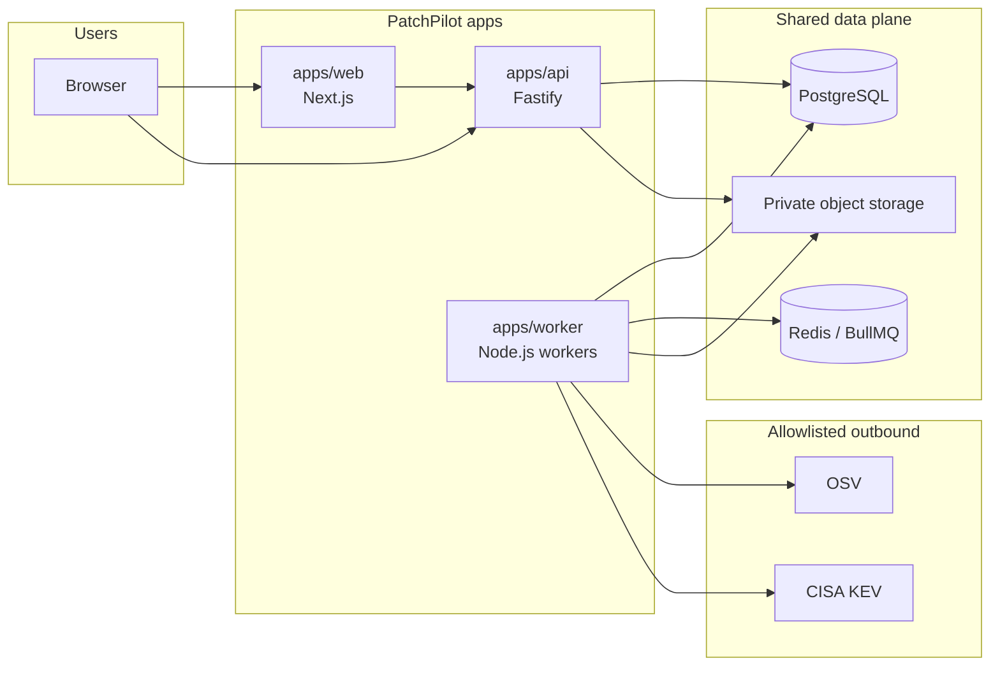

# Container architecture

This document describes the deployable units, shared data stores, and network relationships for PatchPilot v0.1. Separately deployable does **not** mean microservices. All apps share packages and one schema ([ADR 0001](../adr/0001-modular-monolith.md)).

## Containers

If the diagram is not rendered: the browser talks to `apps/web` and `apps/api`. `apps/web` is presentation and calls `apps/api` for all domain operations. `apps/api` and `apps/worker` share PostgreSQL and the object-storage port. Durable jobs are written to PostgreSQL outbox rows, **relayed by the worker** to Redis/BullMQ, and executed by `apps/worker`. The API must **not** publish jobs to Redis (handlers still must not import BullMQ). Inbound rate limiting, if it uses Redis later, is an adapter behind a port and is not a job-publish path. Only the worker performs outbound feed fetches.

## Deployable apps

| App | Runtime | Responsibility | Must not |
| --- | --- | --- | --- |
| `apps/web` | Next.js App Router | UI, accessibility, display of API data | Authorize tenancy alone; import Prisma; call use cases that skip the API; embed secrets |
| `apps/api` | Fastify TypeScript | HTTP boundary: authn context, Zod validation, invoke use cases, size limits | Domain rules in route modules; Prisma/Redis/MinIO SDKs in handlers |
| `apps/worker` | Node.js TypeScript | Job wiring, adapters for queue, storage, and feeds | Trust job payload organization IDs without reloading persistence; run parser I/O inside a DB transaction |

Use cases (application layer) live in `packages/domain`. See [component architecture](component-architecture.md).

## Shared data stores

These stores are **infrastructure**, not independently owned products.

| Store | Role | ADR |
| --- | --- | --- |
| PostgreSQL | System of record: organizations, inventory, derived graphs, findings, policies, audit, outbox | [0005](../adr/0005-postgresql-prisma.md) |
| Redis + BullMQ | At-least-once job queue after outbox publish | [0006](../adr/0006-redis-bullmq.md) |
| Private object storage | Original SBOM bytes (evidence). Local development may use MinIO | [0008](../adr/0008-private-object-storage.md) |

Prisma is the persistence toolkit and stays in `packages/database`. Domain and use cases never import Prisma.

## Process relationships

1. A mutation that needs background work writes **state + outbox row** in one PostgreSQL transaction ([ADR 0007](../adr/0007-transactional-outbox.md)).
2. The outbox **relay** (worker process) publishes to BullMQ. Relay and handlers are idempotent.
3. The worker loads tenant records by **authorized organization** from persistence, not from the payload alone.
4. Object-storage and feed HTTP calls happen **outside** database transactions.

## Network baseline

| Path | Protocol | Notes |
| --- | --- | --- |
| Browser → web | HTTPS | Static UI and Next.js server rendering. Server components still call the API, not the database. |
| Browser → API | HTTPS | Session cookie. CSRF protections on cookie-authenticated mutations. |
| Web → API | HTTPS (server-side) | Same API the browser uses. No second domain API. |
| API/worker → PostgreSQL | TLS in production | Application user with least privilege. |
| API/worker → Redis | Authenticated Redis in production | **Worker** (and outbox relay): queue only; not a second source of truth. API handlers do not publish jobs. |
| API/worker → object storage | HTTPS + private bucket | No public-read ACLs. Keys include organization and content hash. |
| Worker → OSV / KEV | HTTPS | Allowlisted hosts, timeouts, size limits. |

Redis is not exposed to the browser. PostgreSQL is not exposed to the browser.

## Local versus production topology

| Concern | Local (Compose, once scaffolded) | Production (operator-managed) |
| --- | --- | --- |
| Apps | `web`, `api`, `worker` containers | Same three apps, independently scalable **as copies of the same units** |
| PostgreSQL | Compose service | Operator-provided PostgreSQL |
| Redis | Compose service | Operator-provided Redis |
| Object storage | MinIO | S3-compatible private store |
| Development adapters | Allowed only when `deploymentEnvironment` is not `production` **and** `allowDevelopmentAdapters` is true | `allowDevelopmentAdapters` must be false and unselectable; `NODE_ENV=production` alone is not sufficient if the typed flag is true |

Scaling `worker` replicas is still a modular monolith: same schema, same packages, competing for jobs. Splitting worker types into separately owned services requires a new ADR.

## Configuration and secrets

Only `packages/config` reads `process.env`. Apps receive typed configuration. Runtime secrets (database URL, Redis password, object-storage credentials, session signing material, credential KEK) are operator-supplied. They are never baked into images or client bundles.

## Related documents

- [Deployment model](deployment-model.md)
- [Reliability model](reliability-model.md)
- [Component architecture](component-architecture.md)
