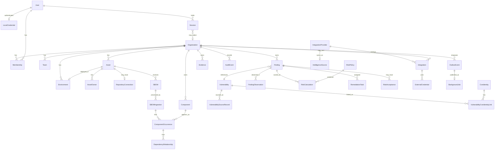

# Domain model

This is the canonical catalog of v0.1 domain entities, identifiers, and **lifecycle state names**. Specialized documents add narrative; they must not rename these states.

Terms follow the [glossary](../product/glossary.md). Opaque IDs are UUIDs. Timestamps are UTC. Tenant-owned rows include `organizationId` from **authorized organization** context.

Observed facts and calculated conclusions are separate records. A ticket status never overwrites an SBOM observation.

## Entity map

If the diagram is not rendered, the sections below define each entity and its relationships.

## Identity and tenancy rules

| Rule | Detail |
| --- | --- |
| Tenant-owned | Row includes `organizationId`. Queries always apply that predicate from trusted context. |
| Global / shared catalog | Instance-owned vulnerability intelligence, KEV snapshots, and built-in **RiskPolicy** definitions. Not tenant-owned and not publicly accessible. Session 9 import ([ADR 0021](../adr/0021-vulnerability-intelligence-import-foundation.md)) writes this catalog only. Generic **Finding** rows exist but are unused by Session 9. |
| Reference rule | Tenant **Finding** rows may store the UUID of a global **Vulnerability** or **VulnerabilitySourceRecord**. They must not copy another organization's findings. |
| Soft identity of a finding | `organizationId` + `assetId` + **versionless** component identity + vulnerability identity (**OSV id**). CVE and other aliases are denormalized; they are **not** part of the identity key. New ingestions add **FindingObservation** rows rather than duplicating the finding when identity matches. Versionless identity means CycloneDX/PURL **type + namespace + name** (or ecosystem + namespace + name). Strip `@version` / `?` / subpath from PURLs before using them as finding or **Component** identity. |
| No cascade-delete of evidence | Foreign keys must not erase SBOMs, findings, audit events, or remediation records as a convenience. |

**Component** identities derived from tenant SBOMs are **tenant-owned**. Private package names must not land in a global component catalog.

## Record classification

Legend: **G** global/shared catalog, **T** tenant-owned, **S** security-sensitive, **E** evidentiary, **M** mutable in place (status/metadata), **A** append-only (new rows, no in-place rewrite of history), **R** retention-controlled.

| Entity | G | T | S | E | M | A | R | Notes |
| --- | --- | --- | --- | --- | --- | --- | --- | --- |
| Organization | | yes | yes | | yes | | yes | Tenant boundary |
| User | instance | | yes | | yes | | | Not a tenant table; listed only via membership |
| LocalCredential | instance | | yes | | yes | | | One Argon2id PHC per User; no plaintext |
| Session | instance | | yes | | yes | | | Opaque digest row; `activeOrganizationId` is a selector |
| Membership | | yes | yes | | revoke only | | yes | Revoke, do not hard-delete |
| Team | | yes | | | yes | | yes | Not an authz substitute |
| Asset | | yes | | | yes | | yes | See [asset-model](asset-model.md) |
| AssetOwner | | yes | | | yes | | | Operational, not authorization |
| Environment | | yes | | | yes | | | `sensitivityClass` is stored data |
| RepositoryConnection | | yes | yes | | yes | | | v0.1 `not_configured` only |
| SBOM | | yes | yes | yes | metadata | original bytes immutable | yes | Original object never replaced |
| SBOMIngestion | | yes | | yes | state machine | | yes | Reprocess = new row |
| Component | | yes | | | | | yes | Tenant package identity |
| ComponentOccurrence | | yes | | yes | no | yes | yes | Per **SBOMIngestion** |
| DependencyRelationship | | yes | | yes | no | yes | yes | Observed edge per ingestion |
| Vulnerability | yes | | | | current projection; withdrawn flag additive | additive | | Shared identity; unique `osvId` is a known later-migration constraint |
| CveIdentity | yes | | | yes | no | yes | | One canonical CVE string; `createdAt` only |
| VulnerabilityCveIdentityLink | yes | | | yes | no | yes | | Source-free advisory-to-CVE link; `linkedAt` only |
| VulnerabilitySourceRecord | yes | | | yes | no | yes | yes | Never silent overwrite |
| Finding | | yes | | | state | | yes | Current calc pointer may move |
| FindingObservation | | yes | | yes | no | yes | yes | Per **SBOMIngestion** compare |
| RiskPolicy (builtin) | yes | | | | no after publish | versioned | | Immutable published definition |
| RiskPolicy (org override) | | yes | | | no after publish | versioned | yes | |
| RiskCalculation | | yes | | yes | no | yes | yes | History never overwritten |
| RemediationTask | | yes | | | until terminal | | yes | Completion ≠ resolved |
| RiskAcceptance | | yes | yes | yes | state only | amendments = new row | yes | Expiration required |
| Evidence | | yes | yes | yes | no | yes | yes | |
| AuditEvent | system or T | tenant when org set | yes | yes | **no** | yes | keep in v0.1 | Tenant `user` actors require membership; instance auth uses `actorUserId` |
| IntegrationProvider | yes | | | | | | | Global provider catalog |
| IntelligenceSource | yes | | yes | | yes | | | OSV/KEV system sync state; KEV worker scheduler exists; OSV runtime remains disabled |
| Integration | | yes | yes | | yes | | | Organization-owned installation; `organizationId` required |
| ExternalCredential | | yes | yes | | state | versions | yes | Ciphertext Restricted; attaches only to Integration |
| OutboxEvent | system or T | tenant when org set | | | publishedAt | | | Tenant work requires `organizationId`; system intel refresh may be null |
| BackgroundJob | system or T | tenant when org set | | | state | | | Same split as outbox |

## Distinctions (do not collapse)

| Pair | Distinction |
| --- | --- |
| **Component** vs **ComponentOccurrence** | Versionless package identity vs this package **version** listed in **this ingestion** |
| **Vulnerability** vs **CveIdentity** | OSV-keyed advisory row vs one canonical CVE string. Sharing a CVE does not merge advisories. |
| **CveIdentity** vs KEV membership | Identity is the CVE string. Session 10 Batch 5B derives **active-catalog membership** by exact read-time equality of that string against active `KevEntry.normalizedCve`. Membership is not tenant exposure, not a Finding, and does not require an identity row. |
| **Vulnerability** vs **Finding** | Shared intel vs tenant+asset observation of it. Session 9 import must not create Findings. Session 10 remains zero-Finding. |
| **VulnerabilitySourceRecord** vs **Vulnerability** | Immutable normalized source revision vs mutable current projection activated only after a complete source unit succeeds. Repeated retrieval of unchanged bytes is not a new revision; a newer `normalizationVersion` may create one. Withdrawal and missing-from-authoritative-snapshot are separate facts. |
| Vulnerability **severity** vs **priority** | Source fact vs calculated ranking |
| **Finding** vs **FindingObservation** | Stable identity vs per-ingestion presence/absence/inconclusive (a **calculated** compare result) |
| **SBOM** vs **SBOMIngestion** | Immutable original document vs one processing attempt (parser version, graph, observations) |
| **RemediationTask** vs **RiskAcceptance** | Work tracking vs time-boxed acceptance of residual risk |
| **Asset** vs **SBOM** | Inventoried system vs one evidence document |
| Current **RiskCalculation** vs history | `currentRiskCalculationId` vs append-only prior rows |

## Lifecycle index (canonical states)

| Entity | States | Detail |
| --- | --- | --- |
| Asset | `active`, `archived` | [asset-model.md](asset-model.md) |
| SBOMIngestion | `accepted`, `queued`, `processing`, `completed`, `rejected`, `quarantined`, `failed` (`duplicate` unused in Session 8) | [sbom-ingestion.md](sbom-ingestion.md) |
| Finding | `open`, `verification_pending`, `risk_accepted`, `mitigated`, `false_positive`, `resolved`, `inconclusive` | [finding-lifecycle.md](finding-lifecycle.md) |
| RemediationTask | `open`, `assigned`, `in_progress`, `blocked`, `completed`, `cancelled` | [remediation-lifecycle.md](remediation-lifecycle.md) |
| RiskAcceptance | `active`, `expired`, `revoked`, `superseded` | [remediation-lifecycle.md](remediation-lifecycle.md) |
| BackgroundJob | `pending`, `queued`, `running`, `succeeded`, `failed`, `dead_lettered`, `cancelled` | [reliability-model.md](reliability-model.md) |
| Integration | `disabled`, `enabled`, `degraded` | this document. **IntelligenceSource** reuses the same stored enum for `enabled`/`disabled` runtime enablement; public `healthStatus` `degraded` is **derived**, not a required persisted IntelligenceSource state |
| ExternalCredential | `pending`, `active`, `rotating`, `expired`, `revoked`, `failed_validation` | this document |

SBOM (the evidence document) has no workflow state of its own; processing state lives on **SBOMIngestion**.

---

## Organization

The **tenant** boundary. Prefer this word in APIs and schema (`organizationId`). **Tenant** is a synonym in prose.

| Field (logical) | Notes |
| --- | --- |
| `id` | UUID |
| `slug` | Globally unique, lowercase `[a-z0-9]+(-[a-z0-9]+)*`, length 2–64. Uniqueness of the stored value does not fully solve Unicode homoglyphs. Reserved product-route slugs are **not** enforced yet; document and implement them before URL routing. |
| `name` | Display name |
| `createdAt` | UTC |
| `updatedAt` | UTC |
| `status` | `active` or `archived` (organization archive is an operator/owner action; not a user-resource lifecycle in the required set). There is no `suspended` state. |
| `archivedAt` | Required when archived; null when active |
| `version` | Optimistic concurrency counter |

Owns: memberships, teams, assets, environments, SBOMs, components, findings, evidence, credentials, audit events, org-owned integrations, outbox events. Built-in risk policies and intelligence sources are not organization-owned.

## User

A person who can authenticate to the instance.

| Field (logical) | Notes |
| --- | --- |
| `id` | UUID |
| `email` | Unique at instance level for local accounts ([ADR 0019](../adr/0019-local-password-sessions.md)). Stored lowercase. Uniqueness does not fully canonicalize plus-addressing or Unicode lookalikes. |
| `displayName` | Untrusted text |
| `status` | `active` or `disabled` |
| `createdAt` | UTC |
| `disabledAt` | Required when disabled |

Password hashes live on **LocalCredential**. Opaque sessions live on **Session**. See those entities below.

A user without membership cannot access tenant-owned data. Instance operator bootstrap is separate ([OD-10](open-decisions.md)).

## LocalCredential

Instance-level Argon2id password hash for one **User** ([ADR 0019](../adr/0019-local-password-sessions.md)). Not tenant-owned.

| Field (logical) | Notes |
| --- | --- |
| `id` | UUID |
| `userId` | Unique; `ON DELETE RESTRICT` |
| `passwordHash` | Argon2id PHC string only. Never plaintext, hint, reversible encryption, recovery token, or history |
| `passwordRevision` | Integer ≥ 1. Incremented when the hash changes |
| `algorithm` | `argon2id` only |
| `createdAt` / `updatedAt` | UTC |

Repositories must not accept plaintext passwords. Hashing remains in `@patchpilot/auth` (not implemented in this batch).

## Session

Opaque server-side session row. PostgreSQL is session authority. Persist **digests only**: SHA-256 of domain-separated raw tokens. The row UUID is separate for audit. `activeOrganizationId` is a selector cache, not authorization; membership and organization are reloaded on every authenticated request. Expiration cleanup is deferred; idle and absolute indexes ship with the table.

| Field (logical) | Notes |
| --- | --- |
| `id` | UUID |
| `userId` | `ON DELETE RESTRICT` |
| `tokenHash` / `csrfTokenHash` | Unique 64-character lowercase hex. Never raw cookies or CSRF tokens |
| `activeOrganizationId` | Optional selector. `ON DELETE RESTRICT` |
| `authenticationMethod` | `password` in v0.1 |
| `passwordRevision` | Snapshot at create/rotate; mismatch invalidates at read time (service, later) |
| `createdAt` / `lastSeenAt` / `idleExpiresAt` / `absoluteExpiresAt` | UTC |
| `revokedAt` / `revokeReason` | Both null or both set |
| `userAgent` | Optional, bounded |

No required client IP, device fingerprint, or Authorization header. Login HTTP, cookies, and CSRF are **not** implemented in this batch.

## Membership

Binds a **User** to an **Organization** with a role.

| Field (logical) | Notes |
| --- | --- |
| `id` | UUID |
| `organizationId` | Authorized tenant |
| `userId` | |
| `role` | `owner`, `admin`, `member`, `viewer` — see [tenant-isolation.md](tenant-isolation.md) |
| `createdAt` | UTC |
| `revokedAt` | Optional UTC |

Revoked memberships remain for audit history. They no longer authorize access.

Authentication-boundary queries `listActiveInActiveOrganizationsForUser` and `findActiveInActiveOrganization` list only active memberships in active organizations for one user. They are not tenant-scoped lookups and do not replace `findByUser(organizationId, userId)`. Callers must pass the authenticated user id.

## Team

Optional grouping of users inside an organization ([OD-11](open-decisions.md)).

| Field (logical) | Notes |
| --- | --- |
| `id` | UUID |
| `organizationId` | |
| `name` | |
| `createdAt` | UTC |

Team membership is a persistence join table (`TeamMembership`) that is organization-consistent: a user must have a `Membership` in the same organization as the team (compound foreign key). Teams do not bypass organization scope.

## Asset

A software system the organization tracks and that can receive SBOM uploads. Detail and vocabularies: [asset-model.md](asset-model.md).

Lifecycle: `active` ↔ `archived`. Creation enters `active`. No hard delete in v0.1.

| Field (logical) | Notes |
| --- | --- |
| `id` | UUID |
| `organizationId` | Tenant scope |
| `name` | Required. Unique per organization among `active` assets (`organization_id` + lower(name)). Archived names may be reused after archive. |
| `description` | Optional untrusted text |
| `assetType` | Controlled vocabulary |
| `environmentId` | Optional FK |
| `businessCriticality` | Controlled vocabulary |
| `internetExposure` | Controlled vocabulary |
| `dataClassification` | Controlled vocabulary (asset's *data*, not PatchPilot's class of the row) |
| `lifecycleStatus` | `active` or `archived` |
| `repositoryUrl` | Optional untrusted URL; **not fetched** in v0.1 |
| `deploymentContext` | Optional untrusted text |
| `externalIdentifiers` | Optional map of vendor keys |
| `tags` | Optional short labels; length-capped |
| `lastObservedAt` | UTC `receivedAt` of the **current** completed ingestion (see below), not the wall-clock of whichever worker finished last |
| `lastSuccessfulSbomIngestionId` | FK to the **current** completed ingestion: among `completed` ingestions for this asset, the one whose SBOM `receivedAt` is greatest (tie-break `SBOMIngestion.createdAt`, then `SBOMIngestion.id`). A late-finishing **older** upload must not overwrite this pointer. |

Context changes (environment, criticality, exposure, classification) emit audit events and enqueue **RiskCalculation** with `calculationReason: asset_change`. History is not erased.

## AssetOwner

Associates people or teams with an asset for operational ownership (not authorization by itself).

| Field (logical) | Notes |
| --- | --- |
| `id` | UUID |
| `organizationId` | Must match asset organization |
| `assetId` | |
| `userId` | Optional |
| `teamId` | Optional |
| `role` | `technical`, `business`, or `security` (display/assignment hints) |

At least one of `userId` or `teamId` is required. AssetOwner is not a substitute for Membership.

## Environment

Organization-scoped named environment used as an **observed** input to environmental priority (for example `production`, `staging`, `development`, or a custom name).

| Field (logical) | Notes |
| --- | --- |
| `id` | UUID |
| `organizationId` | |
| `name` | Unique per organization |
| `sensitivityClass` | Operator-selected label such as `production` or `non_production`; stored as data, not inferred from the name string alone |

An asset references at most one Environment in v0.1. Missing environment is an observed gap, not a hidden default score.

## RepositoryConnection

Placeholder for a later source-control link ([OD-12](open-decisions.md)). GitHub is not MVP.

| Field (logical) | Notes |
| --- | --- |
| `id` | UUID |
| `organizationId` | |
| `assetId` | |
| `provider` | Enum reserved; unused at runtime in v0.1 |
| `status` | `not_configured` only in v0.1 |
| `externalIds` | Untrusted if ever populated; not used for authorization |

No tokens, webhooks, or repo fetches in v0.1.

## SBOM

The original document as **evidence**, plus identifiers needed to retrieve it.

| Field (logical) | Notes |
| --- | --- |
| `id` | UUID |
| `organizationId` | |
| `assetId` | |
| `sha256` | Hex digest of original bytes |
| `byteLength` | |
| `cycloneDxSpecVersion` | Allowlisted value recorded after validation |
| `objectKey` | Storage key including organization and digest |
| `uploadedByMembershipId` | Optional historical membership of the uploader |
| `receivedAt` | Server UTC when PatchPilot accepted the object. Canonical current-ingestion clock. |
| `capturedAt` | Optional producer-supplied generation time. Not used to choose current ingestion. |
| `createdAt` | Database row creation time. |
| `parserVersionLastSucceeded` | Optional; from last completed ingestion |

Original bytes live in object storage, not as a substitute parsed graph. The parsed graph is derived data.

## SBOMIngestion

One processing attempt against an SBOM (initial upload or later reprocess with a newer parser).

Lifecycle states and transitions: [sbom-ingestion.md](sbom-ingestion.md). Session 8 ([ADR 0020](../adr/0020-sbom-ingestion-graph-completion.md)) uses stages `validate`, `parse`, and `persist_graph` only. `completed` means stored evidence was re-read, byte length and SHA-256 were verified, JSON/structural limits, allowlisted CycloneDX schema, semantic limits, and normalized graph persistence all succeeded. It does **not** imply exhaustive software inventory, correlation, findings, enrichment, scoring, or remediation.

| Field (logical) | Notes |
| --- | --- |
| `id` | UUID |
| `organizationId` | |
| `sbomId` | |
| `assetId` | Denormalized for scoping |
| `state` | Canonical ingestion state. Session 8 does not insert `duplicate` rows; duplicate evidence reuses the existing resource. |
| `stage` | Session 8: `validate`, `parse`, `persist_graph`. Frozen unused: `correlate`, `enrich`, `score`. |
| `graphCompleteness` | `empty`, `no_dependencies`, `partial`, or `complete` after graph persist. `empty` does not mean the Asset contains no software. `no_dependencies` does not prove the software has no dependencies. Persisted by Session 8 Batch 4. |
| `parserVersion` | Parser that ran or will run |
| `normalizationVersion` | Required bounded graph normalization identifier. Database column is NOT NULL. Newly created accepted ingestions always persist the provided label. Mappers fail if a row lacks a value; they do not substitute a default. |
| `idempotencyKey` | Existing column is unused in Session 8. HTTP idempotency uses **IdempotencyRecord**. |
| `leaseExpiresAt` | Unused in Session 8. OutboxEvent and BackgroundJob have separate leases. |
| `errorCode` | Stable taxonomy; no raw payload |
| `quarantineReason` | If `quarantined` |

Reprocessing **creates a new SBOMIngestion** for the same SBOM. It does not mutate a `completed` ingestion back to `queued`. Future correlation must not rewrite completed Session 8 history.

## Component

Tenant-owned package identity extracted from SBOMs.

| Field (logical) | Notes |
| --- | --- |
| `id` | UUID |
| `organizationId` | |
| `purl` | Optional **versionless** PURL (`pkg:type/namespace/name` only). Never store `@version`, qualifiers, or subpath on this row. |
| `ecosystem` | Required for correlation when versionless PURL absent |
| `name` | Untrusted text |
| `namespace` | Optional |

Uniqueness is organization-scoped on a normalized **versionless** identity key (versionless PURL, or ecosystem + namespace + name). Version belongs on **ComponentOccurrence**. Names are never executed and are escaped in UI.

## ComponentOccurrence

A component as listed in a specific **SBOMIngestion**, including version and bom-ref.

| Field (logical) | Notes |
| --- | --- |
| `id` | UUID |
| `organizationId` | |
| `sbomId` | Denormalized; original document |
| `sbomIngestionId` | Required. Derived graph is per processing attempt |
| `componentId` | Versionless identity |
| `version` | Untrusted text; **not** part of **Component** or **Finding** identity. Unknown versions persist as `version_known = false` with an empty placeholder. `*`, `latest`, and `unknown` cannot be represented as known ComponentVersion values in Session 8. They may appear only as literal observed evidence if a future explicit policy permits them. |
| `versionedPurl` | Optional full PURL including version as listed in the document |
| `bomRef` | Optional, untrusted |
| `isDirect` | Observed from the document when present; otherwise unknown |

Uniqueness: `(organizationId, sbomIngestionId, componentId, version)`. Parser reprocess of the same SBOM inserts a new ingestion and a new occurrence set; it does not overwrite a completed ingestion's graph.

## DependencyRelationship

An **observed** edge between occurrences in the same SBOM. Not a risk score.

| Field (logical) | Notes |
| --- | --- |
| `id` | UUID |
| `organizationId` | |
| `sbomId` | Denormalized |
| `sbomIngestionId` | Required |
| `fromOccurrenceId` | |
| `toOccurrenceId` | |

## Vulnerability

Normalized, **shared catalog** current projection for a vulnerability identity (typically an OSV id, with CVE when published). Session 9 ([ADR 0021](../adr/0021-vulnerability-intelligence-import-foundation.md)) may later update this projection only after a complete source unit succeeds. Session 9 does **not** create Findings.

| Field (logical) | Notes |
| --- | --- |
| `id` | UUID (internal) |
| `osvId` | Required unique varchar today. Known migration constraint; [ADR 0021](../adr/0021-vulnerability-intelligence-import-foundation.md) does **not** finalize a provider-neutral replacement. A KEV-only CVE cannot be stored here without that later review. |
| `cveId` | Optional |
| `aliases` | Additional identifiers. Alias collision is not a merge key and is not proof that affected ranges are equivalent. |
| `withdrawnAt` | Optional UTC; withdrawn is additive provider fact, not a silent delete, and not the same as missing-from-authoritative-snapshot |

This row is a current projection. Authoritative provenance lives on **VulnerabilitySourceRecord**. Future **Finding** identity uses `osvId` (internal `id` as FK). `cveId` and `aliases` may appear later; adding a CVE must **not** change finding identity or create a second finding.

## CveIdentity

Global, instance-owned canonical CVE registry. One row per exact `CVE-[0-9]{4}-[0-9]{4,19}` string. Session 10 Batch 3B applied and froze this as `cve_identity` (`20260902120000_canonical_cve_identity`, SHA-256 `2190b5a0d22cf008fa01a180bc9233a68ba56159447bc599a4a2a1dba684b0ba`). The table is append-only. It has no organization, provider, KEV, Finding, or Component fields. `createdAt` is the only timestamp and is database-generated. Session 10 Batch 4B implements `createCveIdentityPersistence` insert-once adapters. Unique conflicts reload the stored row. Batch lookup is bounded to 100 inputs. Session 10 Batch 5B derives active-catalog membership for one exact canonical CVE without reading or writing this table. A CVE may be listed in the accepted KEV generation with no `CveIdentity` row. The persistent development database has eleven finished migrations.

| Field (logical) | Notes |
| --- | --- |
| `id` | UUID |
| `cve` | Exact canonical CVE; globally unique; SQL CHECK; `VARCHAR(28)` |
| `createdAt` | Insert timestamp |

## VulnerabilityCveIdentityLink

Append-only many-to-many between an existing **Vulnerability** advisory and a **CveIdentity**. The logical link is source-free. `linkedAt` is the only timestamp and is supplied by the ensure command; existing values are never overwritten. Multiple advisories may share one CVE without merging. One advisory may link to more than one CVE. Session 10 Batch 3B completed a canonical-only backfill of exact values already stored in `vulnerability.cve_id`. Malformed legacy values remain unchanged and unlinked. No Vulnerability merge occurred. `osvId` remains required and unique. `cveId` remains unchanged. `KevEntry` remains unchanged. Batch 4B keyset listing is ordered by `cveIdentityId` and bounded 1–100. Invalid limits are rejected.

| Field (logical) | Notes |
| --- | --- |
| `id` | UUID |
| `vulnerabilityId` | Existing advisory |
| `cveIdentityId` | Canonical identity |
| `linkedAt` | Association-establishment timestamp |

## VulnerabilitySourceRecord

An **immutable normalized source revision**, not a retrieval log and not a raw provider body. Raw bodies belong in private object storage; PostgreSQL stores hashes, metadata, and the normalized revision. Uniqueness is `(source, sourceIdentity, payloadSha256, normalizationVersion)`. The same source bytes may be normalized again by a newer normalizer. Repeated retrieval of unchanged content does not need another revision. Content SHA-256 is import idempotency until conditional GET is separately verified.

| Field (logical) | Notes |
| --- | --- |
| `id` | UUID |
| `vulnerabilityId` | |
| `source` | `osv` or `cisa_kev` (KEV may attach as catalog source records keyed by CVE; that is not Finding enrichment) |
| `sourceIdentity` | Provider document id |
| `retrievedAt` | UTC of the snapshot that was normalized |
| `payloadSha256` | Hash of stored raw snapshot |
| `normalizationVersion` | PatchPilot normalizer identifier; part of uniqueness |
| `normalized` | Validated extracted fields |
| `supersedesRecordId` | Previous revision for the **same** vulnerability, source, and source identity |

Conflicting sources: retain both. A versioned policy may choose display precedence; it does not delete the loser.

## Finding

Tenant-owned link between an asset's observed component identity and a **Vulnerability**, plus later enrichment pointers and the current workflow state. Generic persistence already exists. Session 9 must not create, update, close, or reopen Findings or FindingObservations, and must not enqueue `finding.recalculate`.

Lifecycle: [finding-lifecycle.md](finding-lifecycle.md).

Does not store a mutable "score" in place. Current priority comes from the latest **RiskCalculation** referenced by `currentRiskCalculationId`. Each calculation must store `policyVersion`, `policyDefinitionSha256`, `inputFingerprint`, full **contributingFactors**, intel source record ids used, **priorityBand**, due-date recommendation, and escalation recommendation.

## FindingObservation

Per-**SBOMIngestion** compare result for whether the finding's **versionless** component identity was present. The `result` is a **calculated conclusion**, not a raw SBOM field.

| Field (logical) | Notes |
| --- | --- |
| `id` | UUID |
| `organizationId` | |
| `findingId` | |
| `sbomId` | Denormalized |
| `sbomIngestionId` | Required. Uniqueness: `(organizationId, findingId, sbomIngestionId)` |
| `occurrenceId` | Optional if present (one representative occurrence; mixed versions use method `version_out_of_affected_range` / remain `present`) |
| `result` | `present`, `absent`, `inconclusive` — **calculated** from compare rules, stored with method |
| `method` | For example `exact_purl`, `ecosystem_name_version`, `version_out_of_affected_range`, `missing_identity`, `incomplete_sbom_coverage` |
| `observedAt` | UTC |

`resolved` on the finding is a conclusion over the **current** ingestion's observation (latest SBOM `receivedAt` among `completed` ingestions), not a ticket field and not whichever ingestion finished last.

## RiskPolicy

Versioned rules that turn **observed facts** into **priority**. Shared table. `scope` is `builtin` or `organization`. Built-ins keep `organizationId` null. Organization policies require `organizationId`. Repository methods for built-ins and tenant policies are separate.

| Field (logical) | Notes |
| --- | --- |
| `id` | UUID |
| `scope` | `builtin` or `organization` |
| `organizationId` | Null iff `scope = builtin` |
| `policyKey` | Stable name |
| `version` | Monotonic per key |
| `status` | `draft`, `published`, `retired` |
| `definition` | Weights and factor catalog (JSON, validated) |
| `publishedAt` | Required when published or retired |
| `retiredAt` | Required when retired; null otherwise |
| `createdByMembershipId` | Optional. Organization policies only. Historical membership; revocation does not clear it. Null for built-ins. |

Published definitions are immutable: identity (`policyKey`, `version`, `scope`, `organizationId`), `publishedAt`, and `definition` cannot change. Deletion of a published policy is rejected. The only allowed published-status change is `published` → `retired`. Organization-policy `createdByMembershipId` is optional and must belong to that organization, including after revocation. Built-in policies have no membership creator. Edits that need a new definition publish a new version. Historical **RiskCalculation** rows keep the old version. See [risk-policy.md](risk-policy.md).

## RiskCalculation

Append-only calculated conclusion for a finding under one policy version.

| Field (logical) | Notes |
| --- | --- |
| `id` | UUID |
| `organizationId` | |
| `findingId` | |
| `riskPolicyId` | |
| `policyVersion` | Copied for evidence even if policy row later supersedes |
| `policyDefinitionSha256` | SHA-256 of the published **RiskPolicy.definition** bytes used |
| `intelSourceRecordIds` | Source records whose fields were read |
| `priority` | Stored ranking (synonym: risk score) |
| `priorityBand` | Calculated grouping (for example P1–P4); stored, not inferred later from a changing threshold |
| `dueDateRecommendationDays` | Calculated recommendation; not a contractual SLA |
| `escalationRecommendation` | Calculated boolean/label; MVP does not auto-notify |
| `severitySnapshot` | Copied observed source severity, not the priority |
| `contributingFactors` | Full factor set used |
| `inputFingerprint` | SHA-256 of the canonical input object (sorted intel source record ids, `sbomIngestionId` or null, asset context version or null, override id or null, `calculationReason`, `policyDefinitionSha256`) |
| `sbomIngestionId` | Set for `initial` / `rescan`; null for intel/policy/asset/manual reasons that are not ingest-driven |
| `calculatedAt` | UTC |
| `calculationReason` | `initial`, `rescan`, `intel_refresh`, `policy_change`, `asset_change`, `manual_recalc`, `manual_override` |

Recalculation inserts a new row. It does not erase previous rows. Replay uniqueness: `(organizationId, findingId, inputFingerprint)`. Do not use a different key in the intel docs.

## RemediationTask

Assigned **remediation work**. Completing a task is not proof the finding is **resolved**.

Lifecycle: [remediation-lifecycle.md](remediation-lifecycle.md).

## RiskAcceptance

Explicit decision to accept a finding for a reason and period. Amendments create a new row and mark the previous `superseded`.

Lifecycle: [remediation-lifecycle.md](remediation-lifecycle.md).

Compensating controls are stored as **Evidence** (and audit events), not as silent score overrides unless a published policy lists a named factor and the control record qualifies. Default built-in policy does **not** auto-reduce priority for a control description.

## Evidence

Tenant-owned artifact or structured claim needed to explain a finding later.

| Field (logical) | Notes |
| --- | --- |
| `id` | UUID |
| `organizationId` | |
| `kind` | `sbom_object`, `kev_match`, `intel_record`, `policy_snapshot`, `compensating_control`, `export_snapshot` |
| `findingId` / `sbomId` / `assetId` | Exactly one target. `assetId` is allowed only for `export_snapshot`. |
| `submittedByMembershipId` | Optional historical membership of the submitter |
| `objectKey` | If stored bytes |
| `metadata` | Non-secret structured fields |
| `createdAt` | UTC |

## AuditEvent

Append-only security- or remediation-sensitive record. Never updated or deleted in place. See [audit-model.md](audit-model.md).

System-level events (shared catalog import) may use a null `organizationId` and `actorType` `system` or `instance_operator` with no User or Membership. Anonymous login failures use `actorType` `anonymous` with all actor ids null. Instance-level authentication uses `actorType` `user` with `actorUserId` set and null org/membership. Tenant `user` events require `organizationId`, `actorUserId`, and `actorMembershipId` for the same membership.

## IntegrationProvider

Global catalog row for a named provider (`osv`, `cisa_kev`, `reserved`). Not tenant-owned.

## IntelligenceSource

System synchronization state for OSV and CISA KEV. Not a tenant installation. `providerKey` is `osv` or `cisa_kev`. Last-sync timestamps and later verified conditional-request metadata live here, not on **Integration**. Session 9 Batch 8B runs scheduled CISA KEV import in `apps/worker`. Authenticated provider-status GETs ([ADR 0022](../adr/0022-intelligence-provider-status-authorization.md)) expose a derived `healthStatus`. Public `degraded` is computed from the active generation, last successful synchronization, a later failure timestamp, and stale-threshold precedence (stale wins). Persisted `IntelligenceSource.state` is reconciled to `enabled` or `disabled`; it is not the public degraded flag. Session 10 Batch 5B derives active-catalog membership from the accepted active generation pointer; that read is not a Finding and is not tenant exposure. OSV runtime, matching, and Findings remain **not implemented**. Do not treat stored cursors or ETags as a provider guarantee. Provider freshness must not advance after a partial source unit.

## Integration

Organization-owned installation of an **IntegrationProvider** ([ADR 0015](../adr/0015-provider-neutral-integrations.md)). `organizationId` is required.

| Field (logical) | Notes |
| --- | --- |
| `id` | UUID |
| `organizationId` | Required |
| `providerId` | FK to **IntegrationProvider** |
| `displayName` | Operator-visible label |
| `state` | `disabled`, `enabled`, `degraded` |
| `config` | Non-secret: endpoints from allowlist, refresh interval |

### Integration transitions

| From | To | Trigger |
| --- | --- | --- |
| (create) | `disabled` | Recorded but not fetching |
| `disabled` | `enabled` | Operator enables; config valid |
| `enabled` | `disabled` | Operator disables |
| `enabled` | `degraded` | Consecutive health failures beyond threshold |
| `degraded` | `enabled` | Health recovered |
| `degraded` | `disabled` | Operator disables |

v0.1 **IntelligenceSource** rows exist for OSV and CISA KEV. Session 9 Batch 8B schedules CISA KEV catalog import in `apps/worker` ([ADR 0021](../adr/0021-vulnerability-intelligence-import-foundation.md)). OSV runtime, matching, and Findings remain unimplemented. Tenant GitHub integrations are not enabled. A tenant **Integration** may exist for the reserved provider catalog entry; it is not used for GitHub in v0.1.

## ExternalCredential

Tenant-owned secret material for an organization-owned **Integration**. Encrypted at rest. Decrypt only inside the integration adapter.

v0.1 may have **no** tenant credentials if only public OSV and KEV are used. The entity still exists so later providers do not invent a second model. System feed fetches must not use tenant tokens. Credentials cannot attach to **IntelligenceSource**.

### External credential transitions

| From | To | Trigger |
| --- | --- | --- |
| (create) | `pending` | Ciphertext stored; not yet validated |
| `pending` | `active` | Adapter validation succeeded |
| `pending` | `failed_validation` | Validation failed |
| `failed_validation` | `pending` | Retry with same or new secret |
| `failed_validation` | `revoked` | Abandoned |
| `active` | `rotating` | Rotation started (new version pending) |
| `rotating` | `active` | New version active; previous version `revoked` |
| `rotating` | `failed_validation` | New secret invalid; previous version remains `active` |
| `active` | `expired` | `expiresAt` passed |
| `active` | `revoked` | Operator revoke |
| `expired` | `revoked` | Cleanup |
| `expired` | `pending` | Replacement secret submitted |

Never log plaintext. Never ship in client bundles. Never enable via development defaults in production.

## OutboxEvent

Transactional outbox row for durable work ([ADR 0007](../adr/0007-transactional-outbox.md)).

| Field (logical) | Notes |
| --- | --- |
| `id` | UUID |
| `organizationId` | Required for tenant work |
| `eventType` | Stable name |
| `aggregateType` / `aggregateId` | |
| `payload` | Minimal ids, not raw SBOMs |
| `dedupeKey` | Unique with organization for tenant work. System events (null `organizationId`) use a non-null `dedupeKey` unique on `(eventType, dedupeKey)` because PostgreSQL `UNIQUE` allows duplicate nulls. |
| `createdAt` | UTC |
| `publishedAt` | Optional UTC |

Written in the same transaction as the state change. No network I/O in that transaction. Status values: `pending`, `claimed`, `processed`, `failed`, `dead_lettered`. `processedAt` is the ADR `publishedAt` equivalent. Delivery is at-least-once; the schema does not claim exactly-once.

## BackgroundJob

Worker-visible job created when an outbox event is published.

Lifecycle: [reliability-model.md](reliability-model.md).

Payload organization IDs are hints. Handlers reload the aggregate and confirm `organizationId` before mutation.

## Related documents

- [Data flow](data-flow.md)
- [Tenant isolation](tenant-isolation.md)
- [Glossary](../product/glossary.md)
