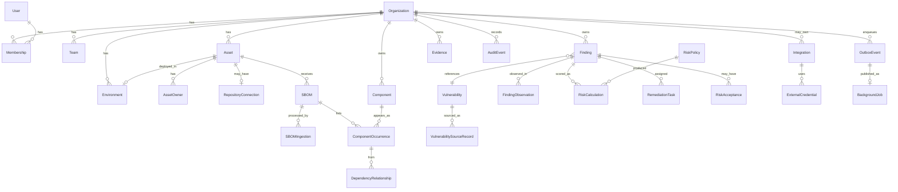

# Domain model

This is the canonical catalog of v0.1 domain entities, identifiers, and **lifecycle state names**. Specialized documents add narrative; they must not rename these states.

Terms follow the [glossary](../product/glossary.md). Opaque IDs are UUIDs. Timestamps are UTC. Tenant-owned rows include `organizationId` from **authorized organization** context.

Observed facts and calculated conclusions are separate records. A ticket status never overwrites an SBOM observation.

## Entity map

If the diagram is not rendered, the sections below define each entity and its relationships.

## Identity and tenancy rules

| Rule | Detail |
| --- | --- |
| Tenant-owned | Row includes `organizationId`. Queries always apply that predicate from trusted context. |
| Global / shared catalog | Vulnerability intelligence, KEV snapshots, and built-in **RiskPolicy** definitions. Not tenant-owned. |
| Reference rule | Tenant **Finding** rows may store the UUID of a global **Vulnerability** or **VulnerabilitySourceRecord**. They must not copy another organization's findings. |
| Soft identity of a finding | `organizationId` + `assetId` + component identity (PURL if present, else ecosystem + name) + vulnerability identity (OSV id and CVE when known). New SBOMs add **FindingObservation** rows rather than duplicating the finding when identity matches. |
| No cascade-delete of evidence | Foreign keys must not erase SBOMs, findings, audit events, or remediation records as a convenience. |

**Component** identities derived from tenant SBOMs are **tenant-owned**. Private package names must not land in a global component catalog.

## Record classification

Legend: **G** global/shared catalog, **T** tenant-owned, **S** security-sensitive, **E** evidentiary, **M** mutable in place (status/metadata), **A** append-only (new rows, no in-place rewrite of history), **R** retention-controlled.

| Entity | G | T | S | E | M | A | R | Notes |
| --- | --- | --- | --- | --- | --- | --- | --- | --- |
| Organization | | yes | yes | | yes | | yes | Tenant boundary |
| User | instance | | yes | | yes | | | Not a tenant table; listed only via membership |
| Membership | | yes | yes | | revoke only | | yes | Revoke, do not hard-delete |
| Team | | yes | | | yes | | yes | Not an authz substitute |
| Asset | | yes | | | yes | | yes | See [asset-model](asset-model.md) |
| AssetOwner | | yes | | | yes | | | Operational, not authorization |
| Environment | | yes | | | yes | | | `sensitivityClass` is stored data |
| RepositoryConnection | | yes | yes | | yes | | | v0.1 `not_configured` only |
| SBOM | | yes | yes | yes | metadata | original bytes immutable | yes | Original object never replaced |
| SBOMIngestion | | yes | | yes | state machine | | yes | Reprocess = new row |
| Component | | yes | | | | | yes | Tenant package identity |
| ComponentOccurrence | | yes | | yes | no | yes | yes | Per SBOM |
| DependencyRelationship | | yes | | yes | no | yes | yes | Observed edge |
| Vulnerability | yes | | | | withdrawn flag additive | additive | | Shared identity |
| VulnerabilitySourceRecord | yes | | | yes | no | yes | yes | Never silent overwrite |
| Finding | | yes | | | state | | yes | Current calc pointer may move |
| FindingObservation | | yes | | yes | no | yes | yes | Per SBOM compare |
| RiskPolicy (builtin) | yes | | | | no after publish | versioned | | Immutable published definition |
| RiskPolicy (org override) | | yes | | | no after publish | versioned | yes | |
| RiskCalculation | | yes | | yes | no | yes | yes | History never overwritten |
| RemediationTask | | yes | | | until terminal | | yes | Completion ≠ resolved |
| RiskAcceptance | | yes | yes | yes | state only | amendments = new row | yes | Expiration required |
| Evidence | | yes | yes | yes | no | yes | yes | |
| AuditEvent | system or T | tenant when org set | yes | yes | **no** | yes | keep in v0.1 | |
| Integration | system or T | tenant when org set | yes | | yes | | | |
| ExternalCredential | | yes | yes | | state | versions | yes | Ciphertext Restricted |
| OutboxEvent | | tenant work | | | publishedAt | | | Payload = ids |
| BackgroundJob | | tenant work | | | state | | | |

## Distinctions (do not collapse)

| Pair | Distinction |
| --- | --- |
| **Component** vs **ComponentOccurrence** | Identity vs this package **version** listed in **this** SBOM |
| **Vulnerability** vs **Finding** | Shared intel vs tenant+asset observation of it |
| **VulnerabilitySourceRecord** vs **Vulnerability** | One retrieved payload vs normalized identity |
| Vulnerability **severity** vs **priority** | Source fact vs calculated ranking |
| **Finding** vs **FindingObservation** | Stable identity vs per-SBOM presence/absence/inconclusive |
| **RemediationTask** vs **RiskAcceptance** | Work tracking vs time-boxed acceptance of residual risk |
| **Asset** vs **SBOM** | Inventoried system vs one evidence document |
| Current **RiskCalculation** vs history | `currentRiskCalculationId` vs append-only prior rows |

## Lifecycle index (canonical states)

| Entity | States | Detail |
| --- | --- | --- |
| Asset | `active`, `archived` | [asset-model.md](asset-model.md) |
| SBOMIngestion | `accepted`, `queued`, `processing`, `completed`, `rejected`, `quarantined`, `failed`, `duplicate` | [sbom-ingestion.md](sbom-ingestion.md) |
| Finding | `open`, `verification_pending`, `risk_accepted`, `mitigated`, `false_positive`, `resolved`, `inconclusive` | [finding-lifecycle.md](finding-lifecycle.md) |
| RemediationTask | `open`, `assigned`, `in_progress`, `blocked`, `completed`, `cancelled` | [remediation-lifecycle.md](remediation-lifecycle.md) |
| RiskAcceptance | `active`, `expired`, `revoked`, `superseded` | [remediation-lifecycle.md](remediation-lifecycle.md) |
| BackgroundJob | `pending`, `queued`, `running`, `succeeded`, `failed`, `dead_lettered`, `cancelled` | [reliability-model.md](reliability-model.md) |
| Integration | `disabled`, `enabled`, `degraded` | this document |
| ExternalCredential | `pending`, `active`, `rotating`, `expired`, `revoked`, `failed_validation` | this document |

SBOM (the evidence document) has no workflow state of its own; processing state lives on **SBOMIngestion**.

---

## Organization

The **tenant** boundary. Prefer this word in APIs and schema (`organizationId`). **Tenant** is a synonym in prose.

| Field (logical) | Notes |
| --- | --- |
| `id` | UUID |
| `name` | Display name |
| `createdAt` | UTC |
| `status` | `active` or `archived` (organization archive is an operator/owner action; not a user-resource lifecycle in the required set) |

Owns: memberships, teams, assets, environments, SBOMs, components, findings, evidence, credentials, audit events, org-scoped integrations, outbox events.

## User

A person who can authenticate to the instance.

| Field (logical) | Notes |
| --- | --- |
| `id` | UUID |
| `email` | Unique at instance level for local accounts (interim [OD-1](open-decisions.md)) |
| `passwordCredential` | Hash only; never log |
| `createdAt` | UTC |
| `disabledAt` | Optional UTC |

A user without membership cannot access tenant-owned data. Instance operator bootstrap is separate ([OD-10](open-decisions.md)).

## Membership

Binds a **User** to an **Organization** with a role.

| Field (logical) | Notes |
| --- | --- |
| `id` | UUID |
| `organizationId` | Authorized tenant |
| `userId` | |
| `role` | `owner`, `admin`, `member`, `viewer` — see [tenant-isolation.md](tenant-isolation.md) |
| `createdAt` | UTC |
| `revokedAt` | Optional UTC |

Revoked memberships remain for audit history. They no longer authorize access.

## Team

Optional grouping of users inside an organization ([OD-11](open-decisions.md)).

| Field (logical) | Notes |
| --- | --- |
| `id` | UUID |
| `organizationId` | |
| `name` | |
| `createdAt` | UTC |

Team membership can be modeled as a join table in persistence without a separately named domain aggregate. Teams do not bypass organization scope.

## Asset

A software system the organization tracks and that can receive SBOM uploads. Detail and vocabularies: [asset-model.md](asset-model.md).

Lifecycle: `active` ↔ `archived`. Creation enters `active`. No hard delete in v0.1.

| Field (logical) | Notes |
| --- | --- |
| `id` | UUID |
| `organizationId` | Tenant scope |
| `name` | Required |
| `description` | Optional untrusted text |
| `assetType` | Controlled vocabulary |
| `environmentId` | Optional FK |
| `businessCriticality` | Controlled vocabulary |
| `internetExposure` | Controlled vocabulary |
| `dataClassification` | Controlled vocabulary (asset's *data*, not PatchPilot's class of the row) |
| `lifecycleStatus` | `active` or `archived` |
| `repositoryUrl` | Optional untrusted URL; **not fetched** in v0.1 |
| `deploymentContext` | Optional untrusted text |
| `externalIdentifiers` | Optional map of vendor keys |
| `tags` | Optional short labels; length-capped |
| `lastObservedAt` | UTC of last **completed** ingestion |
| `lastSuccessfulSbomIngestionId` | Optional FK |

Context changes (environment, criticality, exposure, classification) emit audit events and enqueue **RiskCalculation** with `calculationReason: asset_change`. History is not erased.

## AssetOwner

Associates people or teams with an asset for operational ownership (not authorization by itself).

| Field (logical) | Notes |
| --- | --- |
| `id` | UUID |
| `organizationId` | Must match asset organization |
| `assetId` | |
| `userId` | Optional |
| `teamId` | Optional |
| `role` | `technical`, `business`, or `security` (display/assignment hints) |

At least one of `userId` or `teamId` is required. AssetOwner is not a substitute for Membership.

## Environment

Organization-scoped named environment used as an **observed** input to environmental priority (for example `production`, `staging`, `development`, or a custom name).

| Field (logical) | Notes |
| --- | --- |
| `id` | UUID |
| `organizationId` | |
| `name` | Unique per organization |
| `sensitivityClass` | Operator-selected label such as `production` or `non_production`; stored as data, not inferred from the name string alone |

An asset references at most one Environment in v0.1. Missing environment is an observed gap, not a hidden default score.

## RepositoryConnection

Placeholder for a later source-control link ([OD-12](open-decisions.md)). GitHub is not MVP.

| Field (logical) | Notes |
| --- | --- |
| `id` | UUID |
| `organizationId` | |
| `assetId` | |
| `provider` | Enum reserved; unused at runtime in v0.1 |
| `status` | `not_configured` only in v0.1 |
| `externalIds` | Untrusted if ever populated; not used for authorization |

No tokens, webhooks, or repo fetches in v0.1.

## SBOM

The original document as **evidence**, plus identifiers needed to retrieve it.

| Field (logical) | Notes |
| --- | --- |
| `id` | UUID |
| `organizationId` | |
| `assetId` | |
| `sha256` | Hex digest of original bytes |
| `byteLength` | |
| `cycloneDxSpecVersion` | Allowlisted value recorded after validation |
| `objectKey` | Storage key including organization and digest |
| `uploadedByUserId` | |
| `uploadedAt` | UTC |
| `parserVersionLastSucceeded` | Optional; from last completed ingestion |

Original bytes live in object storage, not as a substitute parsed graph. The parsed graph is derived data.

## SBOMIngestion

One processing attempt against an SBOM (initial upload or later reprocess with a newer parser).

Lifecycle states and transitions: [sbom-ingestion.md](sbom-ingestion.md).

| Field (logical) | Notes |
| --- | --- |
| `id` | UUID |
| `organizationId` | |
| `sbomId` | |
| `assetId` | Denormalized for scoping |
| `state` | Canonical ingestion state |
| `stage` | Fine-grained step: `validate`, `parse`, `persist_graph`, `correlate`, `enrich`, `score` |
| `parserVersion` | Parser that ran or will run |
| `idempotencyKey` | Organization-scoped |
| `errorCode` | Stable taxonomy; no raw payload |
| `quarantineReason` | If `quarantined` |

Reprocessing **creates a new SBOMIngestion** for the same SBOM. It does not mutate a `completed` ingestion back to `queued`.

## Component

Tenant-owned package identity extracted from SBOMs.

| Field (logical) | Notes |
| --- | --- |
| `id` | UUID |
| `organizationId` | |
| `purl` | Optional |
| `ecosystem` | Required for correlation when PURL absent |
| `name` | Untrusted text |
| `namespace` | Optional |

Uniqueness is organization-scoped on a normalized identity key (PURL, or ecosystem + name). Names are never executed and are escaped in UI.

## ComponentOccurrence

A component as listed in a specific SBOM, including version and bom-ref.

| Field (logical) | Notes |
| --- | --- |
| `id` | UUID |
| `organizationId` | |
| `sbomId` | |
| `componentId` | |
| `version` | Untrusted text |
| `bomRef` | Optional, untrusted |
| `isDirect` | Observed from the document when present; otherwise unknown |

## DependencyRelationship

An **observed** edge between occurrences in the same SBOM. Not a risk score.

| Field (logical) | Notes |
| --- | --- |
| `id` | UUID |
| `organizationId` | |
| `sbomId` | |
| `fromOccurrenceId` | |
| `toOccurrenceId` | |

## Vulnerability

Normalized, **shared catalog** record for a vulnerability identity (typically an OSV id, with CVE when published).

| Field (logical) | Notes |
| --- | --- |
| `id` | UUID (internal) |
| `osvId` | Stable source identity when from OSV |
| `cveId` | Optional |
| `aliases` | Additional identifiers |
| `withdrawnAt` | Optional UTC; withdrawn is additive, not a silent delete |

This row is a projection for correlation. Authoritative provenance lives on **VulnerabilitySourceRecord**.

## VulnerabilitySourceRecord

One retrieved payload from one source about one vulnerability identity. Updates are **versioned or additive**. Never silently overwrite.

| Field (logical) | Notes |
| --- | --- |
| `id` | UUID |
| `vulnerabilityId` | |
| `source` | `osv` or `cisa_kev` (KEV may attach as enrichment records keyed by CVE) |
| `sourceIdentity` | Provider document id |
| `retrievedAt` | UTC |
| `payloadSha256` | Hash of stored raw snapshot |
| `normalized` | Validated extracted fields |
| `supersedesRecordId` | Optional previous record |

Conflicting sources: retain both. A versioned policy may choose display precedence; it does not delete the loser.

## Finding

Tenant-owned link between an asset's observed component identity and a **Vulnerability**, plus later enrichment pointers and the current workflow state.

Lifecycle: [finding-lifecycle.md](finding-lifecycle.md).

Does not store a mutable "score" in place. Current priority comes from the latest **RiskCalculation** referenced by `currentRiskCalculationId`.

## FindingObservation

Per-SBOM observation of whether the finding's component identity was present.

| Field (logical) | Notes |
| --- | --- |
| `id` | UUID |
| `organizationId` | |
| `findingId` | |
| `sbomId` | |
| `occurrenceId` | Optional if present |
| `result` | `present`, `absent`, `inconclusive` — **calculated** from compare rules, stored with method |
| `method` | For example `exact_purl_version`, `ecosystem_name_version`, `missing_identity` |
| `observedAt` | UTC |

`resolved` on the finding is a conclusion over observations, not a ticket field.

## RiskPolicy

Versioned rules that turn **observed facts** into **priority**. Built-in policies are global. Organization overrides are tenant-owned copies with their own versions.

| Field (logical) | Notes |
| --- | --- |
| `id` | UUID |
| `organizationId` | Null for built-in |
| `policyKey` | Stable name |
| `version` | Monotonic per key |
| `definition` | Weights and factor catalog (JSON, validated) |
| `publishedAt` | UTC |
| `supersededAt` | Optional UTC |

Published definitions are immutable. Edits publish a new version. Historical **RiskCalculation** rows keep the old version. See [risk-policy.md](risk-policy.md).

## RiskCalculation

Append-only calculated conclusion for a finding under one policy version.

| Field (logical) | Notes |
| --- | --- |
| `id` | UUID |
| `organizationId` | |
| `findingId` | |
| `riskPolicyId` | |
| `policyVersion` | Copied for evidence even if policy row later supersedes |
| `priority` | Stored ranking (synonym: risk score) |
| `severitySnapshot` | Copied observed source severity, not the priority |
| `contributingFactors` | Full factor set used |
| `calculatedAt` | UTC |
| `calculationReason` | `initial`, `rescan`, `intel_refresh`, `policy_change`, `manual_recalc` |

Recalculation inserts a new row. It does not erase previous rows.

## RemediationTask

Assigned **remediation work**. Completing a task is not proof the finding is **resolved**.

Lifecycle: [remediation-lifecycle.md](remediation-lifecycle.md).

## RiskAcceptance

Explicit decision to accept a finding for a reason and period. Amendments create a new row and mark the previous `superseded`.

Lifecycle: [remediation-lifecycle.md](remediation-lifecycle.md).

Compensating controls are stored as **Evidence** (and audit events), not as silent score overrides unless a published policy lists a named factor and the control record qualifies. Default built-in policy does **not** auto-reduce priority for a control description.

## Evidence

Tenant-owned artifact or structured claim needed to explain a finding later.

| Field (logical) | Notes |
| --- | --- |
| `id` | UUID |
| `organizationId` | |
| `kind` | `sbom_object`, `kev_match`, `intel_record`, `policy_snapshot`, `compensating_control`, `export_snapshot` |
| `subjectType` / `subjectId` | Finding, SBOM, asset, or export |
| `objectKey` | If stored bytes |
| `metadata` | Non-secret structured fields |
| `createdAt` | UTC |

## AuditEvent

Append-only security- or remediation-sensitive record. Never updated or deleted in place. See [audit-model.md](audit-model.md).

System-level events (shared catalog import) may use a null `organizationId`. Tenant events always have `organizationId`.

## Integration

Provider-neutral connection record ([ADR 0015](../adr/0015-provider-neutral-integrations.md)).

| Field (logical) | Notes |
| --- | --- |
| `id` | UUID |
| `organizationId` | Null for **system** OSV/KEV; set for future tenant providers |
| `providerKey` | `osv`, `cisa_kev`, reserved others |
| `state` | `disabled`, `enabled`, `degraded` |
| `config` | Non-secret: endpoints from allowlist, refresh interval |

### Integration transitions

| From | To | Trigger |
| --- | --- | --- |
| (create) | `disabled` | Recorded but not fetching |
| `disabled` | `enabled` | Operator enables; config valid |
| `enabled` | `disabled` | Operator disables |
| `enabled` | `degraded` | Consecutive health failures beyond threshold |
| `degraded` | `enabled` | Health recovered |
| `degraded` | `disabled` | Operator disables |

v0.1 runtime integrations are **system** OSV and CISA KEV only. Tenant GitHub integrations are not enabled.

## ExternalCredential

Tenant-owned secret material for an integration. Encrypted at rest. Decrypt only inside the integration adapter.

v0.1 may have **no** tenant credentials if only public OSV and KEV are used. The entity still exists so later providers do not invent a second model. System feed fetches must not use tenant tokens.

### External credential transitions

| From | To | Trigger |
| --- | --- | --- |
| (create) | `pending` | Ciphertext stored; not yet validated |
| `pending` | `active` | Adapter validation succeeded |
| `pending` | `failed_validation` | Validation failed |
| `failed_validation` | `pending` | Retry with same or new secret |
| `failed_validation` | `revoked` | Abandoned |
| `active` | `rotating` | Rotation started (new version pending) |
| `rotating` | `active` | New version active; previous version `revoked` |
| `rotating` | `failed_validation` | New secret invalid; previous version remains `active` |
| `active` | `expired` | `expiresAt` passed |
| `active` | `revoked` | Operator revoke |
| `expired` | `revoked` | Cleanup |
| `expired` | `pending` | Replacement secret submitted |

Never log plaintext. Never ship in client bundles. Never enable via development defaults in production.

## OutboxEvent

Transactional outbox row for durable work ([ADR 0007](../adr/0007-transactional-outbox.md)).

| Field (logical) | Notes |
| --- | --- |
| `id` | UUID |
| `organizationId` | Required for tenant work |
| `eventType` | Stable name |
| `aggregateType` / `aggregateId` | |
| `payload` | Minimal ids, not raw SBOMs |
| `dedupeKey` | Unique with organization for tenant work |
| `createdAt` | UTC |
| `publishedAt` | Optional UTC |

Written in the same transaction as the state change. No network I/O in that transaction.

## BackgroundJob

Worker-visible job created when an outbox event is published.

Lifecycle: [reliability-model.md](reliability-model.md).

Payload organization IDs are hints. Handlers reload the aggregate and confirm `organizationId` before mutation.

## Related documents

- [Data flow](data-flow.md)
- [Tenant isolation](tenant-isolation.md)
- [Glossary](../product/glossary.md)
