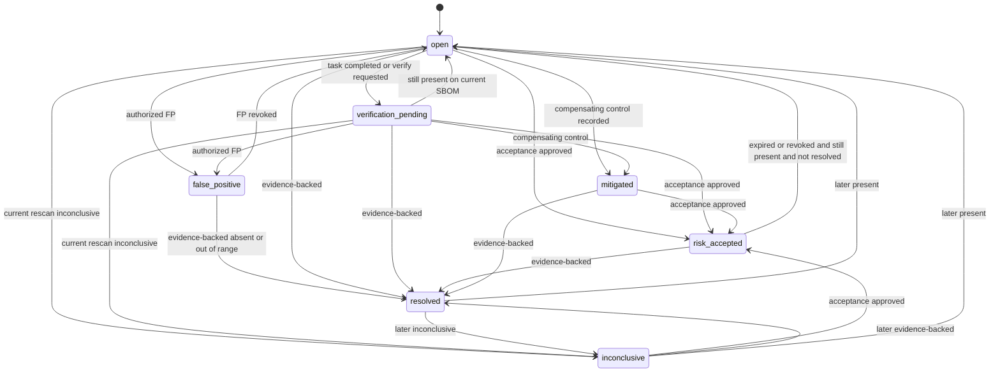

# Finding lifecycle

A **finding** is the tenant-owned link between an asset's observed component identity (from SBOMs) and a **vulnerability record**, plus later enrichment pointers and scores. Canonical fields: [domain model](domain-model.md#finding). Architecture: [ADR 0026](../adr/0026-authoritative-match-evidence-and-finding-lifecycle.md).

**Resolved** is a **calculated conclusion** that requires stored evidence. It is not implied by **RemediationTask** completion, a compensating control description, or archive of an asset by itself.

Session 8 ([ADR 0020](../adr/0020-sbom-ingestion-graph-completion.md)) may mark an ingestion `completed` after evidence verification and graph persist **without** creating findings. `graphCompleteness` values `empty` and `no_dependencies` are not remediation evidence: `empty` does not mean the Asset contains no software, and `no_dependencies` does not prove the software has no dependencies. Future correlation is a separate additive workflow.

This document is lifecycle **architecture**. Session 11 and Session 12 remain zero-Finding. No matcher, match-evaluation persistence, Finding ensure, observation ensure, or Finding-write runtime exists. Session 13 is the earliest candidate for writes and is not authorized by ADR acceptance.

## Identity

Stable natural key ([ADR 0026](../adr/0026-authoritative-match-evidence-and-finding-lifecycle.md)):

`organizationId` + `assetId` + `componentId` + `vulnerabilityId`.

That is one vulnerability advisory affecting one versionless tenant **Component** on one tenant **Asset**. Existing uniqueness `finding_identity_key` already matches this key. Do not modify the schema in Session 11.

`componentId` is the versionless tenant Component UUID. Session 8 inventory identity remains a versionless PURL or ecosystem + namespace + name. Matching identity is the closed, ecosystem-aware model in [ADR 0025](../adr/0025-ecosystem-aware-package-identity-and-version-evaluation.md); a free-form display name or unparsed PURL is not the matching key. Qualifiers and subpath are stripped in Session 8 inventory persistence; ADR 0025 forbids silently dropping security-relevant qualifiers during **matching**. A versioned PURL (`pkg:npm/foo@1.2.3`) must not be the finding key.

`vulnerabilityId` is the global **Vulnerability** advisory UUID. Today that row is OSV-keyed by required unique `osvId`. The Finding key is not the OSV id string column, not CVE, and not **CveIdentity**.

Not part of the Finding natural key: **ComponentOccurrence** ID, SBOM ID, SBOM ingestion ID, CVE, **CveIdentity**, OSV source-record revision, KEV membership, or package version.

CVE and GHSA aliases are **not** part of the identity key. Two **Vulnerability** rows that share one CVE remain two Findings when both are authoritatively matched. Do not merge advisories. If a CVE is published after the finding exists, update the **Vulnerability** aliases or canonical links; do not open a second finding for the same advisory.

Version of the package is **not** part of finding identity. A newer ingestion that lists another version of the same component+advisory pair adds a **FindingObservation** for that ingestion rather than creating a second finding. Multiple occurrences of the same versionless component on one asset contribute to one Finding. Several affected versions in one current ingestion still produce one Finding. The same component on two assets, or in two Organizations, produces isolated Findings.

## Creation

A Finding may eventually be created only from a deterministic `affected` result produced by an approved [ADR 0025](../adr/0025-ecosystem-aware-package-identity-and-version-evaluation.md) evaluator, with append-only match evidence, a `present` observation on the current eligible ingestion, and every [ADR 0026](../adr/0026-authoritative-match-evidence-and-finding-lifecycle.md) creation gate. Unknown, unsupported, malformed, withdrawn, or incomplete evaluation does not create a Finding. KEV membership does not create a Finding. CVE identity does not create a Finding.

A newly created Finding begins `open` only when the current eligible ingestion has an `affected` evaluation and a `present` observation. Initial state is not derived from KEV, CISA `requiredAction`, provider severity, risk policy, or remediation. `currentRiskCalculationId` may remain null. Provider dates must not populate `Finding.dueAt`. An `absent` or `inconclusive` observation must not create a Finding.

## Evaluated states (recommended list)

Each candidate must have distinct operational meaning. Assignment workflow lives on **RemediationTask**, not on the finding.

| Candidate | v0.1 finding state? | Rationale |
| --- | --- | --- |
| OPEN | yes → `open` | Default while observed and not in an exclusive state |
| TRIAGED | no | No distinct data; notes can live on the task |
| ASSIGNED | no | **RemediationTask** `assigned` |
| IN_PROGRESS | no | **RemediationTask** `in_progress` |
| FIX_SUBMITTED | no | Recorded as task activity; verification is separate |
| VERIFICATION_PENDING | yes → `verification_pending` | Task completed (or verify requested); waiting for conclusive SBOM evidence |
| RESOLVED | yes → `resolved` | Evidence-backed absence / out-of-range / allowed decommission path |
| MITIGATED | yes → `mitigated` | Compensating control recorded; component still present; not accepted risk and not resolved |
| RISK_ACCEPTED | yes → `risk_accepted` | Time-boxed acceptance with approver |
| FALSE_POSITIVE | yes → `false_positive` | Authorized decision that the *match* is wrong |
| DEFERRED | no | Use **RiskAcceptance** with expiry |
| REOPENED | no | Transition into `open`, not a state |
| (prior `in_remediation`) | removed | Duplicated the task |

Additional v0.1 state: `inconclusive` — latest compare cannot decide; must not display as fixed.

## States

`open`, `verification_pending`, `risk_accepted`, `mitigated`, `false_positive`, `resolved`, `inconclusive`.

If the diagram is not rendered, the transition table is authoritative.

## Who may transition

| Transition | Actor | Required fields |
| --- | --- | --- |
| Create `open` | system (correlation), only in a later authorized session | Observation `present`, deterministic `affected` match evaluation, vulnerability id, closed match method. Session 11 and Session 12 must not perform this write |
| → `verification_pending` | system when task → `completed` **and** finding is `open`, or `member`+ request verify **from `open`** | Task id or reason. Must **not** run if finding is `risk_accepted`, `mitigated`, or `false_positive` |
| → `risk_accepted` | system when **RiskAcceptance** becomes `active` | See [remediation-lifecycle.md](remediation-lifecycle.md) (requester, approver, expiry) |
| → `mitigated` | `admin` or `owner` | Compensating-control **Evidence** id, reason |
| → `false_positive` | `admin` or `owner` | Reason; optional evidence; does **not** delete intel |
| → `resolved` | system only | Stored observation or verification record meeting evidence rules below |
| → `inconclusive` | system | Observation `inconclusive` with method, and occupancy rules (does not clobber `risk_accepted` / `mitigated` / `false_positive`) |
| → `open` (reopen) | system on `present` after `resolved`/`inconclusive` (not from `risk_accepted`/`mitigated`/`false_positive` while those still apply); or `admin`/`owner` revoking FP/mitigated/acceptance | |

Due dates are **calculated recommendations** on **RiskCalculation**, not a finding state. Overdue does not auto-transition.

## Allowed transitions (summary)

| From | To | Trigger | Kind |
| --- | --- | --- | --- |
| (create) | `open` | A later authorized session created the finding from a `present` observation backed by deterministic `affected` evaluation | Calculated from intel + SBOM. Not Session 11 or Session 12 |
| `open` | `verification_pending` | Remediation task `completed` or verify requested | Workflow |
| `verification_pending` | `open` | Current ingestion's conclusive observation is `present` | Calculated |
| `open` / `verification_pending` / `mitigated` / `inconclusive` | `risk_accepted` | Acceptance `active` | Workflow |
| `risk_accepted` | `open` | Acceptance `expired`/`revoked`/`superseded` without replacement, current observation `present`, and finding is not `resolved` | Workflow |
| `open` / `verification_pending` | `mitigated` | Compensating control recorded | Workflow |
| `open` / `verification_pending` | `false_positive` | Authorized FP | Workflow |
| `false_positive` | `open` | FP revoked | Workflow |
| `mitigated` | `open` | Control withdrawn | Workflow |
| `open`, `verification_pending`, `risk_accepted`, `mitigated`, `inconclusive`, `false_positive` | `resolved` | Evidence-backed resolution (below) | Calculated / evidenced |
| `open`, `verification_pending` | `inconclusive` | Current completed ingestion yields `inconclusive` | Calculated |
| `resolved` | `open` | Later **current** ingestion yields `present` | Calculated |
| `resolved` | `inconclusive` | Later **current** ingestion yields `inconclusive` | Calculated |
| `inconclusive` | `open` | Later **current** ingestion yields `present` | Calculated |

### Workflow vs calculated occupancy

A finding has one current state. For the **current** eligible completed ingestion, one **FindingObservation** is ensured per existing Finding. Observation rows do **not** always change finding state. A superseded completed ingestion must not update `lastObservedAt`, Finding state, or `Asset.lastSuccessfulSbomIngestionId`. Historical observation retention for a never-current superseded ingestion follows [ADR 0026](../adr/0026-authoritative-match-evidence-and-finding-lifecycle.md) and is not current occupancy.

When applying the **current** completed ingestion (defined below):

1. If resolution evidence rules are met → `resolved` (including from `risk_accepted`; the acceptance row stays until expiry/revoke and must **not** reopen a `resolved` finding).
2. Else if observation is `inconclusive`: keep `risk_accepted`, `mitigated`, and `false_positive`. Only `open` and `verification_pending` (and `resolved`) may move to `inconclusive`.
3. Else if observation is `present`: keep `risk_accepted` (while acceptance `active`), `mitigated` (while control not withdrawn), and `false_positive` (until revoked). Move `verification_pending` → `open`. Reopen `resolved` → `open`.
4. Task `completed` or verify requested → `verification_pending` **only from `open`**. Do not displace `risk_accepted`, `mitigated`, or `false_positive`.

`false_positive` remains until revoked **or** evidence-backed `resolved`. New **FindingObservation** rows are ensured for the current eligible completed ingestion. UI must not label FP as remediated.

When `risk_accepted` and evidence supports `resolved`, the finding becomes `resolved`. The acceptance row remains historical (`active` until expiry, then `expired` with **no** finding reopen if already `resolved`).

### Disallowed

- Task `completed` → `resolved`
- Manual `resolved` without stored evidence
- Transitions from quarantined/failed ingestions
- Cross-organization merge
- Permanent risk acceptance (no `expiresAt`)

## FindingObservation

**FindingObservation** is one immutable observation of one logical Finding under one completed SBOM ingestion ([ADR 0026](../adr/0026-authoritative-match-evidence-and-finding-lifecycle.md)). Natural key: `(organizationId, findingId, sbomIngestionId)`. That uniqueness already exists. One ingestion may contain multiple occurrences of the same component; the observation summarizes the Finding-level result. It is not one row per occurrence.

Each **current eligible** completed SBOM ingestion for the asset may produce one observation per existing finding and, in a later authorized session, create findings for new `present` matches. A superseded completed ingestion must not create a Finding or change current occupancy. Historical evaluation or observation retention for that ingestion requires the later persistence review in [ADR 0026](../adr/0026-authoritative-match-evidence-and-finding-lifecycle.md). Observations are never rewritten or deleted through ordinary application behavior. Replay ensures the existing row.

A future append-only **VulnerabilityMatchEvaluation** (not implemented) records the deterministic evaluation of one occurrence against one pinned provider revision. Only an `affected` evaluation may contribute to Finding creation. Negative evaluations do not create, reopen, or by themselves close a Finding.

**Current ingestion:** among ingestions in state `completed` for the asset, the one whose SBOM `receivedAt` is greatest (tie-break ingestion `createdAt`, then ingestion `id`), stored as `Asset.lastSuccessfulSbomIngestionId`. Completing an **older** upload still persists that ingestion's graph and may retain historical evaluations or observations; it must **not** update `lastSuccessfulSbomIngestionId`, `lastObservedAt`, or finding state. "Latest completed" never means last worker to finish. Failed, quarantined, or partial ingestions cannot create observations that change current Finding state. Session 13 must apply this existing pointer before Finding writes; do not invent timestamp-only authority.

| `result` | Meaning |
| --- | --- |
| `present` | At least one eligible current occurrence for the Finding's component and advisory evaluates `affected` (supported ecosystem, known version, positive match evaluation). Other occurrences that are `indeterminate` or `unsupported` do not veto `present` |
| `absent` | Every relevant occurrence in an adequately covered completed ingestion is authoritatively `not_affected`, or the component is authoritatively not present |
| `inconclusive` | No eligible occurrence is `affected`, and the ingestion cannot establish `absent` (missing ecosystem/PURL, unknown version, unsupported evaluation, parse gaps, remaining `indeterminate` occurrences, or **coverage inadequate**) |

Do **not** record `absent` when version is unknown, evaluation is unsupported, provider data is malformed, ingestion is incomplete, coverage is inadequate, a relevant occurrence is `indeterminate`, or a relevant occurrence remains `affected`. Do **not** record `inconclusive` when any eligible occurrence is `affected`. Inconclusive must not create a new Finding and must not automatically resolve an existing Finding.

`method` must be a closed, versioned catalog at implementation. Architectural examples: `affected_version_match`, `explicit_version_match`, `version_out_of_affected_range`, `component_not_observed`, `unsupported_ecosystem`, `unknown_version`, `insufficient_coverage`, `withdrawn_advisory`. Do not store free-form provider text as the authoritative method. Earlier sketches such as `exact_purl` are historical examples until Session 13 selects the catalog.

Inconclusive must not be displayed as "fixed."

When an existing Finding is present again in a later authoritative ingestion: do not create a new Finding; ensure one new observation for that ingestion; update `lastObservedAt` only if the ingestion is newer and eligible; preserve `firstObservedAt` and prior observations; do not rewrite prior match evaluations; do not duplicate audit on replay; do not change risk acceptance or `dueAt` from provider data.

A version change on the same Asset and versionless Component retains the same Finding, creates a new occurrence and match evaluation, and produces one observation for the new ingestion. An upgrade that is authoritatively `not_affected` may make the current observation `absent`. It does not delete the Finding.

## Remediation verification (evidence to `resolved`)

| Situation | May set `resolved`? | Evidence | Confidence |
| --- | --- | --- | --- |
| Component no longer present | yes, if coverage adequate | Observation `absent` on the **current** completed ingestion **and** compare method shows identity could have been seen | `high` if PURL/ecosystem+name stable across ingestions |
| Component upgraded outside affected range | yes, if **every** occurrence of that **versionless** identity on the **current** completed ingestion is outside the affected range (or absent) | Observation method `version_out_of_affected_range`; if **any** occurrence remains in range → remain `present`, do not `resolved` | `high` when range parse succeeded for all occurrences; else `inconclusive` |
| Advisory withdrawn | no by itself | Persist or derive a `withdrawn` evaluation; finding remains until later lifecycle policy or reviewer action | Withdrawal is intel, not asset evidence. Do not auto-`resolved` |
| VEX not-affected | **future** | Not MVP ([non-goals](../product/non-goals.md) extra formats) | — |
| Compensating mitigation | no | State `mitigated` + **Evidence**; component still present | Claim only |
| False-positive determination | no | State `false_positive`; intel remains | Match challenged, not remediated |
| Asset decommissioning | only with explicit verify | Asset `archived` **plus** `admin`/`owner` verification reason `asset_decommissioned` stored as **Evidence**; not implied by archive alone | `medium` |
| Newer SBOM omits component, coverage poor | no | Observation `inconclusive` / `incomplete_sbom_coverage` | Absence is **not** proof |

**Incomplete inventory:** do **not** record `absent` (and therefore do not `resolved` from absence) when coverage is inadequate. Initial **configurable proposals** (validate before treating as defaults):

- Component count drops by ≥50% versus the previous **completed** graph.
- The previous completed SBOM recorded dependency edges and the new one has none (or far fewer than a configurable ratio).
- The compare method is weaker than the previous observation (for example previous used PURL, new SBOM has name only).

Treat those missing former components as `inconclusive` / `incomplete_sbom_coverage`, not `absent`. Same component count does not prove completeness; it only avoids this particular heuristic. Session 8 `completed` does not imply exhaustive coverage and does not by itself support `resolved`.

Withdrawn vulnerabilities: do not auto-`resolved`. Changed severity or KEV: new **RiskCalculation** only, and only under a later published policy; matching must not enqueue `finding.recalculate`. KEV membership must not create, close, or reopen a Finding and must not set `Finding.dueAt`. Unsupported/archived assets: no new uploads; existing findings remain until verification rules apply. Findings are not deleted because a component disappears, a version upgrades, an advisory withdraws, KEV changes, risk is accepted, the issue is mitigated, the Finding is false positive, or the Asset is archived.

## Intelligence changes vs state

| Change | Finding state | Calculation |
| --- | --- | --- |
| New/removed KEV | unchanged except via policy factors | new **RiskCalculation** `intel_refresh` |
| Severity change on source record | unchanged | new calculation |
| Withdrawn advisory | unchanged | new calculation with factor |

## Priority history

`currentRiskCalculationId` points at the latest calculation. Previous **RiskCalculation** rows remain. Changing finding state does not rewrite scores.

## Authorization and jobs

Finding reads and mutations require organization scope. Recalculation jobs, if a later ADR authorizes them, reload the finding and confirm `organizationId` before insert. Session 11 and Session 12 must not enqueue `finding.recalculate`. [ADR 0026](../adr/0026-authoritative-match-evidence-and-finding-lifecycle.md) does not authorize that event.

Due dates on the Finding row are tenant workflow data. CISA KEV `dueDate` / `requiredAction` and OSV provider dates must never populate or modify `Finding.dueAt` automatically.

## Related documents

- [ADR 0026](../adr/0026-authoritative-match-evidence-and-finding-lifecycle.md)
- [Remediation lifecycle](remediation-lifecycle.md)
- [Risk policy](risk-policy.md)
- [SBOM ingestion](sbom-ingestion.md)
