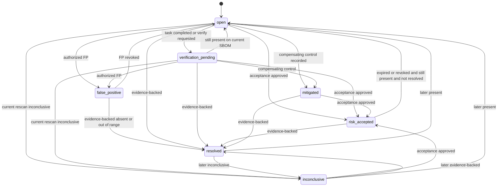

# Finding lifecycle

A **finding** is the tenant-owned link between an asset's observed component identity (from SBOMs) and a **vulnerability record**, plus later enrichment pointers and scores. Canonical fields: [domain model](domain-model.md#finding).

**Resolved** is a **calculated conclusion** that requires stored evidence. It is not implied by **RemediationTask** completion, a compensating control description, or archive of an asset by itself.

Session 8 ([ADR 0020](../adr/0020-sbom-ingestion-graph-completion.md)) may mark an ingestion `completed` after evidence verification and graph persist **without** creating findings. `graphCompleteness` values `empty` and `no_dependencies` are not remediation evidence: `empty` does not mean the Asset contains no software, and `no_dependencies` does not prove the software has no dependencies. Future correlation is a separate additive workflow.

## Identity

Stable identity:

`organizationId` + `assetId` + **versionless** component identity + vulnerability identity (**OSV id**).

Versionless component identity is CycloneDX/PURL **type + namespace + name**, or ecosystem + namespace + name when no versionless PURL can be parsed, for **current inventory and Finding-identity sketches**. **Strip `@version` from a PURL** before using it as Component identity. Qualifiers and subpath are stripped in Session 8 inventory persistence; [ADR 0025](../adr/0025-ecosystem-aware-package-identity-and-version-evaluation.md) forbids silently dropping security-relevant qualifiers during **matching**. Future matching identity is ecosystem-aware and registry-controlled. A versioned PURL (`pkg:npm/foo@1.2.3`) must not be the finding key — that would mint a new finding on every upgrade and break rescan. Finding identity remains future ADR 0026.

CVE and GHSA aliases are **not** part of the identity key. If a CVE is published after the finding exists, update the **Vulnerability** aliases; do not open a second finding.

Version of the package is **not** part of finding identity. A newer ingestion that lists another version of the same package+vuln pair updates **FindingObservation** (`present` with a new occurrence) rather than always creating a second finding. If product later needs version-scoped findings, that requires an ADR.

## Evaluated states (recommended list)

Each candidate must have distinct operational meaning. Assignment workflow lives on **RemediationTask**, not on the finding.

| Candidate | v0.1 finding state? | Rationale |
| --- | --- | --- |
| OPEN | yes → `open` | Default while observed and not in an exclusive state |
| TRIAGED | no | No distinct data; notes can live on the task |
| ASSIGNED | no | **RemediationTask** `assigned` |
| IN_PROGRESS | no | **RemediationTask** `in_progress` |
| FIX_SUBMITTED | no | Recorded as task activity; verification is separate |
| VERIFICATION_PENDING | yes → `verification_pending` | Task completed (or verify requested); waiting for conclusive SBOM evidence |
| RESOLVED | yes → `resolved` | Evidence-backed absence / out-of-range / allowed decommission path |
| MITIGATED | yes → `mitigated` | Compensating control recorded; component still present; not accepted risk and not resolved |
| RISK_ACCEPTED | yes → `risk_accepted` | Time-boxed acceptance with approver |
| FALSE_POSITIVE | yes → `false_positive` | Authorized decision that the *match* is wrong |
| DEFERRED | no | Use **RiskAcceptance** with expiry |
| REOPENED | no | Transition into `open`, not a state |
| (prior `in_remediation`) | removed | Duplicated the task |

Additional v0.1 state: `inconclusive` — latest compare cannot decide; must not display as fixed.

## States

`open`, `verification_pending`, `risk_accepted`, `mitigated`, `false_positive`, `resolved`, `inconclusive`.

If the diagram is not rendered, the transition table is authoritative.

## Who may transition

| Transition | Actor | Required fields |
| --- | --- | --- |
| Create `open` | system (correlation) | Observation `present`, vulnerability id, match method |
| → `verification_pending` | system when task → `completed` **and** finding is `open`, or `member`+ request verify **from `open`** | Task id or reason. Must **not** run if finding is `risk_accepted`, `mitigated`, or `false_positive` |
| → `risk_accepted` | system when **RiskAcceptance** becomes `active` | See [remediation-lifecycle.md](remediation-lifecycle.md) (requester, approver, expiry) |
| → `mitigated` | `admin` or `owner` | Compensating-control **Evidence** id, reason |
| → `false_positive` | `admin` or `owner` | Reason; optional evidence; does **not** delete intel |
| → `resolved` | system only | Stored observation or verification record meeting evidence rules below |
| → `inconclusive` | system | Observation `inconclusive` with method, and occupancy rules (does not clobber `risk_accepted` / `mitigated` / `false_positive`) |
| → `open` (reopen) | system on `present` after `resolved`/`inconclusive` (not from `risk_accepted`/`mitigated`/`false_positive` while those still apply); or `admin`/`owner` revoking FP/mitigated/acceptance | |

Due dates are **calculated recommendations** on **RiskCalculation**, not a finding state. Overdue does not auto-transition.

## Allowed transitions (summary)

| From | To | Trigger | Kind |
| --- | --- | --- | --- |
| (create) | `open` | Correlation created the finding from a `present` observation | Calculated from intel + SBOM |
| `open` | `verification_pending` | Remediation task `completed` or verify requested | Workflow |
| `verification_pending` | `open` | Current ingestion's conclusive observation is `present` | Calculated |
| `open` / `verification_pending` / `mitigated` / `inconclusive` | `risk_accepted` | Acceptance `active` | Workflow |
| `risk_accepted` | `open` | Acceptance `expired`/`revoked`/`superseded` without replacement, current observation `present`, and finding is not `resolved` | Workflow |
| `open` / `verification_pending` | `mitigated` | Compensating control recorded | Workflow |
| `open` / `verification_pending` | `false_positive` | Authorized FP | Workflow |
| `false_positive` | `open` | FP revoked | Workflow |
| `mitigated` | `open` | Control withdrawn | Workflow |
| `open`, `verification_pending`, `risk_accepted`, `mitigated`, `inconclusive`, `false_positive` | `resolved` | Evidence-backed resolution (below) | Calculated / evidenced |
| `open`, `verification_pending` | `inconclusive` | Current completed ingestion yields `inconclusive` | Calculated |
| `resolved` | `open` | Later **current** ingestion yields `present` | Calculated |
| `resolved` | `inconclusive` | Later **current** ingestion yields `inconclusive` | Calculated |
| `inconclusive` | `open` | Later **current** ingestion yields `present` | Calculated |

### Workflow vs calculated occupancy

A finding has one current state. **FindingObservation** rows are always inserted for the ingestion that just completed. Observation rows do **not** always change finding state.

When applying the **current** completed ingestion (defined below):

1. If resolution evidence rules are met → `resolved` (including from `risk_accepted`; the acceptance row stays until expiry/revoke and must **not** reopen a `resolved` finding).
2. Else if observation is `inconclusive`: keep `risk_accepted`, `mitigated`, and `false_positive`. Only `open` and `verification_pending` (and `resolved`) may move to `inconclusive`.
3. Else if observation is `present`: keep `risk_accepted` (while acceptance `active`), `mitigated` (while control not withdrawn), and `false_positive` (until revoked). Move `verification_pending` → `open`. Reopen `resolved` → `open`.
4. Task `completed` or verify requested → `verification_pending` **only from `open`**. Do not displace `risk_accepted`, `mitigated`, or `false_positive`.

`false_positive` remains until revoked **or** evidence-backed `resolved`. New **FindingObservation** rows are always written. UI must not label FP as remediated.

When `risk_accepted` and evidence supports `resolved`, the finding becomes `resolved`. The acceptance row remains historical (`active` until expiry, then `expired` with **no** finding reopen if already `resolved`).

### Disallowed

- Task `completed` → `resolved`
- Manual `resolved` without stored evidence
- Transitions from quarantined/failed ingestions
- Cross-organization merge
- Permanent risk acceptance (no `expiresAt`)

## FindingObservation

Each **completed** SBOM ingestion for the asset produces an observation per existing finding (keyed by `sbomIngestionId`) and creates findings for new present matches.

**Current ingestion:** among ingestions in state `completed` for the asset, the one whose SBOM `receivedAt` is greatest (tie-break ingestion `createdAt`, then ingestion `id`). Completing an **older** upload still persists that ingestion's graph and observations; it must **not** update `lastSuccessfulSbomIngestionId`, `lastObservedAt`, or finding state. "Latest completed" never means last worker to finish.

| `result` | Meaning |
| --- | --- |
| `present` | Component identity observed with a recorded method |
| `absent` | Identity not observed; method confirms the compare was possible **and** coverage was adequate |
| `inconclusive` | Missing ecosystem/PURL, parse gaps, matcher cannot decide, or **coverage inadequate** |

`method` examples: `exact_purl`, `ecosystem_name_version`, `version_out_of_affected_range`, `missing_component_identity`, `incomplete_sbom_coverage`.

Inconclusive must not be displayed as "fixed."

## Remediation verification (evidence to `resolved`)

| Situation | May set `resolved`? | Evidence | Confidence |
| --- | --- | --- | --- |
| Component no longer present | yes, if coverage adequate | Observation `absent` on the **current** completed ingestion **and** compare method shows identity could have been seen | `high` if PURL/ecosystem+name stable across ingestions |
| Component upgraded outside affected range | yes, if **every** occurrence of that **versionless** identity on the **current** completed ingestion is outside the affected range (or absent) | Observation method `version_out_of_affected_range`; if **any** occurrence remains in range → remain `present`, do not `resolved` | `high` when range parse succeeded for all occurrences; else `inconclusive` |
| Advisory withdrawn | no by itself | New calculation with `advisory_withdrawn`; finding may remain `open` | Withdrawal is intel, not asset evidence |
| VEX not-affected | **future** | Not MVP ([non-goals](../product/non-goals.md) extra formats) | — |
| Compensating mitigation | no | State `mitigated` + **Evidence**; component still present | Claim only |
| False-positive determination | no | State `false_positive`; intel remains | Match challenged, not remediated |
| Asset decommissioning | only with explicit verify | Asset `archived` **plus** `admin`/`owner` verification reason `asset_decommissioned` stored as **Evidence**; not implied by archive alone | `medium` |
| Newer SBOM omits component, coverage poor | no | Observation `inconclusive` / `incomplete_sbom_coverage` | Absence is **not** proof |

**Incomplete inventory:** do **not** record `absent` (and therefore do not `resolved` from absence) when coverage is inadequate. Initial **configurable proposals** (validate before treating as defaults):

- Component count drops by ≥50% versus the previous **completed** graph.
- The previous completed SBOM recorded dependency edges and the new one has none (or far fewer than a configurable ratio).
- The compare method is weaker than the previous observation (for example previous used PURL, new SBOM has name only).

Treat those missing former components as `inconclusive` / `incomplete_sbom_coverage`, not `absent`. Same component count does not prove completeness; it only avoids this particular heuristic. Session 8 `completed` does not imply exhaustive coverage and does not by itself support `resolved`.

Withdrawn vulnerabilities: do not auto-`resolved`. Changed severity or KEV: new **RiskCalculation** only. Unsupported/archived assets: no new uploads; existing findings remain until verification rules apply.

## Intelligence changes vs state

| Change | Finding state | Calculation |
| --- | --- | --- |
| New/removed KEV | unchanged except via policy factors | new **RiskCalculation** `intel_refresh` |
| Severity change on source record | unchanged | new calculation |
| Withdrawn advisory | unchanged | new calculation with factor |

## Priority history

`currentRiskCalculationId` points at the latest calculation. Previous **RiskCalculation** rows remain. Changing finding state does not rewrite scores.

## Authorization and jobs

Finding reads and mutations require organization scope. Recalculation jobs reload the finding and confirm `organizationId` before insert.

## Related documents

- [Remediation lifecycle](remediation-lifecycle.md)
- [Risk policy](risk-policy.md)
- [SBOM ingestion](sbom-ingestion.md)
