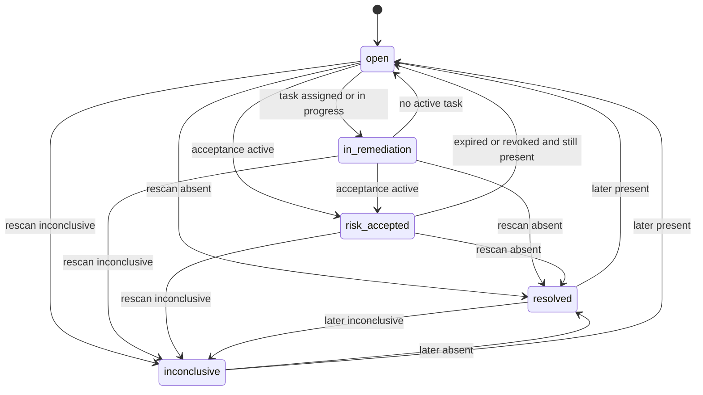

# Finding lifecycle

A **finding** is the tenant-owned link between an asset's observed component identity (from SBOMs) and a **vulnerability record**, plus later enrichment pointers and scores. Canonical fields: [domain model](domain-model.md#finding).

**Resolved (on rescan)** is a **calculated conclusion**. It is not implied by **RemediationTask** completion or by a compensating control description.

## Identity

Stable identity:

`organizationId` + `assetId` + component identity (PURL if parseable, else ecosystem + name) + vulnerability identity (OSV id, CVE when known).

Version is **not** part of finding identity. A newer SBOM that lists another version of the same package+vuln pair updates **FindingObservation** (`present` with a new occurrence) rather than always creating a second finding. If product later needs version-scoped findings, that requires an ADR.

## States

States: `open`, `in_remediation`, `risk_accepted`, `resolved`, `inconclusive`.

If the diagram is not rendered, the transition table is authoritative.

## Allowed transitions

| From | To | Trigger | Kind |
| --- | --- | --- | --- |
| (create) | `open` | Correlation created the finding from a `present` observation | Calculated from intel + SBOM |
| `open` | `in_remediation` | At least one **RemediationTask** is `assigned`, `in_progress`, or `blocked` | Workflow |
| `in_remediation` | `open` | No remaining task in `assigned`, `in_progress`, or `blocked` (`completed`/`cancelled` only) | Workflow |
| `open` | `risk_accepted` | **RiskAcceptance** `active` | Workflow |
| `in_remediation` | `risk_accepted` | **RiskAcceptance** `active` (tasks may continue) | Workflow |
| `risk_accepted` | `open` | Acceptance `expired`, `revoked`, or `superseded` with no replacement, and latest conclusive observation is `present` | Workflow |
| `open`, `in_remediation`, `risk_accepted`, `inconclusive` | `resolved` | Latest **completed** SBOM ingestion for the asset yields observation `absent` | Calculated |
| `open`, `in_remediation`, `risk_accepted` | `inconclusive` | Latest completed ingestion yields `inconclusive` | Calculated |
| `resolved` | `open` | Later completed ingestion yields `present` | Calculated |
| `resolved` | `inconclusive` | Later completed ingestion yields `inconclusive` | Calculated |
| `inconclusive` | `open` | Later completed ingestion yields `present` | Calculated |

### Disallowed

- `completed` task → `resolved`
- Operator manually setting `resolved` without a stored `absent` observation
- Transitions from a quarantined or failed ingestion
- Cross-organization merge of findings

When `risk_accepted` and rescan is `absent`, the finding becomes `resolved`. The acceptance row remains historical (`active` until expiry unless revoked). UI must show both: previously accepted, currently absent on rescan.

## FindingObservation

Each completed SBOM ingestion for the asset produces an observation per existing finding (and creates findings for new present matches).

| `result` | Meaning |
| --- | --- |
| `present` | Component identity observed with a recorded method |
| `absent` | Identity not observed; method confirms the compare was possible |
| `inconclusive` | Missing ecosystem/PURL on the new document, parse gaps, or matcher cannot decide |

`method` examples: `exact_purl`, `ecosystem_name`, `missing_component_identity`, `graph_truncated_rejected` (should not apply if ingestion rejected).

Inconclusive must not be displayed as "fixed."

## Enrichment versus score versus state

| Data | Type |
| --- | --- |
| Component identity, SBOM hash, source record id | Observed / recorded |
| KEV listed at enrichment time | Enrichment (observed catalog fact) |
| **Priority** | Calculated (**RiskCalculation**) |
| Finding `state` | Mix: workflow states vs rescan conclusions; UI labels them separately |

## Priority history

`currentRiskCalculationId` points at the latest calculation. Previous **RiskCalculation** rows remain. Changing finding state does not rewrite scores.

## Authorization and jobs

Finding reads and mutations require organization scope. Recalculation jobs reload the finding and confirm `organizationId` before insert.

## Related documents

- [Remediation lifecycle](remediation-lifecycle.md)
- [Risk policy](risk-policy.md)
- [SBOM ingestion](sbom-ingestion.md)
