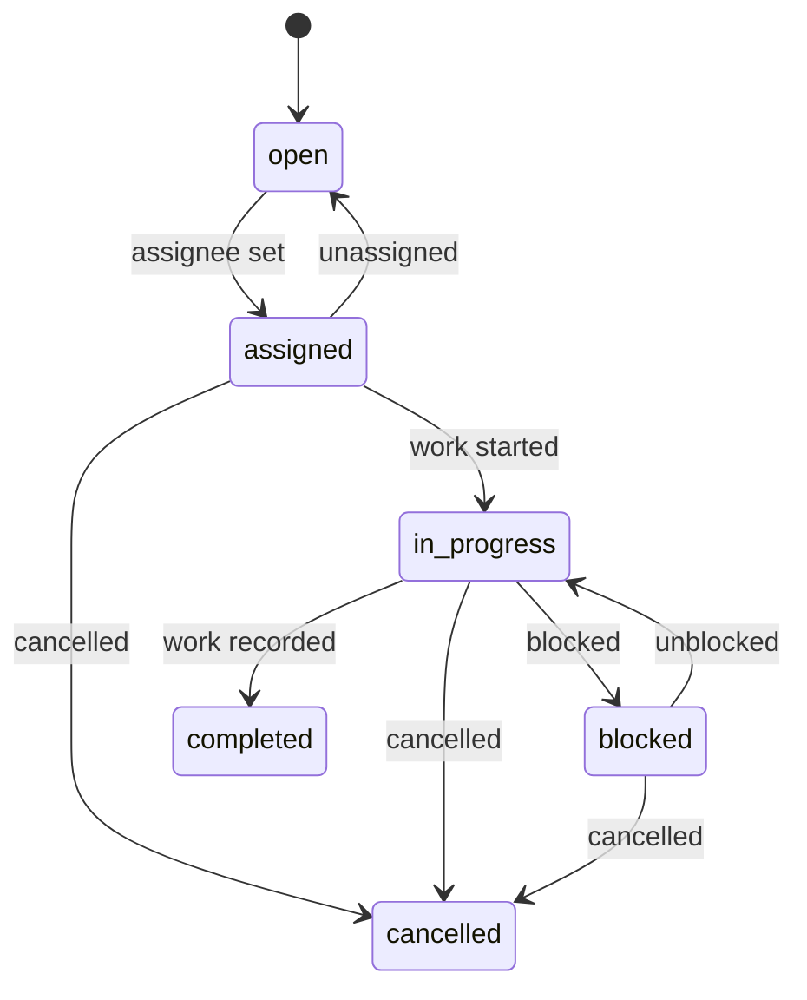

# Remediation lifecycle

This document defines **RemediationTask** and **RiskAcceptance** states. Completing work records **remediation activity**. It does not prove the vulnerable component is gone. **Resolved (on rescan)** lives on the [finding](finding-lifecycle.md).

## RemediationTask

Assigned **remediation work** inside one organization, pointing at one **Finding**.

### States

`open`, `assigned`, `in_progress`, `blocked`, `completed`, `cancelled`.

### Allowed transitions

| From | To | Actor | Guard |
| --- | --- | --- | --- |
| (create) | `open` | `member`+ | Finding in authorized org; finding not required to be `open` (may already be `risk_accepted`) |
| `open` | `assigned` | `member`+ | Assignee is a non-revoked member of the same organization |
| `assigned` | `open` | `member`+ | Unassign |
| `assigned` | `in_progress` | `member`+ | |
| `assigned` | `cancelled` | `member`+ | |
| `in_progress` | `blocked` | `member`+ | Reason required |
| `in_progress` | `completed` | `member`+ | Activity note required (what was done); not a new SBOM |
| `in_progress` | `cancelled` | `member`+ | |
| `blocked` | `in_progress` | `member`+ | |
| `blocked` | `cancelled` | `member`+ | |

`completed` and `cancelled` are terminal. Further work requires a **new** task.

### Disallowed

- Transition to `completed` implying finding `resolved`
- Assigning a user from another organization
- Updating a terminal task in place except for non-state metadata explicitly allowed later (v0.1: no edits; add activity via audit + optional notes only before terminal)

Each transition emits **AuditEvent** `remediation_task.transition` (or more specific names listed in [audit-model.md](audit-model.md)).

Finding coupling: assignment lives on the **RemediationTask**. Completing a task moves the finding to `verification_pending` per [finding lifecycle](finding-lifecycle.md). `risk_accepted`, `mitigated`, and `false_positive` can coexist with tasks; UI shows both.

## RiskAcceptance

Explicit, auditable decision to accept residual risk on a **finding** (MVP scope is finding-level, not blanket asset-level). It never marks the **vulnerability** or finding as **resolved** / fixed.

### States

`active`, `expired`, `revoked`, `superseded`.

There is **no** permanent acceptance in v0.1.

### Allowed transitions

| From | To | Trigger |
| --- | --- | --- |
| (create as request) | `active` | `admin` or `owner` **approves**; `expiresAt` required |
| `active` | `expired` | Time passed `expiresAt` (system job, idempotent) |
| `active` | `revoked` | `admin` or `owner` |
| `active` | `superseded` | New acceptance created for the same finding |

A `member` may **request** (requester). Only `admin` or `owner` may **approve** (approver must be a different user when more than one eligible actor exists; solo-owner orgs may approve their own request — record that fact). Amendments do not edit reason in place. A new row is inserted; the previous becomes `superseded`.

### Required fields

| Field | Rule |
| --- | --- |
| Finding, organization | Authorized org; finding not used to "fix" intel |
| Requester user id | Membership in org |
| Approver user id | `admin` or `owner` |
| Reason | Required untrusted text |
| Compensating-control evidence ids | Optional claims |
| `validFrom` / `expiresAt` | Required UTC; `expiresAt` > `validFrom` |
| `reviewAt` | Required UTC; must be `< expiresAt`. Default proposal: 7 days before expiry when duration allows, else `validFrom` (configurable) |
| Supporting **Evidence** | Optional |
| Status | Lifecycle above |

Maximum duration is a **configurable initial recommendation**: 365 days. Operators may lower it. The product must reject missing `expiresAt` or missing `reviewAt`.

### Review and expiry jobs

- **Review job:** `reviewAt <= now` and `state = active` → emit audit `risk_acceptance.review_due` and surface the finding in a review queue. It does **not** auto-`resolved` or extend `expiresAt`.
- **Expiry job:** `expiresAt <= now` and `state = active` → `expired`, audit, finding state per [finding lifecycle](finding-lifecycle.md) (typically back to `open` if still `present`). Idempotent on acceptance id.

## Compensating controls

Stored as **Evidence** `compensating_control` plus audit. Finding may move to `mitigated` (still observed). Default policy does not auto-change **priority** unless a published factor catalog includes a named, schema-checked control. Reviewers see the claim and the still-observed component separately from `resolved`.

## Re-scan after remediation

Operators upload a newer SBOM. Compare rules in [finding lifecycle](finding-lifecycle.md) decide `present` / `absent` / `inconclusive` and whether coverage is adequate. Task `completed` plus observation `absent` (or out-of-range) is the evidence-preserving story. Absence from an incomplete SBOM is not proof.

## Exports

Exports include task history, acceptance records, policy version, and observation results, labeled as PatchPilot outputs.

## Related documents

- [Finding lifecycle](finding-lifecycle.md)
- [Audit model](audit-model.md)
- [Risk policy](risk-policy.md)
