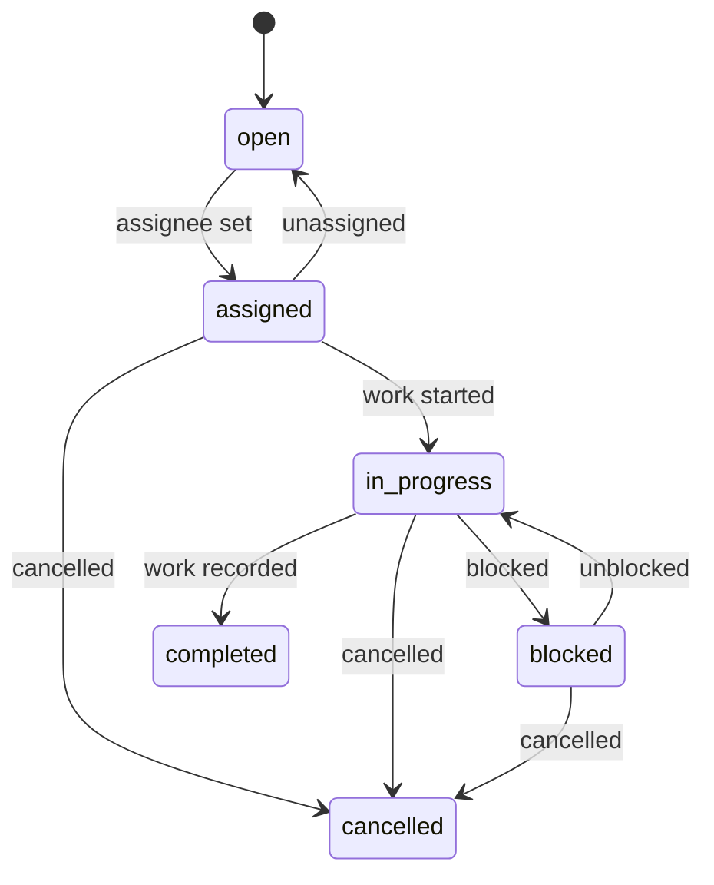

# Remediation lifecycle

This document defines **RemediationTask** and **RiskAcceptance** states. Completing work records **remediation activity**. It does not prove the vulnerable component is gone. **Resolved (on rescan)** lives on the [finding](finding-lifecycle.md).

## RemediationTask

Assigned **remediation work** inside one organization, pointing at one **Finding**.

### States

`open`, `assigned`, `in_progress`, `blocked`, `completed`, `cancelled`.

### Allowed transitions

| From | To | Actor | Guard |
| --- | --- | --- | --- |
| (create) | `open` | `member`+ | Finding in authorized org; finding not required to be `open` (may already be `risk_accepted`) |
| `open` | `assigned` | `member`+ | Assignee is a non-revoked member of the same organization |
| `assigned` | `open` | `member`+ | Unassign |
| `assigned` | `in_progress` | `member`+ | |
| `assigned` | `cancelled` | `member`+ | |
| `in_progress` | `blocked` | `member`+ | Reason required |
| `in_progress` | `completed` | `member`+ | Activity note required (what was done); not a new SBOM |
| `in_progress` | `cancelled` | `member`+ | |
| `blocked` | `in_progress` | `member`+ | |
| `blocked` | `cancelled` | `member`+ | |

`completed` and `cancelled` are terminal. Further work requires a **new** task.

### Disallowed

- Transition to `completed` implying finding `resolved`
- Assigning a user from another organization
- Updating a terminal task in place except for non-state metadata explicitly allowed later (v0.1: no edits; add activity via audit + optional notes only before terminal)

Each transition emits **AuditEvent** `remediation_task.transition` (or more specific names listed in [audit-model.md](audit-model.md)).

Finding state coupling: if any task is `assigned`, `in_progress`, or `blocked`, finding may be `in_remediation` unless `risk_accepted` takes display precedence as defined in finding lifecycle (`risk_accepted` can coexist with tasks).

## RiskAcceptance

Explicit, auditable decision to accept a finding for a defined reason and period.

### States

`active`, `expired`, `revoked`, `superseded`.

### Allowed transitions

| From | To | Trigger |
| --- | --- | --- |
| (create) | `active` | `admin` or `owner`; reason, `expiresAt` (UTC) required |
| `active` | `expired` | Time passed `expiresAt` (system job, idempotent) |
| `active` | `revoked` | `admin` or `owner` |
| `active` | `superseded` | New acceptance created for the same finding |

Amendments do not edit reason in place. A new row is inserted; the previous becomes `superseded`.

### Required fields

- Finding id, organization id, actor user id
- Reason (text; untrusted; stored and escaped)
- Period (`validFrom`, `expiresAt`)
- Optional compensating-control **Evidence** ids (claims, not automatic score override)

### Expiry job

A scheduled job loads acceptances with `expiresAt <= now` and `state = active`, transitions to `expired`, writes audit events, and updates finding state per [finding lifecycle](finding-lifecycle.md). Idempotent on acceptance id.

## Compensating controls

Stored as **Evidence** `compensating_control` plus audit. Default policy does not auto-change **priority**. Reviewers see the claim and the still-observed component.

## Re-scan after remediation

Operators upload a newer SBOM. Compare rules in finding lifecycle decide `present` / `absent` / `inconclusive`. Task `completed` plus `absent` is the evidence-preserving story: work was recorded **and** the component was not observed later.

## Exports

Exports include task history, acceptance records, policy version, and observation results, labeled as PatchPilot outputs.

## Related documents

- [Finding lifecycle](finding-lifecycle.md)
- [Audit model](audit-model.md)
- [Risk policy](risk-policy.md)
