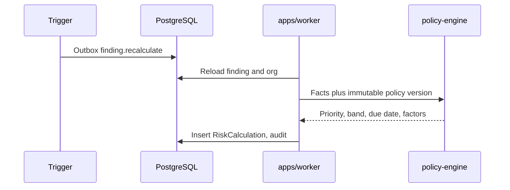

# Risk policy

This is the canonical design for explainable, versioned **priority** calculation. Engine decision: [ADR 0012](../adr/0012-explainable-policy-engine.md).

Until a later ADR splits the terms, **priority** and **risk score** mean the same stored ranking ([glossary](../product/glossary.md), [OD-7](open-decisions.md)).

AI must not set authoritative scores. Optional AI, if added later, may only draft non-authoritative text ([ADR 0017](../adr/0017-optional-ai-user-credentials.md)).

## Observed facts versus calculated values

| Observed facts (inputs) | Calculated conclusions (outputs) |
| --- | --- |
| Source severity / CVSS when provided | **Priority** integer |
| KEV listed boolean and catalog identity at enrichment time | **Priority band** |
| Asset environment `sensitivityClass` | Rank order among findings |
| Asset **business criticality** | **Due-date recommendation** (calendar days; not a SLA contract) |
| Internet exposure vocabulary | **Escalation recommendation** (boolean/label; not auto-notify in MVP) |
| Asset data classification vocabulary | |
| Direct vs transitive when the SBOM recorded it | |
| Fix available / affected range from OSV when present | |
| Finding age (`firstObservedAt` vs now, frozen in tests) | |
| Compensating control present (boolean if schema-checked evidence exists; default unused) | |
| Advisory withdrawn flag | |
| Policy version identifier used | Copied onto the calculation as evidence |

The engine must not treat **RemediationTask** state as a fact about the component. Completing work does not change inputs until a new SBOM observation exists.

Missing evidence is recorded as `unavailable` with **zero** favorable contribution. It must not be treated as "not internet facing" or "not KEV."

Default built-in policy does **not** treat compensating-control prose as a numeric factor. A future published policy may add a named factor only if the **Evidence** row matches a defined schema.

**Risk acceptance** does not rewrite **RiskCalculation**. It changes finding workflow state and default queue filters.

**Manual priority override** (authorized `admin`/`owner`): reason, expiration, and audit required. Inserts a new **RiskCalculation** with `calculationReason: manual_override` and stores the override as explicit factors (`manual_override=true`, actor id, expiresAt). It does not edit old rows. Override expiry restores ranking from a new non-override calculation. Overrides cannot call AI.

## Vulnerability severity versus remediation priority

| Term | Meaning |
| --- | --- |
| Vulnerability severity | Observed (or source-provided) severity on the intelligence record. Copied onto **RiskCalculation** as `severitySnapshot`. |
| Remediation **priority** | PatchPilot's calculated ranking for **this** finding under **this** policy version, including environment and KEV enrichment factors. |

UI, exports, and logs must not label priority as "CVSS" or as "exploitability proof." KEV is a factor, not proof of exploitation in the user's environment.

## Policy versions

- Built-in policy key: `patchpilot.builtin.v0`.
- Versions are monotonic integers per key. Published **RiskPolicy.definition** is immutable.
- Each **RiskCalculation** stores `riskPolicyId`, `policyVersion`, `policyDefinitionSha256` of the published definition, intel source record ids, **priority**, **priorityBand**, **dueDateRecommendationDays**, **escalationRecommendation**, `inputFingerprint`, and the full **contributingFactors** object used. Re-running the engine on those stored inputs plus the hashed definition must yield the same **priority** (and the same stored band/due-date/escalation).
- Application release version and policy version are independent. Release notes must mention policy version when scoring behavior changes.

## Contributing factors

Every calculation persists the **full set** of factors the engine received, including those with zero contribution and those marked `unavailable`.

Example shape (illustrative, not a live schema):

```text
factor_id, input_kind (observed|unavailable), raw_value, contribution, notes
source_severity, observed, CVSS 9.8, 35, from osv record uuid
kev_listed, observed, true, 40, catalog date and snapshot hash
environment, observed, production, 15, environment id
dependency_direct, unavailable, null, 0, SBOM omitted dependency section
```

Factors are the explanation. Do not persist only the final number.

## Ranking explanation (why A is above B)

The API must be able to compare two findings in the same organization by:

1. Same policy version (if versions differ, say so first).
2. Ordered factor contributions (highest absolute contribution first).
3. Tie-breakers defined in the policy (for example KEV then severity then finding id) so order is deterministic.

A comparison response is a **calculated** artifact. It cites stored factors; it does not call an LLM.

## Recalculation without erasure

Insert a new **RiskCalculation**. Reasons: `initial`, `rescan`, `intel_refresh`, `policy_change`, `asset_change`, `manual_recalc`, `manual_override`.

Never UPDATE factor blobs or priority in place. `currentRiskCalculationId` on the finding moves forward. History remains queryable. Users can diff two calculations to see why a score changed.



If the diagram is not rendered: triggers write an outbox event; the worker reloads tenant context; the engine is pure; a new row is inserted.

## Organization overrides

An organization `admin`/`owner` may publish an override **RiskPolicy** (tenant-owned) that clones the builtin factor catalog and changes weights within validated bounds.

Rules:

- Override applies only to **new** calculations after `publishedAt`.
- Historical calculations keep their policy version.
- Disable override → later calculations use builtin current version; history unchanged.
- Overrides cannot add AI, cannot fetch URLs, and cannot drop provenance fields.
- Publishing emits **AuditEvent** `risk_policy.published`.

## Engine isolation

`packages/policy-engine` is deterministic, pure, and side-effect free. Given the same facts and definition, tests must get the same priority.

It does not import Prisma, HTTP, or AI SDKs.

## v0.1 builtin factor catalog

The first published builtin version includes at least:

| Factor | Input | Contribution idea |
| --- | --- | --- |
| `source_severity` | Mapped from CVSS base when present; else OSV severity label; else `unavailable` | Dominant but not exclusive |
| `kev_listed` | Boolean from current KEV enrichment | Large boost when true; labeled enrichment |
| `environment_sensitivity` | `production` vs `non_production` vs `unavailable` | Environmental |
| `internet_exposure` | Vocabulary or `unavailable` | Environmental |
| `business_criticality` | Vocabulary or `unavailable` | Environmental |
| `asset_data_classification` | Vocabulary or `unavailable` | Environmental |
| `direct_dependency` | Boolean or `unavailable` | Tie-break / modest boost when direct |
| `fix_available` | Boolean or `unavailable` from OSV | Modest boost when a fix exists (actionable), not a "safe" reduction |
| `finding_age_days` | Observed first-seen age | Modest boost when old; `unavailable` if unknown |
| `advisory_withdrawn` | Boolean | Reduction or flag; does not delete the finding |

Exact weights ship with the policy definition JSON and tests. **Weights and thresholds below are initial policy proposals, not universal security truth.** They must be validated with operators and can change only via a new policy version.

### Example calculations (illustrative)

Assumptions for the sketch: priority 0–100; band `P1` ≥ 80, `P2` ≥ 60, `P3` ≥ 40, `P4` < 40. Due-date recommendation sketch: P1 7 days, P2 30 days, P3 90 days, P4 180 days. Escalation recommendation: true when `kev_listed` and environment is production. **Not** a contractual SLA.

**Finding A:** CVSS 9.8 (contrib 35), KEV true (40), production (15), internet_facing (8), direct (5) → ~100 capped, band P1. Ranks above B because of KEV (+40) despite similar severity.

**Finding B:** CVSS 9.8 (35), KEV false (0), production (15), exposure `unavailable` (0, not treated as internal), transitive `unavailable` (0) → ~50, band P3.

Unavailable exposure did **not** subtract risk.

## Incorrect prioritization as a product risk

A scoring bug is fixed by publishing a **new policy version** and recalculating. It is not fixed by silently rewriting history. See [release principles](../development/release-principles.md).

## Related documents

- [Finding lifecycle](finding-lifecycle.md)
- [Vulnerability intelligence](vulnerability-intelligence.md)
- [Audit model](audit-model.md)
