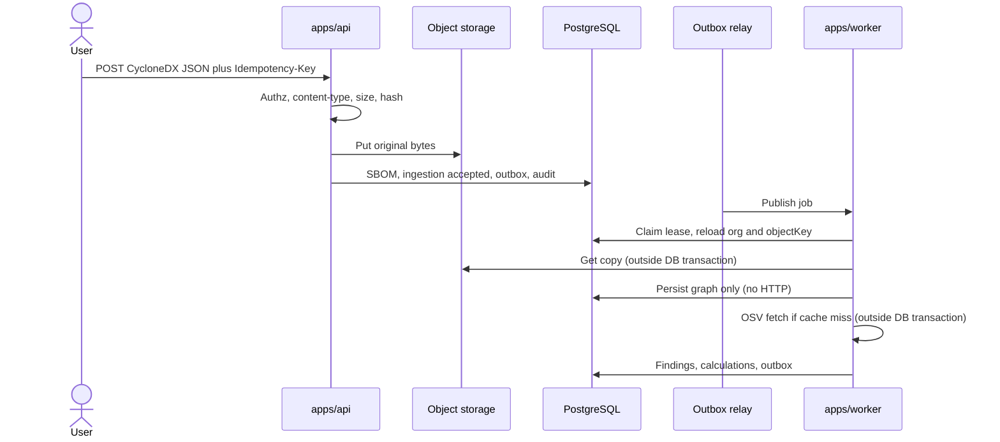

# SBOM ingestion

This is the canonical design for CycloneDX JSON upload, validation, storage, parse-on-copy, idempotency, quarantine, and reprocessing. Format decision: [ADR 0009](../adr/0009-cyclonedx-json.md). Storage: [ADR 0008](../adr/0008-private-object-storage.md).

SBOMs are untrusted. Do not execute content. Do not fetch `externalReferences`, license URLs, bom-links, or other document URLs.

## Goals

- Keep original bytes as **evidence** (SHA-256, private object storage).
- Parse a **copy**. The parsed graph is derived and must not replace the original.
- Record upload, then parse/correlate via the **outbox**. No parser, feed, or object-storage I/O inside the upload database transaction.
- Fail closed on malformed, oversized, or hostile documents.

## Default limits

**All numeric limits below are configurable initial recommendations.** They require performance validation on representative SBOMs before they are treated as production defaults. Operators override them through `packages/config`. Changing a default in a release is a documented behavior change.

| Limit | Initial recommendation | On violation |
| --- | --- | --- |
| Upload size (Content-Length and counted bytes) | 20 MiB | Reject before store; HTTP 413 / validation error |
| Content-Type allowlist | `application/json`, `application/vnd.cyclonedx+json` | Reject; no store |
| Charset | UTF-8 only | Reject |
| JSON parse byte cap | 20 MiB (same as upload) | Reject |
| Max JSON object/array nesting depth | 32 | `rejected` |
| Max string length per JSON string | 64 KiB | `rejected` |
| Max identifier length (purl, bom-ref, name) | 2 KiB | `rejected` |
| CycloneDX `specVersion` allowlist | `1.4`, `1.5`, `1.6` | `rejected` |
| Max components | 10,000 | `rejected` |
| Max dependency edges | 50,000 | `rejected` |
| Duplicate `bom-ref` in one document | not allowed | `rejected` |
| Parse CPU/time budget | 60 s (configurable) | `quarantined` |

Explicitly **rejected** media: `application/pdf`, `application/zip`, `application/gzip`, `application/x-tar`, `application/xml`, `text/xml`, SPDX types, CycloneDX XML. Do not sniff PDF `%PDF` or zip magic as a substitute for allowlisting JSON — still reject if magic matches those families after a bounded prefix check.

Archives (zip, tar, gzip-wrapped JSON) are **not** accepted. SPDX is **not** accepted. XML CycloneDX is **not** accepted.

## Content-type and body validation order

1. Authenticate and authorize against the **active** asset in the authorized organization.
2. Require `Idempotency-Key` (header) for uploads. Uniqueness: `organizationId` + key. Replay returns the original result.
3. Check `Content-Type` against the allowlist (ignore extra parameters except charset).
4. Enforce `Content-Length` if present; still count bytes while reading.
5. Stream to SHA-256 and a bounded buffer. Abort at size limit.
6. JSON parse with depth and string-length guards (no `eval`, no YAML).
7. Read `bomFormat` / `specVersion` **before** interpreting the rest of the document. Require `bomFormat === "CycloneDX"` and allowlisted `specVersion`.
8. Put original bytes to object storage.
9. Database transaction: SBOM + ingestion + outbox + audit.

Schema validation against the allowlisted CycloneDX JSON schema happens in the worker on a copy (step 7 is a spec-version gate, not a full schema pass) so the HTTP request stays bounded. If pre-parse JSON is not an object, reject synchronously.

## SHA-256 and object keys

- Hash **original bytes** as received (not a canonicalized pretty-print).
- Object key shape:

```text
org/{organizationId}/assets/{assetId}/sboms/sha256/{sha256}
```

Organization in the key prevents cross-tenant access by digest guessing. Asset id groups evidence. Digest makes the object content-addressed within that prefix.

Private bucket: no public-read, no world-list. API never returns a durable unsigned public URL. If presigned URLs are added later, they require an ADR, short TTL, and org checks.

## Duplicate uploads

Duplicate means the same `organizationId` + `assetId` + `sha256`.

| Situation | Behavior |
| --- | --- |
| Duplicate with completed ingestion | HTTP success or conflict-as-success; ingestion state `duplicate`; no second parse |
| Duplicate while processing | Return existing in-flight ingestion; do not enqueue a second job |
| Same hash, different asset in same org | **Not** a duplicate. Store a second SBOM row; object storage may reuse bytes only if the adapter supports aliasing **without** dropping org/asset in the key. Default: store again under the new key (identical content, different key) to keep access control simple |
| Same hash, different organization | Different key prefix; no sharing of objects across organizations |

## Idempotency

- HTTP `Idempotency-Key` scoped to organization (and user is not the scope; org is).
- Natural key `(organizationId, assetId, sha256)` for the SBOM document.
- Outbox `dedupeKey` for `sbom.ingest` includes organization, sbom id, parser version.
- Job handlers are idempotent: replaying parse does not duplicate components or findings.

## Asynchronous processing

After `accepted`, the relay publishes `sbom.ingest`. The worker:

1. Reloads the **SBOM** row with an organization predicate and uses the stored `objectKey` (never a key built only from a payload digest).
2. Gets a copy from object storage **outside** any database transaction.
3. Full CycloneDX schema validation for the allowlisted version.
4. Enforces depth, component, and edge limits on the **logical** graph (not only JSON depth).
5. Persists derived graph in a **database transaction that performs no HTTP, queue, or object-storage I/O**.
6. Correlates, enriches, scores in **separate** steps: feed HTTP (OSV) is always outside a DB transaction; finding/calculation writes are their own transactions with outbox rows as needed (see [data flow](data-flow.md)).

A single worker **process** may run parse + correlate + enrich + score for one ingestion, but it **must not** combine feed or storage I/O with a state-transition transaction. Stage values remain `validate`, `parse`, `persist_graph`, `correlate`, `enrich`, `score`.

## Pipeline (text is canonical)

Upload initiated → authorization checked → upload limit enforced → evidence hashed (SHA-256) → evidence privately stored → ingestion record created → outbox event written → worker claims job **with a lease** → CycloneDX document validated → components normalized → dependency graph created → vulnerabilities correlated → findings created or observed → risk calculated → ingestion completed.



If the diagram is not rendered, the sentence above is complete.

HTTP upload does not wait for correlation.

Duplicate **components** (same bom-ref): reject. Duplicate identity (same purl+version) in one SBOM: persist one **ComponentOccurrence** and record a parse warning; do not explode rows.

## Processing leases

When a worker moves ingestion to `processing`, it writes `leaseOwner`, `leaseExpiresAt` (initial recommendation: 15 minutes, configurable, must be validated under load). Heartbeats extend the lease. On expiry, another worker may claim. Handlers are idempotent so overlapping claims must not duplicate findings. Lease theft (forged owner) is mitigated by treating lease fields as worker-internal, not client-supplied.

## Transaction and rollback

- Object storage put is **outside** the DB transaction. Failure before put: no row. Failure after put, before commit: orphan (cleanup job).
- DB transaction: SBOM + ingestion + outbox + audit. Rollback drops those rows only; it does not delete the object (orphan path).
- Worker graph persist: transactional for derived rows; on rollback the ingestion returns to `queued` or stays `processing` for retry. Completed correlation must not leave a second org mutated.

## Observability

Emit `ingestionId`, `jobId`, `organizationId` (UUID), `stage`, `state`, duration, reject reason **codes**. Never raw SBOMs. See [observability](observability.md) and [sbom-ingestion-failure](../runbooks/sbom-ingestion-failure.md).

## Lifecycle states

States: `accepted`, `queued`, `processing`, `completed`, `rejected`, `quarantined`, `failed`, `duplicate`.

| From | To | Meaning |
| --- | --- | --- |
| (create after store) | `accepted` | Bytes stored; DB row written; original is evidence |
| `accepted` | `duplicate` | Natural-key duplicate detected in the same transaction path |
| `accepted` | `queued` | Outbox published to BullMQ |
| `queued` | `processing` | Worker acquired the job |
| `processing` | `queued` | Retryable release (transient storage/DB) |
| `processing` | `completed` | Graph persisted; correlation/enrichment/scoring finished or explicitly continued by follow-on jobs that still complete this ingestion |
| `processing` | `rejected` | Deterministic validation failure (schema, limits, missing identity rules) |
| `processing` | `quarantined` | Poison, parser crash, prototype-pollution attempt, unsafe structure |
| `processing` | `failed` | Retryable errors exhausted |
| `failed` | `queued` | Operator or automated requeue **same** ingestion |
| `quarantined` | `queued` | Operator release after review |
| `quarantined` | `failed` | Operator abandons processing; object retained |

`completed`, `rejected`, and `duplicate` are terminal for **that** ingestion row. Parser reprocess creates a **new** SBOMIngestion on the same SBOM.

For v0.1, one worker **job** may sequence parse + correlate + enrich + score before `completed`, using internal `stage` values: `validate`, `parse`, `persist_graph`, `correlate`, `enrich`, `score`. Failures after persist_graph must be idempotent to resume without duplicating findings. Feed HTTP and object-storage get/put remain **outside** every database transaction.

## Poison payload handling

Treat as poison (quarantine, do not keep retrying the parse):

- Worker crash or unrecoverable exception while parsing
- Detected prototype pollution patterns in JSON keys (`__proto__`, `constructor`, `prototype` as object keys)
- Graph limits exceeded in a way that already cost bounded CPU — still `rejected` if cleanly detected; `quarantined` if the parser aborted
- Byte sequences that pass JSON parse but hang the CycloneDX schema library past a CPU/time budget (time-box parse; on timeout → quarantine)

Poison jobs go to the dead-letter path. The original object remains for forensic review by **authorized** org admins/owners. Do not log raw SBOM bytes.

## Quarantine

- State `quarantined` with `quarantineReason` code (not the payload).
- No correlation against quarantined ingestions.
- Object remains private.
- Only `admin`/`owner` may release to `queued` or mark `failed`.
- Audit: `sbom.quarantined`, `sbom.released_from_quarantine`.

## Retry behavior

| Failure class | Retry | Ingestion state |
| --- | --- | --- |
| Object storage read timeout | Yes, exponential backoff | `processing` → `queued` |
| PostgreSQL serialization failure | Yes | `processing` → `queued` |
| OSV rate limit / 5xx | Yes, with feed-aware backoff; ingestion may stay `processing` at `correlate` stage | Do not quarantine the SBOM |
| Schema invalid | No | `rejected` |
| Over limits | No | `rejected` |
| Poison | No automatic | `quarantined` |

Default: five attempts for transient errors, then `failed` / job `dead_lettered`. Backoff is exponential **with jitter**. See [reliability](reliability-model.md). Attempt count is a configurable proposal pending validation.

## Terminal failure

`failed` means operators can requeue. `rejected` means the document will not succeed without a new upload (different bytes). `quarantined` needs a human decision.

HTTP clients of a still-running ingestion poll ingestion status. They do not receive partial finding lists from an incomplete parse.

## Data provenance

Each SBOM stores:

- Uploader, time (UTC), asset, organization
- SHA-256, byte length, content type as received
- CycloneDX spec version
- Object key
- Parser version on each **SBOMIngestion**

Each derived component stores the `sbomId`. Correlation stores match method and intelligence record id.

## Parser-version retention and reprocessing

- `parserVersion` is a semver-like identifier of the PatchPilot parser, not the CycloneDX spec version.
- Reprocessing with a newer parser: new **SBOMIngestion**, same object key, new outbox job, `calculationReason` / observation method recorded.
- Previous derived graphs remain unless a retention job explicitly replaces **derived** data; originals are never replaced.
- Findings may gain new observations; historical **RiskCalculation** rows remain.

## Related documents

- [Data flow](data-flow.md)
- [Finding lifecycle](finding-lifecycle.md)
- [Threat model](../security/threat-model.md) (malicious SBOMs, oversized JSON, dependency explosion)
