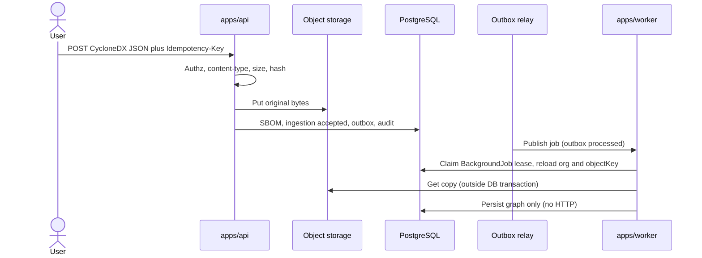

# SBOM ingestion

This is the canonical design for CycloneDX JSON upload, validation, storage, parse-on-copy, idempotency, quarantine, and graph persistence. Format decision: [ADR 0009](../adr/0009-cyclonedx-json.md). Storage: [ADR 0008](../adr/0008-private-object-storage.md). Session 8 completion and graph semantics: [ADR 0020](../adr/0020-sbom-ingestion-graph-completion.md).

SBOMs are untrusted. Do not execute content. Do not fetch `externalReferences`, license URLs, bom-links, or other document URLs.

Session 8 implements **validate**, **parse**, and **persist_graph** only. Frozen stage values `correlate`, `enrich`, and `score` remain unused. There is **no** web upload UI and **no** retry or quarantine-release HTTP API in Session 8.

Session 8 Batch 6 implements the authorized, idempotent upload **use case** (`createUploadSbomUseCase` in `@patchpilot/domain`). Session 8 Batch 7 implements Fastify SBOM upload and read routes. Session 8 Batch 8 implements the worker outbox relay (PostgreSQL claim, BullMQ publish, processed + BackgroundJob). Session 8 Batch 9 implements the worker-thread CycloneDX parser. Session 8 Batch 10 implements the ingestion processor (BullMQ `sbom.ingest`, evidence re-read, parse, graph persist). The upload-to-graph path is therefore runnable end to end against local Compose infrastructure.

## Not implemented after Session 8

Do not document, alert on, or assume these exist. Each is a known gap, not an oversight to be silently filled by a handler:

| Gap | Consequence today |
| --- | --- |
| Web upload UI | Uploads are HTTP-only (`apps/api`) |
| Retry and quarantine-release HTTP API | `failed` and `quarantined` ingestions need direct database intervention |
| Orphan-object reconciliation job | `SBOM_ORPHAN_GRACE_SECONDS` is validated configuration with no consumer ([orphan reconciliation](#orphan-reconciliation)) |
| BackgroundJob lease heartbeat | `renewLease` exists on the port and adapter and is never called ([processing leases](#processing-leases)) |
| BackgroundJob requeue poller | A `queued` BackgroundJob is only re-executed if BullMQ redelivers ([retry behavior](#retry-behavior)) |
| Correlation, enrichment, scoring | Stage values `correlate`, `enrich`, `score` stay frozen and unused |

## Goals

- Keep original bytes as **evidence** (SHA-256, private tenant-and-Asset-scoped object storage).
- Parse a **copy**. The parsed graph is derived and must not replace the original.
- Record upload, then parse and persist the graph via the **outbox**. No parser, feed, or object-storage I/O inside the upload database transaction.
- Fail closed on malformed, oversized, or hostile documents.
- Treat `completed` as successful evidence and graph processing, not as exhaustive inventory or later product work.

## Session 8 meaning of `completed`

`completed` means all of the following succeeded:

1. Stored evidence was re-read from the stored object key.
2. Byte length and SHA-256 were verified.
3. JSON parse and structural limits passed.
4. Allowlisted CycloneDX schema validation passed.
5. Semantic limits passed.
6. Normalized component graph persistence committed.

`completed` does **not** mean exhaustive software inventory, vulnerability correlation, finding creation, intelligence enrichment, risk scoring, or remediation.

Future correlation is a **separate additive workflow**. It must not rewrite completed Session 8 ingestion history.

## Graph completeness

`graphCompleteness` on a completed ingestion is one of:

| Value | Meaning |
| --- | --- |
| `empty` | The document yielded no components after validation. This does **not** mean the Asset contains no software. |
| `no_dependencies` | Components were stored and the document listed no usable dependency edges. This does **not** prove the software has no dependencies. |
| `partial` | Some dependency information was represented; the graph is not a full closed set of listed refs. |
| `complete` | The document’s dependency graph was fully represented after validation. This is not exhaustive product inventory. |

Unknown `dependsOn` targets reject the ingestion (`unresolved_dependency_ref`). Self-edges are omitted by the parser and counted as warnings (`self_dependency_skipped`). Persistence does not skip or warn on self-edges; a normalized graph that still contains one violates DTO invariants and is rejected. Batch 9 parser tests prove: the parser receives a self-edge, omits it from normalized edges, increments the self-edge skipped warning count, and persistence then receives a graph with no self-edge. Cycles are preserved.

## Default limits

**All numeric limits below are configurable initial recommendations** loaded by `@patchpilot/config`. They require performance validation on representative SBOMs before they are treated as production defaults. Operators override them through environment variables. Changing a default in a release is a documented behavior change.

`REQUEST_BODY_LIMIT_BYTES` remains the ordinary Fastify JSON body limit and is independent of `SBOM_UPLOAD_MAX_BYTES`. Session 8 upload uses a raw-body stream, not that ordinary JSON parser.

| Limit | Initial recommendation | On violation |
| --- | --- | --- |
| Upload size (`SBOM_UPLOAD_MAX_BYTES`) | 20 MiB | Reject before store; HTTP 413 / validation error |
| Content-Type allowlist | `application/json`, `application/vnd.cyclonedx+json` | Reject; no store |
| Charset | UTF-8 only | Reject |
| JSON parse byte cap | Same as upload | Reject |
| Max JSON object/array nesting depth | 32 | `rejected` |
| Max JSON nodes (every JSON value) | 200,000 | `rejected` |
| Max string length per JSON string | 64 KiB | `rejected` |
| Max identifier length (purl, bom-ref) | 2 KiB | `rejected` |
| Max component name characters | 512 | `rejected` |
| Max version characters | 256 | `rejected` |
| CycloneDX `specVersion` allowlist | `1.4`, `1.5`, `1.6` | `rejected` |
| Max components | 10,000 | `rejected` |
| Max dependency edges | 50,000 | `rejected` |
| Duplicate `bom-ref` in one document | not allowed | `rejected` |
| Parse wall-clock budget | 60 s | `quarantined` after worker-thread termination |

The parser wall-clock budget is enforced by **worker-thread termination**, not by `Promise.race` around synchronous `JSON.parse` or Ajv. A timeout promise cannot preempt CPU-bound work on the same isolate. Object GET may use `AbortSignal`. The processing lease is an execution lock, not a parser kill switch.

Explicitly **rejected** media: `application/pdf`, `application/zip`, `application/gzip`, `application/x-tar`, `application/xml`, `text/xml`, SPDX types, CycloneDX XML. Do not sniff PDF `%PDF` or zip magic as a substitute for allowlisting JSON — still reject if magic matches those families after a bounded prefix check.

Archives (zip, tar, gzip-wrapped JSON) are **not** accepted. SPDX is **not** accepted. XML CycloneDX is **not** accepted.

## Raw upload contract

`POST /assets/:assetId/sboms` is the only write route. `apps/api` registers content-type parsers for the two approved media types only and passes the request stream through unchanged; there is no multipart parser, no Fastify JSON parse, and no buffering of the whole document before hashing.

### Request

| Element | Requirement |
| --- | --- |
| Session cookie | Required. Name comes from `AUTH_COOKIE_NAME`. |
| `Origin` | Required and must exactly match an entry in `CORS_ALLOWED_ORIGINS`. Missing or unlisted origin is rejected, not defaulted. |
| CSRF header | Required. Name comes from `AUTH_CSRF_HEADER_NAME`; the value must match the session's stored digest. |
| `Idempotency-Key` | Required. 1–256 visible ASCII characters, read case-insensitively. |
| `Content-Type` | `application/json` or `application/vnd.cyclonedx+json`. The only permitted parameter is `charset`, which must be `utf-8` or `utf8`. |
| `Content-Length` | Optional. When present it must be digits only, a safe integer of at least 1, and at most `SBOM_UPLOAD_MAX_BYTES`. Absent length is allowed; bytes are still counted while streaming. |
| Body | Raw CycloneDX JSON. Bounded by a per-route `bodyLimit` of `SBOM_UPLOAD_MAX_BYTES`, independent of the global `REQUEST_BODY_LIMIT_BYTES`. |
| Permission | `sbom:upload` on the **active** organization; the Asset must exist in that organization and must not be archived. |

Authorization runs before body handling: cookie, then Origin, then session, then CSRF, then active organization, then permission. `trustProxy` is `false`, so `X-Forwarded-For` never selects a rate-limit key or an audit source address.

### Response

Success is **202 Accepted**. HTTP does not wait for parse or graph persistence.

```json
{
  "sbomId": "…",
  "ingestionId": "…",
  "assetId": "…",
  "state": "accepted",
  "specificationType": "cyclonedx",
  "sha256": "…",
  "byteLength": 12345,
  "source": "upload",
  "receivedAt": "2026-08-31T00:00:00.000Z"
}
```

Every SBOM response carries `Cache-Control: private, no-store`. Public response bodies never contain `objectKey`, `originalFilename`, `filename`, `workerIdentifier`, `leaseExpiresAt`, `auditPayload`, `ajvErrors`, or `parserException`. That omission is asserted by tests, not left to reviewer discipline.

### Failure statuses

| Status | Cause |
| --- | --- |
| 400 | Non-UUID `assetId`, missing or malformed `Idempotency-Key`, malformed `Content-Length`, non-UTF-8 charset, unsupported `Content-Type` parameter, client abort mid-upload, or storage-reported invalid content |
| 401 | No session, expired session, or CSRF mismatch |
| 403 | Missing or disallowed `Origin`, no active organization, or missing `sbom:upload` |
| 404 | Asset not found **in the authorized organization** (tenant-safe: the same response covers "exists elsewhere") |
| 409 | Asset archived, an upload for the same key is already in progress, or the same `Idempotency-Key` was replayed with a different request fingerprint |
| 413 | Declared or observed size above `SBOM_UPLOAD_MAX_BYTES` |
| 415 | A media type with no registered parser, such as `application/zip` |
| 429 | Peer-IP or organization rate limit exceeded |
| 500 | Object storage unavailable, or a finalization failure including the possible-orphan path |

Error bodies use the shared envelope (`error.code`, `error.message`, `error.requestId`, `error.correlationId`). Messages are stable, safe strings; they never contain document content, object keys, or Ajv output.

### Rate limits

Two independent limiters, both sized by `SBOM_UPLOAD_RATE_LIMIT_MAX` and `SBOM_UPLOAD_RATE_LIMIT_WINDOW_SECONDS`:

1. Direct peer IP from the socket (`@fastify/rate-limit`, `skipOnError: false`, so a limiter fault fails closed).
2. Authorized `organizationId`, so one organization cannot spread a flood across many source addresses.

Both apply to the upload sub-scope only. Read routes are not rate limited and stay available while uploads are throttled.

### Order of operations

1. Authenticate and authorize against the **active** asset in the authorized organization.
2. Reserve the hashed `Idempotency-Key` on **IdempotencyRecord**, organization-scoped. Replay returns the original result. Session 8 does not write `SbomIngestion.idempotencyKey`.
3. Check `Content-Type` and `Content-Length` as above.
4. Stream to SHA-256 with a bounded JSON sniff prefix, counting bytes and aborting at the limit.
5. Put original bytes to private object storage under a temporary key, then promote to the content-addressed key.
6. Database transaction: SBOM metadata + ingestion + audit + idempotency finalization + outbox. No parser, feed, or further storage I/O in this transaction.

Schema validation against the allowlisted CycloneDX JSON schema happens in the worker on a re-read copy so the HTTP request stays bounded.

## Storage behavior

`S3SbomObjectStorage` in `@patchpilot/integrations` is the only implementation. It speaks S3 over `@aws-sdk/client-s3` with `forcePathStyle: true` so MinIO and AWS-compatible endpoints behave identically. There is no MinIO-specific SDK.

### SHA-256 and object keys

- Hash **original bytes** as received (not a canonicalized pretty-print).
- Object key shape:

```text
org/{organizationId}/assets/{assetId}/sboms/tmp/{uploadId}
org/{organizationId}/assets/{assetId}/sboms/sha256/{sha256}
```

Organization and Asset in the key prevent cross-tenant access by digest guessing. Digest makes the final object content-addressed within that prefix. The adapter validates key shape before every call and refuses to promote when the final key's digest does not match the expected SHA-256 or when the temporary and final keys are not in the same organization and asset scope.

### Write path

The upload streams to a temporary key, then promotes:

1. `putTemporaryObject` streams the body through a transform that computes SHA-256, counts bytes, and sniffs a bounded prefix for JSON. `ContentLength` is sent only when the client declared one. A declared-versus-observed length mismatch deletes the temporary object and reports `invalid_content`.
2. `promoteTemporaryObject` heads the final key first. If an object with the same digest and length already exists, it deletes the temporary object and returns success without copying. Otherwise it issues `CopyObject` with `MetadataDirective: REPLACE`, then heads the result to confirm the copy.
3. The temporary object is deleted best-effort. A failed cleanup is logged as a warning with ids only; it never fails the upload.

No request sets an ACL. Production code cannot reference `getSignedUrl` or `@aws-sdk/s3-request-presigner`; a boundary test fails the build if those identifiers appear. Object bodies never enter PostgreSQL, and there is no application download route.

### Read path

`getObject` returns a stream plus a `completion` promise and a `cancel` function. Verification is enforced in the transform, not by the caller's good intentions:

- `ContentLength` above the caller's maximum, or unequal to the expected byte length, fails before any body is read.
- Observed bytes above the maximum abort the stream with `size_limit`.
- A final byte count or SHA-256 that disagrees with stored metadata rejects `completion` with `invalid_content`.

`cancel()` rejects with `aborted`. Every operation combines the caller's `AbortSignal` with a timeout derived from `OBJECT_STORAGE_OPERATION_TIMEOUT_MS`, and the SDK is configured with `maxAttempts: 1` so a retry storm cannot multiply that budget.

The storage port validates final-key **shape** only, not tenant scope. Promote enforces matching org/asset prefixes between temporary and final keys. The ingestion processor adds a second check: `sbomObjectKeyScope(objectKey)` must agree with the reloaded **SBOM** row before any GET.

### Failure categories

The adapter returns a `StorageFailureCategory`, never a raw SDK error. The ingestion processor maps each category to a safe failure code:

| Storage category | Typical cause | Safe failure code | Outcome |
| --- | --- | --- | --- |
| `object_missing` | `NoSuchKey`, HTTP 404 | `object_missing` | retryable |
| `timeout` | Operation timeout, `ETIMEDOUT`, undici timeouts | `storage_timeout` | retryable |
| `aborted` | Caller abort or `cancel()` | `storage_timeout` | retryable |
| `storage_unavailable` | HTTP 5xx, `ECONNREFUSED`, `ENOTFOUND`, `ECONNRESET` | `storage_timeout` | retryable |
| `invalid_content` | Byte-length or digest mismatch, non-JSON sniff | `hash_mismatch` | quarantined |
| `size_limit` | Object larger than the configured maximum | `payload_too_large` | rejected |
| `bucket_missing` | `NoSuchBucket`, or 404 on head-bucket | `processing_failed` | terminal internal |
| `access_denied` | `AccessDenied`, `InvalidAccessKeyId`, HTTP 403 | `processing_failed` | terminal internal |
| `copy_failed` | Any failure during promote's copy or its verification head | `processing_failed` | terminal internal |
| `internal` | Key-shape violations, `MissingContentLength`, unclassified errors | `processing_failed` | terminal internal |

`hash_mismatch` is deliberately **not** retryable. Stored bytes that no longer match their recorded digest are a corruption or tampering signal, so the ingestion is quarantined for review rather than reprocessed until it happens to pass.

### Bucket lifecycle

`verifyBucketAvailability` heads the bucket and returns the privacy assumptions the adapter relies on (`bucketPrivate`, `publicAccessDisabled`, `signedUrlsDisabled`). Those are assumptions the operator must actually enforce on the bucket; the adapter cannot prove them.

`initializeDevelopmentBucket` creates a missing bucket only when the deployment environment is not `production`, `PATCHPILOT_ALLOW_DEVELOPMENT_ADAPTERS` is `true`, the caller passes `explicitlyAllowed: true`, and the requested bucket equals the configured bucket. Production never creates a missing bucket; a missing bucket there is an operator error and surfaces as `bucket_missing`.

## Duplicate uploads

Duplicate means the same `organizationId` + `assetId` + `sha256`.

| Situation | Behavior |
| --- | --- |
| Duplicate evidence for the same asset | Reuse the existing SBOM and ingestion resource. Do **not** insert a `duplicate`-state ingestion row. Do not enqueue a second outbox event. Audit `sbom.duplicate` when a user request resolves to existing evidence. |
| Duplicate while processing | Return the existing in-flight ingestion; do not enqueue a second job |
| Same hash, different asset in same org | **Not** a duplicate. Store a second SBOM row under the new asset-scoped key |
| Same hash, different organization | Different key prefix; no sharing of objects across organizations |

The frozen ingestion state value `duplicate` remains unused in Session 8.

## Idempotency

Four independent layers, each scoped to an organization. None of them relies on a client assertion.

| Layer | Key | Enforced by |
| --- | --- | --- |
| HTTP replay | Hashed `Idempotency-Key` + organization + asset scope | **IdempotencyRecord** reservation, finalized in the upload transaction |
| Evidence | `(organizationId, assetId, sha256)` | Unique constraint on the **SBOM** row |
| Queue delivery | Outbox event id | Deterministic BullMQ job id `{eventType}__{outboxEventId}` |
| Processor execution | Outbox event id | `BackgroundJob.outboxEventId` unique constraint |

The outbox `dedupeKey` for `sbom.ingest` is `{organizationId}:sbom.ingest:{sbomId}:{parserVersion}`, so reprocessing under a new parser version is a distinct unit of work rather than a suppressed duplicate.

Reservation is taken **before** any storage write. A second request presenting the same key while the first is still in flight receives 409 `in_progress` rather than starting a competing upload. A request presenting the same key with a different asset or content type receives 409 `idempotency_conflict`. A replay of a finished upload returns the original 202 body byte-for-byte and does not write a second outbox event.

`SBOM_IDEMPOTENCY_TTL_SECONDS` must exceed **twice** `OBJECT_STORAGE_OPERATION_TIMEOUT_MS` so a reservation can cover sequential temporary put and promote. That rule is enforced at process start. It does **not** bound a slow client stream: the reservation fingerprint covers only `assetId` and `contentType`, not body hash, and `expiresAt` is fixed at reservation time. An upload still streaming when the TTL expires can lose the key to a reclaiming request and leave a possible orphan. Operators should keep the TTL comfortably above expected upload duration; reservation renewal during streaming is not implemented.

Job handlers are idempotent at each step: claiming an already-succeeded **BackgroundJob** returns `already_complete`, and graph persistence is insert-once for a given `sbomIngestionId`.

## Asynchronous processing

After `accepted`, the relay publishes `sbom.ingest`. The processor's step order is fixed, and every step that could act on attacker-influenced input reloads authoritative state first:

1. Validate the job payload strictly. It carries **ids only**: `organizationId`, `outboxEventId`, `aggregateType`, `aggregateId`, `eventType`, `dedupeKey`. Anything else is `skipped`, not guessed at.
2. Load the **BackgroundJob** by `(organizationId, outboxEventId)`. A missing row or an organization mismatch never mutates tenant data.
3. Claim the BackgroundJob lease. A lost claim is a retry, not a second execution.
4. Reload the **SbomIngestion** with an organization predicate and transition it to `processing`.
5. Reload the **SBOM** row with an organization predicate and use the stored `objectKey`, never a key rebuilt from a payload digest.
6. Verify the key's embedded `org/{organizationId}/assets/{assetId}` segments match the reloaded SBOM row. A mismatch is `processing_failed` with no storage GET.
7. Get a copy from object storage **outside** any database transaction.
8. Verify byte length and SHA-256 against stored metadata while streaming.
9. Parse in a worker thread: secure JSON parse, prototype-key rejection, structural limits, allowlisted CycloneDX schema validation, semantic limits, PURL normalization. A worker that exits without posting a result is `parser_crash`, not a hung host promise.
10. Persist the derived graph **keyed by this `sbomIngestionId`** in a **database transaction that performs no HTTP, queue, or object-storage I/O**. The same transaction marks the ingestion `completed`, appends the `sbom.ingestion.completed` audit event, updates the Asset pointer, and marks the BackgroundJob succeeded.

Graph persist is `completed`. Correlation is not part of this session.

`OutboxEvent` `processed` means BullMQ **accepted** the job. **BackgroundJob** represents actual processor execution. Those leases are separate. `SbomIngestion.leaseExpiresAt` is unused in Session 8 and is never written.

## Outbox relay

The relay is a poll loop in `apps/worker`. It never reads a job payload from Redis to decide what to do; PostgreSQL is the source of truth.

| Setting | Value |
| --- | --- |
| Poll interval | 1 s |
| Batch limit | 50 events (persistence clamps any request to 100) |
| Claim lease | 30 s |
| Max attempts | 5 |
| Retry backoff | `min(900_000, 5_000 * 2^(attempt-1))` scaled by jitter in `[0.5, 1.0)` |
| Queue name | `patchpilot` |
| Job name | `sbom.ingest` |
| BullMQ job id | `{eventType}__{outboxEventId}` |

Each batch:

1. Claims due `pending` rows with `FOR UPDATE SKIP LOCKED`, ordered by `available_at`, then `id`. If the batch is not full, it fills the remainder with `claimed` rows whose lease has expired. The claim increments `attempt_count`.
2. Dead-letters an event whose `eventType` has no mapped job type, or whose attempt count now exceeds the maximum.
3. Publishes to BullMQ with the deterministic job id. An existing job id counts as a duplicate, not a failure.
4. Marks the event `processed` (which means "BullMQ accepted it"), then creates or reuses the **BackgroundJob** row.
5. Reconciles: any `processed` event with no **BackgroundJob** row gets one. This closes the window where publish succeeded and the process died before the job row was written. Reconciliation does **not** republish to BullMQ.

A retryable publish failure returns the event to `pending` with a backed-off `available_at`. The relay returns per-batch counters (`claimed`, `published`, `duplicated`, `retried`, `deadLettered`, `reconciledJobs`) for logging.

Redis being down produces a growing `pending` backlog, not lost work. Shutdown aborts the poll delay, lets the in-flight batch finish, then closes the queue connection.

## Orphan reconciliation

An orphan is an object in the bucket with no **SBOM** row pointing at it. Two paths create one:

- A temporary-key put succeeded and the best-effort delete failed. The upload still returns its normal result.
- A promote to the final key succeeded and the database transaction then failed. The caller receives 500 with the `possible_orphan` outcome. The final object is deliberately **not** deleted, because at this point the bytes may be the only copy of evidence the user has.

There is no automated reconciliation job. `SBOM_ORPHAN_GRACE_SECONDS` (default 7 days, validated to exceed `SBOM_IDEMPOTENCY_TTL_SECONDS`) exists as the policy floor that a future job must honor, and nothing reads it today. Until that job exists, orphans accumulate and are an operator concern; see [sbom-ingestion-failure](../runbooks/sbom-ingestion-failure.md).

When the job is built it must list before it deletes, delete only under `org/{organizationId}/` prefixes it has enumerated, confirm no **SBOM** row references the key, respect the grace period, and log the key template plus digest rather than the key itself. Deleting a final object that a **SBOM** row still references destroys evidence and is never acceptable to satisfy a storage quota.

## Pipeline (text is canonical)

Session 8: Upload initiated → authorization checked → upload limit enforced → evidence hashed (SHA-256) → evidence privately stored → ingestion record created → outbox event written → relay publishes to BullMQ → worker claims the **BackgroundJob** lease → stored evidence re-read and verified → CycloneDX document validated → components normalized → dependency graph persisted → ingestion `completed`.

Future additive work (not Session 8): vulnerabilities correlated → findings created or observed → risk calculated.



If the diagram is not rendered, the sentence above is complete.

HTTP upload does not wait for graph persistence. Session 8 has no web upload UI.

Duplicate **components** (same bom-ref): reject. Duplicate identity (same **versionless** identity + version) in one ingestion: persist one **ComponentOccurrence** and record a parse warning; do not explode rows.

## Processing leases

Two independent leases, on two different rows:

| Lease | Row | Duration | Held during |
| --- | --- | --- | --- |
| Relay claim | `outbox_event.lease_expires_at` | 30 s | Claim until BullMQ accepts the job (`processed`) |
| Processor execution | `background_job.lease_expires_at` | `SBOM_PROCESSING_LEASE_MS`, default 15 min | Object read, parse, and graph persist |

`SbomIngestion.leaseExpiresAt` is unused in Session 8 and is never written. Ingestion state is not a lock.

The BackgroundJob claim is a single conditional `UPDATE` scoped by organization. It succeeds only when the row is `queued`, or `running` with an expired lease, and it increments `attempt`. A lost claim returns a conflict, which the processor treats as a retry rather than a reason to proceed unclaimed.

**No heartbeat is implemented.** `renewLease` exists on the port and the Prisma adapter and is not called by any worker code. The lease therefore has to be provisioned longer than the worst-case run, and configuration enforces that: both `SBOM_PARSER_TIMEOUT_MS` and `OBJECT_STORAGE_OPERATION_TIMEOUT_MS` must be less than `SBOM_PROCESSING_LEASE_MS`. Raising the parser timeout without raising the lease is rejected at process start.

On expiry another worker may claim the same job. Handlers are idempotent, so overlapping claims must not duplicate graph rows; graph persistence is insert-once per `sbomIngestionId`. Lease fields are worker-internal, never client-supplied and never returned in a public response, so a caller cannot forge a lease owner.

## Transaction and rollback

- Object storage put is **outside** the DB transaction. Failure before put: no row. Failure after put, before commit: orphan ([orphan reconciliation](#orphan-reconciliation)). Do not delete the final object immediately.
- DB transaction: SBOM + ingestion + outbox + audit + idempotency finalization. Rollback drops those rows only; it does not delete the object (orphan path).
- Worker graph persist: one transaction covering derived rows keyed by `sbomIngestionId`, the `completed` transition, the `sbom.ingestion.completed` audit event, the Asset pointer update, and the BackgroundJob success. Object reads, queue calls, and Redis calls all happen outside it. A test asserts that no storage call is made while that transaction is open.
- Completed correlation is future work and must not leave a second organization mutated.

## Observability

Emit `ingestionId`, `jobId`, `organizationId` (UUID), `stage`, `state`, `graphCompleteness`, duration, and the safe `failureCode`. Never raw SBOMs, object keys, filenames, or parser exception text. The safe failure catalog exists precisely so that logs, audit payloads, and API responses can name a failure without quoting the document. See [observability](observability.md) and [sbom-ingestion-failure](../runbooks/sbom-ingestion-failure.md).

## Lifecycle states

States: `accepted`, `queued`, `processing`, `completed`, `rejected`, `quarantined`, `failed`. Frozen unused: `duplicate`.

| From | To | Meaning |
| --- | --- | --- |
| (create after store) | `accepted` | Bytes stored; DB row written; original is evidence |
| `accepted` | `queued` | Outbox published to BullMQ (ingestion may already be claimed from `accepted` if the worker wins the race) |
| `accepted` | `processing` | Worker acquired the job before the relay flipped `queued` |
| `queued` | `processing` | Worker acquired the job |
| `processing` | `queued` | Retryable release (transient storage/DB) |
| `processing` | `completed` | Session 8 evidence verification and graph persist finished for **this** ingestion |
| `processing` | `rejected` | Deterministic validation failure (schema, limits, unresolved dependency refs, missing identity rules) |
| `processing` | `quarantined` | Poison, parser crash, prototype-pollution attempt, unsafe structure, parser timeout |
| `processing` | `failed` | Retryable errors exhausted |
| `failed` | `queued` | Operator or automated requeue **same** ingestion (no HTTP API in Session 8) |
| `quarantined` | `queued` | Operator release after review (no HTTP API in Session 8) |
| `quarantined` | `failed` | Operator abandons processing; object retained |

`completed`, `rejected` are terminal for **that** ingestion row. Parser reprocess creates a **new** SBOMIngestion on the same SBOM.

Session 8 uses internal `stage` values `validate`, `parse`, and `persist_graph` only. Feed HTTP and object-storage get/put remain **outside** every database transaction.

## Failure taxonomy

Every ingestion failure resolves to one **safe failure code** from a closed set in `@patchpilot/domain`. A code is a stable, non-secret label: it never carries document content, Ajv output, exception text, object keys, or stack frames. The code is what gets persisted on the ingestion, put in the audit payload, and shown to the user.

Each code has a **category** (what kind of thing went wrong) and an **outcome** (what the system does about it). The outcome, not the call site, decides the transition — so a new code cannot accidentally invent new retry behavior.

| Outcome | Ingestion state | BackgroundJob | Retried? |
| --- | --- | --- | --- |
| `rejected` | `rejected` | `failed` | No. The document cannot succeed without different bytes. |
| `quarantined` | `quarantined` | `failed` | No. Needs a human decision. |
| `retryable_infrastructure` | back to `queued` | back to `queued` | Yes, if the job is redelivered. |
| `terminal_internal` | `failed` | `failed` | No automatic retry. Operator action. |

### Code catalog

| Code | Category | Outcome | Raised when |
| --- | --- | --- | --- |
| `payload_too_large` | limit | rejected | Body or stored object exceeds `SBOM_UPLOAD_MAX_BYTES` |
| `content_type` | validation | rejected | Media type outside the allowlist |
| `utf8` | validation | rejected | Non-UTF-8 charset or invalid UTF-8 bytes |
| `json_syntax` | validation | rejected | Body is not well-formed JSON |
| `json_depth` | limit | rejected | Nesting above `SBOM_JSON_MAX_DEPTH` |
| `json_nodes` | limit | rejected | Value count above `SBOM_JSON_MAX_NODES` |
| `json_string_length` | limit | rejected | A string above `SBOM_JSON_MAX_STRING_BYTES` |
| `not_cyclonedx` | validation | rejected | Document is JSON but not a CycloneDX BOM |
| `unsupported_spec_version` | validation | rejected | `specVersion` outside `1.4`, `1.5`, `1.6` |
| `schema_invalid` | validation | rejected | Allowlisted CycloneDX schema validation failed |
| `component_limit` | limit | rejected | Components above `SBOM_MAX_COMPONENTS` |
| `edge_limit` | limit | rejected | Dependency edges above `SBOM_MAX_DEPENDENCY_EDGES` |
| `identifier_length` | limit | rejected | `bom-ref`, PURL, name, or version above its configured maximum |
| `tool_limit` | limit | rejected | Metadata tools above `SBOM_MAX_METADATA_TOOLS` |
| `reference_limit` | limit | rejected | External references above the per-component maximum |
| `property_limit` | limit | rejected | Properties above the per-component maximum |
| `duplicate_bom_ref` | validation | rejected | The same `bom-ref` appears twice in one document |
| `unresolved_dependency_ref` | validation | rejected | A `dependsOn` target is not a declared `bom-ref` |
| `invalid_purl` | validation | rejected | PURL cannot be parsed or normalized |
| `normalized_output_too_large` | limit | rejected | Normalized result exceeds the bounded output budget |
| `prototype_pollution` | poison | quarantined | `__proto__`, `constructor`, or `prototype` used as a JSON object key |
| `parser_timeout` | timeout | quarantined | Worker thread terminated at `SBOM_PARSER_TIMEOUT_MS` |
| `parser_crash` | poison | quarantined | Worker thread died, returned an unusable result, or exited without posting a message |
| `hash_mismatch` | storage | quarantined | Stored bytes do not match the recorded SHA-256 or byte length |
| `object_missing` | storage | retryable | Stored object not found at read time |
| `storage_timeout` | storage | retryable | Object-storage timeout, abort, or unavailability |
| `queue_unavailable` | timeout | retryable | BackgroundJob missing at claim time, or a lost lease claim |
| `processing_failed` | internal | terminal internal | Bucket missing, access denied, copy failure, invalid key shape, or an unclassified adapter error |

Note the two storage codes that are *not* retried. `hash_mismatch` means the evidence no longer verifies, and `payload_too_large` from a stored object means the object is out of policy; retrying either just burns the lease.

### Poison payload handling

Poison is quarantined rather than retried: worker crash or unrecoverable exception while parsing, prototype-pollution keys, and byte sequences that pass JSON parse but exhaust the wall-clock budget inside the schema library. Limits detected cleanly are `rejected`; the same limit hit after the parser aborted is `quarantined`.

The original object remains for forensic review by **authorized** org admins and owners. Never log raw SBOM bytes.

## Parser timeout and quarantine

The parse budget is enforced by `worker.terminate()` on a Node worker thread, not by `Promise.race`. A promise cannot preempt CPU-bound work on the same isolate, so a `Promise.race` around synchronous `JSON.parse` or Ajv is not a control and must not be introduced as one. The processing lease is an execution lock, not a parser kill switch.

Termination yields `parser_timeout`, which quarantines. That is intentional: a document that exhausted a 60-second budget once will exhaust it again, and retrying converts one hostile upload into sustained CPU denial.

A worker thread that exits without posting a message is treated as `parser_crash` and quarantined. The host must never leave a BullMQ handler waiting on an unsettled parser promise.

Quarantine behavior:

- State `quarantined` with a safe failure code, never the payload or an exception string.
- The object remains private and retained. Quarantine preserves evidence; it does not delete it.
- No correlation runs against quarantined ingestions.
- A `sbom.ingestion.quarantined` audit event is appended with `sbomId`, `ingestionId`, `parserVersion`, and `failureCode`.
- There is **no** quarantine-release HTTP API. A later session may allow `admin`/`owner` to release to `queued` or mark `failed`, emitting `sbom.ingestion.released_from_quarantine`.

## Retry behavior

There is no retry HTTP API. Retry means "the same BullMQ job is delivered again."

A retryable outcome returns both the ingestion and the **BackgroundJob** to `queued` inside one transaction, then the handler throws so BullMQ sees a failure. Two properties of the current wiring matter operationally:

- Job-level `attempts` and `backoff` are **not** configured on the `sbom.ingest` job, so BullMQ does not schedule an automatic retry after that throw.
- There is **no** BackgroundJob poller. A `queued` BackgroundJob row is not re-executed on its own.

So a retryable failure leaves consistent, resumable state and then stops. Recovery is an operator replay of the BullMQ job, which is safe because the claim, the ingestion transition, and graph persistence are all idempotent. Treat a rising count of `queued` BackgroundJob rows with no matching queue activity as a stall, not as work in progress; see [background-job-failure](../runbooks/background-job-failure.md).

The relay's five-attempt backoff applies to **publishing**, not to processing. Do not read it as a processing retry budget.

## Terminal failure

`failed` means the ingestion can be requeued once an API or operator procedure exists. `rejected` means the document will not succeed without a new upload of different bytes. `quarantined` needs a human decision. All three retain the stored object.

HTTP clients of a still-running ingestion poll `GET /assets/:assetId/sbom-ingestions/:ingestionId`. They do not receive finding lists from Session 8.

## Data provenance

Each SBOM stores:

- Uploader, time (UTC), asset, organization
- SHA-256, byte length, content type as received
- CycloneDX spec version
- Object key
- Parser version on each **SBOMIngestion**

Each derived component stores the `sbomId`. Correlation (future) stores match method and intelligence record id. Session 8 does not insert **Evidence** rows for the original bytes; the **SBOM** row is the evidence pointer.

## Parser-version retention and reprocessing

- `parserVersion` is a semver-like identifier of the PatchPilot parser, not the CycloneDX spec version.
- Reprocessing with a newer parser: new **SBOMIngestion**, same object key, new occurrence/relationship rows for that ingestion, new outbox job. Do not overwrite a previous ingestion's graph.
- Previous derived graphs remain unless a retention job explicitly replaces **derived** data; originals are never replaced.
- Findings and observations are future correlation work. Finding state will follow the **current** completed ingestion only after that workflow exists. Session 8 `completed` rows are not rewritten when correlation is added.

## Related documents

- [Data flow](data-flow.md)
- [Finding lifecycle](finding-lifecycle.md)
- [Threat model](../security/threat-model.md) (malicious SBOMs, oversized JSON, dependency explosion)
- [ADR 0020](../adr/0020-sbom-ingestion-graph-completion.md)
