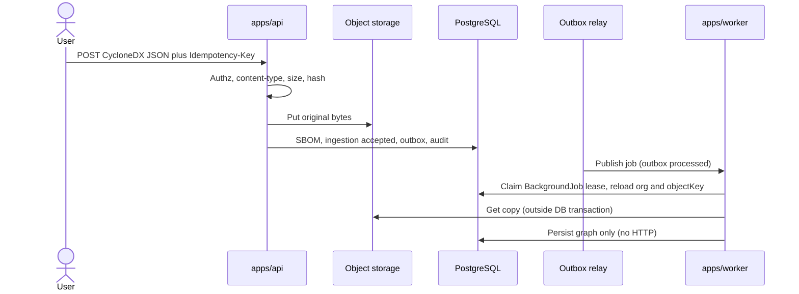

# SBOM ingestion

This is the canonical design for CycloneDX JSON upload, validation, storage, parse-on-copy, idempotency, quarantine, and graph persistence. Format decision: [ADR 0009](../adr/0009-cyclonedx-json.md). Storage: [ADR 0008](../adr/0008-private-object-storage.md). Session 8 completion and graph semantics: [ADR 0020](../adr/0020-sbom-ingestion-graph-completion.md).

SBOMs are untrusted. Do not execute content. Do not fetch `externalReferences`, license URLs, bom-links, or other document URLs.

Session 8 implements **validate**, **parse**, and **persist_graph** only. Frozen stage values `correlate`, `enrich`, and `score` remain unused. There is **no** web upload UI and **no** retry or quarantine-release HTTP API in Session 8.

## Goals

- Keep original bytes as **evidence** (SHA-256, private tenant-and-Asset-scoped object storage).
- Parse a **copy**. The parsed graph is derived and must not replace the original.
- Record upload, then parse and persist the graph via the **outbox**. No parser, feed, or object-storage I/O inside the upload database transaction.
- Fail closed on malformed, oversized, or hostile documents.
- Treat `completed` as successful evidence and graph processing, not as exhaustive inventory or later product work.

## Session 8 meaning of `completed`

`completed` means all of the following succeeded:

1. Stored evidence was re-read from the stored object key.
2. Byte length and SHA-256 were verified.
3. JSON parse and structural limits passed.
4. Allowlisted CycloneDX schema validation passed.
5. Semantic limits passed.
6. Normalized component graph persistence committed.

`completed` does **not** mean exhaustive software inventory, vulnerability correlation, finding creation, intelligence enrichment, risk scoring, or remediation.

Future correlation is a **separate additive workflow**. It must not rewrite completed Session 8 ingestion history.

## Graph completeness

`graphCompleteness` on a completed ingestion is one of:

| Value | Meaning |
| --- | --- |
| `empty` | The document yielded no components after validation. This does **not** mean the Asset contains no software. |
| `no_dependencies` | Components were stored and the document listed no usable dependency edges. This does **not** prove the software has no dependencies. |
| `partial` | Some dependency information was represented; the graph is not a full closed set of listed refs. |
| `complete` | The document’s dependency graph was fully represented after validation. This is not exhaustive product inventory. |

Unknown `dependsOn` targets reject the ingestion (`unresolved_dependency_ref`). Self-edges are omitted by the parser and counted as warnings (`self_dependency_skipped`). Persistence does not skip or warn on self-edges; a normalized graph that still contains one violates DTO invariants and is rejected. Batch 9 parser tests must prove: the parser receives a self-edge, omits it from normalized edges, increments the self-edge skipped warning count, and persistence then receives a graph with no self-edge. Cycles are preserved.

## Default limits

**All numeric limits below are configurable initial recommendations** loaded by `@patchpilot/config`. They require performance validation on representative SBOMs before they are treated as production defaults. Operators override them through environment variables. Changing a default in a release is a documented behavior change.

`REQUEST_BODY_LIMIT_BYTES` remains the ordinary Fastify JSON body limit and is independent of `SBOM_UPLOAD_MAX_BYTES`. Session 8 upload uses a raw-body stream, not that ordinary JSON parser.

| Limit | Initial recommendation | On violation |
| --- | --- | --- |
| Upload size (`SBOM_UPLOAD_MAX_BYTES`) | 20 MiB | Reject before store; HTTP 413 / validation error |
| Content-Type allowlist | `application/json`, `application/vnd.cyclonedx+json` | Reject; no store |
| Charset | UTF-8 only | Reject |
| JSON parse byte cap | Same as upload | Reject |
| Max JSON object/array nesting depth | 32 | `rejected` |
| Max JSON nodes (every JSON value) | 200,000 | `rejected` |
| Max string length per JSON string | 64 KiB | `rejected` |
| Max identifier length (purl, bom-ref) | 2 KiB | `rejected` |
| Max component name characters | 512 | `rejected` |
| Max version characters | 256 | `rejected` |
| CycloneDX `specVersion` allowlist | `1.4`, `1.5`, `1.6` | `rejected` |
| Max components | 10,000 | `rejected` |
| Max dependency edges | 50,000 | `rejected` |
| Duplicate `bom-ref` in one document | not allowed | `rejected` |
| Parse wall-clock budget | 60 s | `quarantined` after worker-thread termination |

The parser wall-clock budget is enforced by **worker-thread termination**, not by `Promise.race` around synchronous `JSON.parse` or Ajv. A timeout promise cannot preempt CPU-bound work on the same isolate. Object GET may use `AbortSignal`. The processing lease is an execution lock, not a parser kill switch.

Explicitly **rejected** media: `application/pdf`, `application/zip`, `application/gzip`, `application/x-tar`, `application/xml`, `text/xml`, SPDX types, CycloneDX XML. Do not sniff PDF `%PDF` or zip magic as a substitute for allowlisting JSON — still reject if magic matches those families after a bounded prefix check.

Archives (zip, tar, gzip-wrapped JSON) are **not** accepted. SPDX is **not** accepted. XML CycloneDX is **not** accepted.

## Content-type and body validation order

1. Authenticate and authorize against the **active** asset in the authorized organization.
2. Require `Idempotency-Key` (header) for uploads. Uniqueness is organization-scoped on **IdempotencyRecord**. Replay returns the original result. Session 8 does not write `SbomIngestion.idempotencyKey`.
3. Check `Content-Type` against the allowlist (ignore extra parameters except charset).
4. Enforce `Content-Length` if present; still count bytes while reading.
5. Stream to SHA-256 and a bounded buffer. Abort at size limit. Raw body; no multipart; no Fastify JSON parse for this route.
6. Put original bytes to private object storage (temporary key, then content-addressed key).
7. Database transaction: SBOM metadata + ingestion + audit + idempotency finalization + outbox. No parser, feed, or further storage I/O in this transaction.

Schema validation against the allowlisted CycloneDX JSON schema happens in the worker on a re-read copy so the HTTP request stays bounded.

## SHA-256 and object keys

- Hash **original bytes** as received (not a canonicalized pretty-print).
- Object key shape:

```text
org/{organizationId}/assets/{assetId}/sboms/tmp/{uploadId}
org/{organizationId}/assets/{assetId}/sboms/sha256/{sha256}
```

Organization and Asset in the key prevent cross-tenant access by digest guessing. Digest makes the final object content-addressed within that prefix.

Private bucket only. **No** public ACL, **no** signed or presigned object URLs, and **no** application download route exist. Object bodies never enter PostgreSQL.

## Duplicate uploads

Duplicate means the same `organizationId` + `assetId` + `sha256`.

| Situation | Behavior |
| --- | --- |
| Duplicate evidence for the same asset | Reuse the existing SBOM and ingestion resource. Do **not** insert a `duplicate`-state ingestion row. Do not enqueue a second outbox event. Audit `sbom.duplicate` when a user request resolves to existing evidence. |
| Duplicate while processing | Return the existing in-flight ingestion; do not enqueue a second job |
| Same hash, different asset in same org | **Not** a duplicate. Store a second SBOM row under the new asset-scoped key |
| Same hash, different organization | Different key prefix; no sharing of objects across organizations |

The frozen ingestion state value `duplicate` remains unused in Session 8.

## Idempotency

- HTTP `Idempotency-Key` scoped to organization via **IdempotencyRecord**.
- Natural key `(organizationId, assetId, sha256)` for the SBOM document.
- Outbox `dedupeKey` for `sbom.ingest` includes organization, sbom id, parser version.
- Job handlers are idempotent: replaying parse does not duplicate components.

## Asynchronous processing

After `accepted`, the relay publishes `sbom.ingest`. The worker:

1. Reloads the **SBOM** row with an organization predicate and uses the stored `objectKey` (never a key built only from a payload digest).
2. Gets a copy from object storage **outside** any database transaction.
3. Verifies byte length and SHA-256 against stored metadata.
4. Full CycloneDX schema validation for the allowlisted version.
5. Enforces JSON, component, and edge limits on the **logical** graph (not only JSON depth).
6. Persists derived graph **keyed by this `sbomIngestionId`** in a **database transaction that performs no HTTP, queue, or object-storage I/O**.
7. Moves ingestion to `completed` after those Session 8 steps succeed. Graph persist is `completed`. Correlation is not part of this session.

`OutboxEvent` `processed` means BullMQ **accepted** the job. **BackgroundJob** represents actual processor execution. Those leases are separate. `SbomIngestion.leaseExpiresAt` is unused in Session 8.

## Pipeline (text is canonical)

Session 8: Upload initiated → authorization checked → upload limit enforced → evidence hashed (SHA-256) → evidence privately stored → ingestion record created → outbox event written → relay publishes to BullMQ → worker claims the **BackgroundJob** lease → stored evidence re-read and verified → CycloneDX document validated → components normalized → dependency graph persisted → ingestion `completed`.

Future additive work (not Session 8): vulnerabilities correlated → findings created or observed → risk calculated.



If the diagram is not rendered, the sentence above is complete.

HTTP upload does not wait for graph persistence. Session 8 has no web upload UI.

Duplicate **components** (same bom-ref): reject. Duplicate identity (same **versionless** identity + version) in one ingestion: persist one **ComponentOccurrence** and record a parse warning; do not explode rows.

## Processing leases

- **OutboxEvent** lease: relay claim until BullMQ accepts the job (`processed`).
- **BackgroundJob** lease: processor execution, including parse and graph persist.
- `SbomIngestion.leaseExpiresAt` is unused in Session 8.

These are two independent leases. Initial processing-lease recommendation: 15 minutes (`SBOM_PROCESSING_LEASE_MS`), configurable, must be validated under load. Heartbeats extend the BackgroundJob lease. On expiry, another worker may claim. Handlers are idempotent so overlapping claims must not duplicate graph rows. Lease theft (forged owner) is mitigated by treating lease fields as worker-internal, not client-supplied.

## Transaction and rollback

- Object storage put is **outside** the DB transaction. Failure before put: no row. Failure after put, before commit: orphan (cleanup after `SBOM_ORPHAN_GRACE_SECONDS`). Do not delete the final object immediately.
- DB transaction: SBOM + ingestion + outbox + audit + idempotency finalization. Rollback drops those rows only; it does not delete the object (orphan path).
- Worker graph persist: transactional for derived rows keyed by `sbomIngestionId`. Session 8 marks `completed` after that commit when verification succeeded. Completed correlation is future work and must not leave a second org mutated.

## Observability

Emit `ingestionId`, `jobId`, `organizationId` (UUID), `stage`, `state`, `graphCompleteness`, duration, reject reason **codes**. Never raw SBOMs. See [observability](observability.md) and [sbom-ingestion-failure](../runbooks/sbom-ingestion-failure.md).

## Lifecycle states

States: `accepted`, `queued`, `processing`, `completed`, `rejected`, `quarantined`, `failed`. Frozen unused: `duplicate`.

| From | To | Meaning |
| --- | --- | --- |
| (create after store) | `accepted` | Bytes stored; DB row written; original is evidence |
| `accepted` | `queued` | Outbox published to BullMQ (ingestion may already be claimed from `accepted` if the worker wins the race) |
| `accepted` | `processing` | Worker acquired the job before the relay flipped `queued` |
| `queued` | `processing` | Worker acquired the job |
| `processing` | `queued` | Retryable release (transient storage/DB) |
| `processing` | `completed` | Session 8 evidence verification and graph persist finished for **this** ingestion |
| `processing` | `rejected` | Deterministic validation failure (schema, limits, unresolved dependency refs, missing identity rules) |
| `processing` | `quarantined` | Poison, parser crash, prototype-pollution attempt, unsafe structure, parser timeout |
| `processing` | `failed` | Retryable errors exhausted |
| `failed` | `queued` | Operator or automated requeue **same** ingestion (no HTTP API in Session 8) |
| `quarantined` | `queued` | Operator release after review (no HTTP API in Session 8) |
| `quarantined` | `failed` | Operator abandons processing; object retained |

`completed`, `rejected` are terminal for **that** ingestion row. Parser reprocess creates a **new** SBOMIngestion on the same SBOM.

Session 8 uses internal `stage` values `validate`, `parse`, and `persist_graph` only. Feed HTTP and object-storage get/put remain **outside** every database transaction.

## Poison payload handling

Treat as poison (quarantine, do not keep retrying the parse):

- Worker crash or unrecoverable exception while parsing
- Detected prototype pollution patterns in JSON keys (`__proto__`, `constructor`, `prototype` as object keys)
- Graph limits exceeded in a way that already cost bounded CPU — still `rejected` if cleanly detected; `quarantined` if the parser aborted
- Byte sequences that pass JSON parse but hang the CycloneDX schema library past the wall-clock budget (terminate the worker thread; on timeout → quarantine)

Poison jobs go to the dead-letter path. The original object remains for forensic review by **authorized** org admins/owners. Do not log raw SBOM bytes.

## Quarantine

- State `quarantined` with `quarantineReason` code (not the payload).
- No correlation against quarantined ingestions.
- Object remains private.
- Session 8 has **no** quarantine-release HTTP API. A later session may allow `admin`/`owner` to release to `queued` or mark `failed`.
- Audit: `sbom.ingestion.quarantined`, `sbom.ingestion.released_from_quarantine` (same names as [audit-model.md](audit-model.md)).

## Retry behavior

Session 8 has **no** retry HTTP API.

| Failure class | Retry | Ingestion state |
| --- | --- | --- |
| Object storage read timeout | Yes, exponential backoff | `processing` → `queued` |
| PostgreSQL serialization failure | Yes | `processing` → `queued` |
| Schema invalid | No | `rejected` |
| Over limits | No | `rejected` |
| Unresolved dependency ref | No | `rejected` |
| Poison / parser timeout | No automatic | `quarantined` |

Default: five attempts for transient errors, then `failed` / job `dead_lettered`. Backoff is exponential **with jitter**. See [reliability](reliability-model.md). Attempt count is a configurable proposal pending validation.

## Terminal failure

`failed` means operators can requeue when a later API exists. `rejected` means the document will not succeed without a new upload (different bytes). `quarantined` needs a human decision.

HTTP clients of a still-running ingestion poll ingestion status. They do not receive finding lists from Session 8.

## Data provenance

Each SBOM stores:

- Uploader, time (UTC), asset, organization
- SHA-256, byte length, content type as received
- CycloneDX spec version
- Object key
- Parser version on each **SBOMIngestion**

Each derived component stores the `sbomId`. Correlation (future) stores match method and intelligence record id. Session 8 does not insert **Evidence** rows for the original bytes; the **SBOM** row is the evidence pointer.

## Parser-version retention and reprocessing

- `parserVersion` is a semver-like identifier of the PatchPilot parser, not the CycloneDX spec version.
- Reprocessing with a newer parser: new **SBOMIngestion**, same object key, new occurrence/relationship rows for that ingestion, new outbox job. Do not overwrite a previous ingestion's graph.
- Previous derived graphs remain unless a retention job explicitly replaces **derived** data; originals are never replaced.
- Findings and observations are future correlation work. Finding state will follow the **current** completed ingestion only after that workflow exists. Session 8 `completed` rows are not rewritten when correlation is added.

## Related documents

- [Data flow](data-flow.md)
- [Finding lifecycle](finding-lifecycle.md)
- [Threat model](../security/threat-model.md) (malicious SBOMs, oversized JSON, dependency explosion)
- [ADR 0020](../adr/0020-sbom-ingestion-graph-completion.md)
