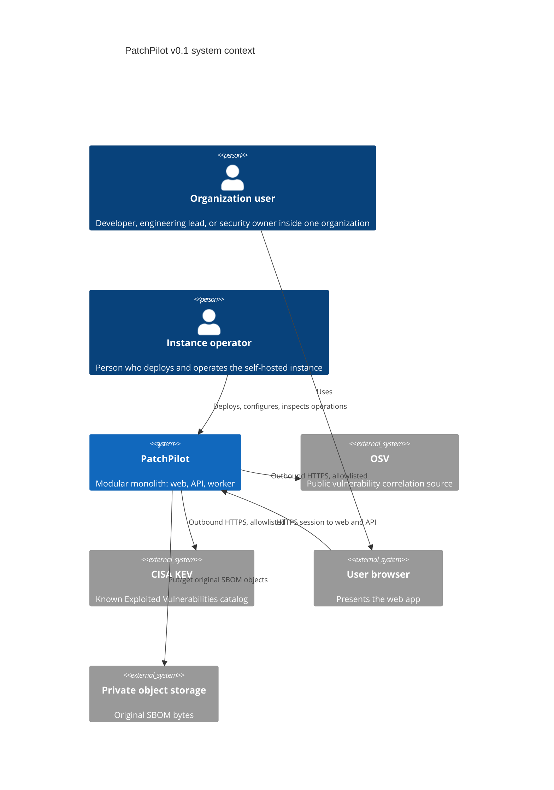

# System context

This document describes PatchPilot's v0.1 MVP as a self-hosted system: who uses it, which external systems it talks to, and which systems it deliberately does **not** talk to.

Product journey: [MVP scope](../product/mvp-scope.md). Terms: [glossary](../product/glossary.md).

## Purpose

Operators inventory software **assets**, upload CycloneDX JSON **SBOMs**, correlate components with **vulnerability records**, enrich applicable **findings** with CISA KEV catalog data, calculate an explainable **priority**, assign **remediation work**, record **risk acceptance** and **compensating controls**, process a newer SBOM, and export operational evidence.

The system preserves **audit events** so a later reviewer can see what was known, who decided, and which **policy version** produced a score.

## Context diagram

The diagram is a summary. The tables below are the source of truth if the diagram is not rendered.

## People

| Actor | Relationship | What they can do in v0.1 |
| --- | --- | --- |
| Organization user | Authenticated member of exactly the organizations they belong to | Complete the MVP journey for **authorized organization** data only |
| Instance operator | Runs the deployment | Configure system integrations (OSV, KEV refresh), backups, and runtime secrets. Cannot read another organization's SBOMs, findings, or credentials unless they are also a member of that organization |
| Later reviewer | Reads exports and audit history | Sees stored evidence; does not receive a compliance certificate |

Users are described in [target users](../product/target-users.md). Personas do not expand MVP scope.

## PatchPilot (the system)

One self-hosted **modular monolith** with three deployable **apps** that share packages and schema ([ADR 0001](../adr/0001-modular-monolith.md)):

- `apps/web` — Next.js presentation
- `apps/api` — Fastify HTTP API
- `apps/worker` — background processing

Shared data stores (not separately owned services): PostgreSQL, Redis (queue), private object storage.

## External systems in v0.1

| System | Direction | Trust | Why it exists |
| --- | --- | --- | --- |
| User browser | Inbound HTTPS to web and API | Untrusted | Presentation only. Authorization is not decided solely in the browser. |
| OSV | Outbound HTTPS from worker (refresh and correlation support) | Untrusted payloads | Initial **correlation** source ([ADR 0010](../adr/0010-osv-correlation.md)) |
| CISA KEV catalog | Outbound HTTPS from worker (snapshot refresh) | Untrusted payloads | **Enrichment** only ([ADR 0011](../adr/0011-cisa-kev-enrichment.md)). A KEV listing is not proof of exploitation in the user's environment. |
| Private object storage | Outbound from API and worker via a storage port | Trusted network if configured correctly; objects remain tenant-owned | Original SBOM **evidence** ([ADR 0008](../adr/0008-private-object-storage.md)) |

All outbound fetches apply SSRF controls: allowlists, blocked link-local and metadata ranges, timeouts, and size limits. See [trust boundaries](trust-boundaries.md).

## External systems explicitly out of v0.1 context

These must not appear as runtime dependencies of the MVP:

| System | Reason |
| --- | --- |
| GitHub, GitLab, or other source control | Not MVP. [RepositoryConnection](domain-model.md#repositoryconnection) is modeled as `not_configured` only. |
| Inbound webhooks | Not MVP. Signature and replay rules are documented for later ADRs. |
| Cloud LLM or any AI provider | Optional AI is future work and disabled by default ([ADR 0017](../adr/0017-optional-ai-user-credentials.md)). |
| SPDX catalogs or non-JSON CycloneDX registries as upload formats | CycloneDX JSON only ([ADR 0009](../adr/0009-cyclonedx-json.md)). |
| Customer production runtimes | PatchPilot does not deploy patches or scan live systems. |
| Hosted SaaS control plane operated by the project | Self-hosted delivery ([non-goals](../product/non-goals.md)). |

## Data that crosses the system boundary

| Crossing | Data | Notes |
| --- | --- | --- |
| Browser → API | Credentials, session cookie, SBOM upload bytes, mutation commands | Untrusted. Validated at the API. |
| API → browser | Findings, priorities, exports, sanitized display fields | Treat component names and versions as untrusted text (XSS). Do not send raw SBOM JSON unless a sanitized evidence view is explicitly designed. |
| Worker → OSV | Ecosystem, package name, version, or PURL derived from a **copy** of parsed components | Do not upload the original SBOM document to OSV. |
| Worker → CISA KEV | Catalog fetch only (no tenant SBOM) | Store snapshot provenance. |
| API/worker → object storage | Original SBOM bytes | Organization-scoped, content-addressed keys. |
| Operator → system | Environment configuration and secrets | Via `packages/config` only at runtime; never hardcoded. |

## Claims this context does not support

PatchPilot does not certify frameworks, prove exploitability in the user's environment, or prove remediation solely because a task was completed. Exports are PatchPilot outputs, not auditor attestations.

## Related documents

- [Container architecture](container-architecture.md)
- [Trust boundaries](trust-boundaries.md)
- [Threat model](../security/threat-model.md)
