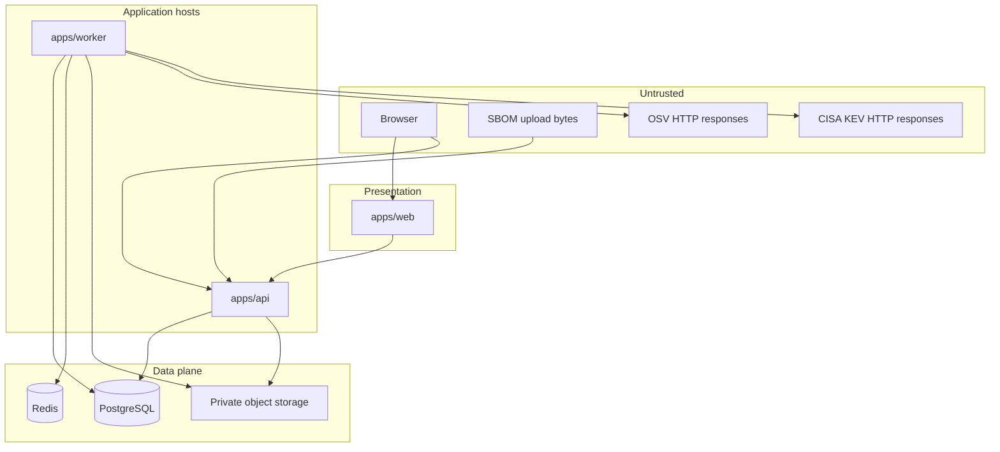

# Trust boundaries

This document names the v0.1 trust boundaries, what is untrusted at each, and which controls apply. Mitigations are summarized here and detailed in [security controls](../security/security-controls.md) and the [threat model](../security/threat-model.md).

## Boundary map

If the diagram is not rendered, treat every arrow from browser, SBOM bytes, or feed HTTP as crossing into a validating adapter.

## Trust zones

| Zone | Components | Trust stance |
| --- | --- | --- |
| Browser | User agent, extensions, XSS surface | Untrusted. No sole security decisions. |
| Web app | `apps/web` | Authenticated UI. Still untrusted as an authorization engine. May be a victim of XSS if it renders component names unsafely. |
| API | `apps/api` | Primary HTTP trust boundary for tenants. |
| Worker | `apps/worker` | Trusts PostgreSQL rows more than queue payloads. Treats feed bodies as untrusted. |
| PostgreSQL | System of record | Trusted for integrity if credentials and network are locked down. SQL is parameterized via Prisma. |
| Redis | Queue | Trusted as a transport, not as an authorization source. Assume at-least-once and possible duplicate or stale jobs. |
| Object storage | Original SBOMs | Trusted only if private, operator-configured, and keys are unguessable without org + digest. |
| OSV / KEV | Public catalogs | Untrusted content. May be stale, withdrawn, or malicious if the provider or path is compromised. |
| Instance operator | Host, backups, config | Privileged for infrastructure. Not privileged to bypass organization scope in the application. |
| Development adapters | Fake auth, unrestricted HTTP | Untrusted-in-production. Must be unselectable when config is production. |

## Untrusted input classes

Per architecture invariants, validate with Zod (or equivalent schema) at the boundary:

- HTTP headers, cookies, query, path, JSON bodies
- Multipart uploads
- SBOM documents (names, versions, URLs, graphs)
- Vulnerability feed payloads
- Job payloads and webhook bodies (webhooks are not MVP; still untrusted if added later)
- Object-storage user metadata
- Environment variable **values** are operator-trusted for config, but still parsed and range-checked in `packages/config`

## Boundary-specific rules

### Browser → web / API

- Session cookie is `HttpOnly`, `Secure` (production), `SameSite=Lax`.
- CSRF: synchronizer token on cookie-authenticated mutations (interim [OD-1](open-decisions.md)).
- Rate limits on auth, upload, and export.
- Do not treat `organizationId` in the body or path as authorization.

### Web → API

- Same authn as the browser. Server components must not open a back door to Prisma.

### API → object storage

- Put/get through a port. Keys: organization id + content hash (and asset id when useful). See [SBOM ingestion](sbom-ingestion.md).
- No public ACL. No listing API exposed to tenants beyond their own evidence metadata.

### API → PostgreSQL

- Transactions for state transitions only.
- Outbox row in the same transaction as the mutation that needs a job.

### Worker → Redis

- Consume jobs idempotently. The API does not publish jobs here.
- Reload aggregates from PostgreSQL. Job `organizationId` is not sufficient.

### Worker → OSV / KEV

- Allowlisted hosts only.
- Block link-local, metadata, and user-controlled URLs (including URLs inside SBOMs and feeds).
- Timeouts and response size limits.
- Hash and store snapshots; do not execute content.

### SBOM content

- CycloneDX JSON only. No archives, no XML, no execution.
- Do not fetch `externalReferences`, license URLs, or bom-links by default.

## Inbound webhooks (not MVP)

When a future ADR adds webhooks:

- Signature verification required (deny unsigned deliveries)
- Reject replay: persist provider **delivery id** as unique per integration **and** reject timestamps outside a **configurable window** (initial proposal: 5 minutes skew; validate before production use)
- Validate payload shape
- Map installations 1:1 with organizations
- Treat repo/org ids in the payload as untrusted until they match stored installation
- Job/payload org ids are not membership

v0.1 has **no** inbound webhook listener. [RepositoryConnection](domain-model.md#repositoryconnection) stays `not_configured`.

## Credentials

| Secret | Boundary | Rule |
| --- | --- | --- |
| User password | API | Argon2id hash; never log |
| Session id | Cookie | Opaque; server-side session row |
| ExternalCredential | Adapter | Encrypt at rest; decrypt only in adapter |
| Object-storage keys | Config | Operator-supplied |
| Feed access (if any) | Config | Not tenant-scoped for OSV/KEV public HTTP |

Canonical log redaction: never log authorization headers, cookies, API tokens, GitHub tokens, raw SBOMs, private source code, plaintext credentials, or complete vulnerability-feed payloads.

## Administrative plane

Instance operator actions (enable **IntelligenceSource**, intel refresh interval, restore from backup) stay outside tenant data APIs. There is **no** cross-organization application bypass. See [tenant isolation](tenant-isolation.md).

## Related documents

- [System context](system-context.md)
- [Tenant isolation](tenant-isolation.md)
- [Threat model](../security/threat-model.md)
