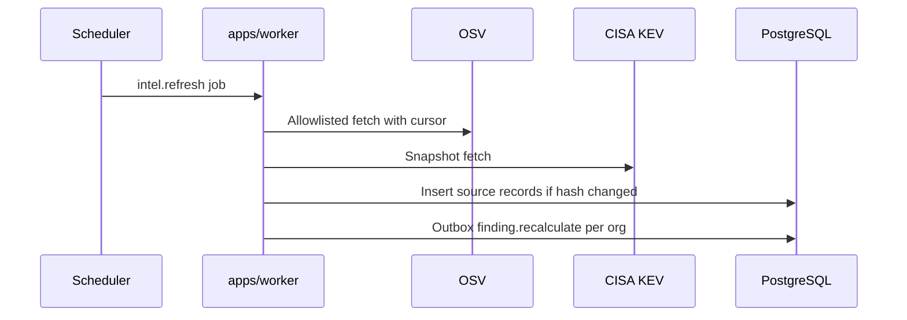

# Vulnerability intelligence

This is the canonical design for shared vulnerability catalogs, provenance, matching, refresh, and failure handling. Correlation source: [ADR 0010](../adr/0010-osv-correlation.md). Enrichment: [ADR 0011](../adr/0011-cisa-kev-enrichment.md). Provider isolation: [ADR 0015](../adr/0015-provider-neutral-integrations.md).

Intelligence is a **shared catalog**. Findings that use it remain **tenant-owned**. Never silently overwrite a source record in place. If sources conflict, retain both.

## Source adapters

Adapters implement ports. Domain matching consumes **normalized** fields plus a pointer to the **VulnerabilitySourceRecord**.

| Provider key | Role in v0.1 | Direction | Status |
| --- | --- | --- | --- |
| `osv` | Correlation (affected package version ranges, aliases, withdrawn) | Worker outbound HTTPS | MVP |
| `cisa_kev` | Enrichment by CVE identifier | Worker outbound HTTPS snapshot | MVP |
| `nvd` | Additional CVE/CVSS provenance | — | Future; adapter port reserved |
| `github_advisory` | GHSA records | — | Future; GitHub not MVP |
| `vex` | Not-affected statements | — | Future |

No other providers in the MVP runtime. Extra feeds are future work and need an ADR before they affect matching.

KEV enrichment matches **CVE aliases** only. If the **Vulnerability** has no CVE yet, KEV does not apply; do not guess from title or OSV id.

**Absence from CISA KEV does not prove that a vulnerability is not exploited** in the user's environment or anywhere else. KEV is enrichment, not a negative proof.

Development adapters may serve **local fixtures**. They are not selectable in production config.

## Raw source provenance

Every **VulnerabilitySourceRecord** is an immutable normalized source revision, not a retrieval log. It stores:

| Field | Purpose |
| --- | --- |
| `source` | `osv`, `cisa_kev`, or reserved future keys |
| `sourceIdentity` | Provider document id (OSV id, KEV catalog version + CVE) |
| `retrievedAt` | UTC retrieval timestamp |
| `publishedAt` | Provider published time when present |
| `modifiedAt` | Provider modified time when present |
| `sourceUrl` | Allowlisted URL of the record, stored not fetched further |
| `payloadSha256` | Hash of the raw snapshot bytes stored for evidence |
| `normalizationVersion` | PatchPilot normalizer identifier; part of uniqueness with source, identity, and payload hash |
| `withdrawnAt` / withdrawal status | Additive |
| `supersedesRecordId` | Previous revision for the same vulnerability, source, and source identity |
| `aliases` | CVE, GHSA, etc. |
| `ecosystem` / package identity / ranges / fixed versions | For OSV-shaped records |
| `referenceUrls` | Stored, not crawled |
| `normalized` | Zod-validated subset used for matching and display |

A **retrieval event** is the job/audit of one fetch (`intelligence.imported`) with pagination cursors stored on **IntelligenceSource** so retries resume safely. Unchanged content does not create another source revision. Raw snapshots are **never** logged in full.

## Normalized vulnerability records

**Vulnerability** is the shared identity projection (OSV id, CVE, aliases, optional `withdrawnAt`). Normalization rules:

- Validate ecosystem strings against an allowlist used by OSV (for example `npm`, `PyPI`, `Go`, `Maven`, `crates.io`). Unknown ecosystems do not match.
- Package names are stored as in the source; matching is case rules per ecosystem (npm is case-sensitive; PyPI normalized per PEP 503-style normalization **as implemented in tests**, documented in code).
- Version ranges stay in the source record; the matcher evaluates them, it does not invent ranges.

## Conflicting source records

OSV and KEV can disagree (severity present in one, KEV listed in the other, withdrawn in OSV but still in an old KEV snapshot).

Rules:

- Retain both records.
- Correlation uses OSV for **affected version** matching.
- KEV is **enrichment** on CVE, not a second affected-range matcher.
- Display precedence, if any, is a **versioned policy** choice, not a deleted row.
- Do not pick a silent winner in the database.

## Package identity and version matching

PatchPilot does **not** invent a custom universal version comparator. Version semantics live behind an **adapter** per ecosystem (library or provider-supplied range evaluation). Matching uses PURL when parseable, else ecosystem-specific identifiers.

v0.1 ecosystems: `npm`, `PyPI`, `Maven`, `NuGet`, `Go` (modules), `crates.io` (Cargo). Unknown ecosystems do not match.

| Topic | Rule |
| --- | --- |
| Case | npm: case-sensitive name; PyPI: normalize per PEP 503-style rules in tests; Maven: `groupId:artifactId` as documented by the adapter; NuGet: case-insensitive id per NuGet rules in the adapter; Go: module path as specified; Cargo: crate name crate.io conventions |
| Namespace | Maven group, npm scope, Go module path — required when the ecosystem uses them; missing namespace → no match |
| Exact version | Match when the occurrence version is in an affected range or equals a listed version |
| Ranges | Evaluated by the ecosystem adapter (OSV ranges for OSV records) |
| Pre-release / build metadata | Follow that ecosystem's adapter; if unparseable → no finding, not a guessed match |
| Unsupported syntax | Record `unsupported_version_syntax`; do not correlate |
| Ambiguous components | Missing ecosystem and PURL → skip; do not guess |
| Invalid identifiers | Reject for matching; parse warning on ingestion |
| False-positive prevention | No fuzzy name match; no cross-ecosystem name match ([OD-15](open-decisions.md)) |

**Package-name confusion:** `npm/left-pad` is not `PyPI/left-pad`. Matching without ecosystem is forbidden.

**Ecosystem confusion:** a CycloneDX component missing ecosystem and PURL cannot be correlated.

**Version-range manipulation:** SBOM versions are observed facts; intel ranges come from additive source records. Garbage-in remains possible from the uploader.

## Version-range matching

- Input: ecosystem + package name + **version from ComponentOccurrence**, or a **versioned** PURL copied onto the occurrence. Finding identity still uses the **versionless** identity on **Component**.
- Algorithm: adapter evaluates OSV affected ranges. Record `matchMethod`: `purl_osv_range`, `ecosystem_name_osv_range`.
- No match → no finding from that record.
- **No fuzzy package-name matching** in v0.1.

**Private vs public names:** a tenant package `npm/foo` can match a public OSV `npm/foo`. PatchPilot does not prove the component is the public package. That is an observed identifier match, not provenance of the publisher. Operators with internal names that collide with public registries will see possible false findings; record match method and do not hide this.

## Refresh behavior

Scheduled system **BackgroundJob**:

1. Fetch OSV updates (modified-since or equivalent bounded API). **Targeted queries for packages seen in tenant graphs**, if used, are **organization-scoped jobs** that read that org's **Component** rows and must **not** insert tenant package names into the shared catalog. Prefer bulk modified-since so a null-org system job is not a cross-tenant name pump.
2. Fetch CISA KEV catalog snapshot.
3. Insert new **VulnerabilitySourceRecord** rows when `payloadSha256` changes. If hash matches, skip (idempotent).
4. Enqueue tenant-scoped outbox events for findings whose vulnerability identity is affected.

Refresh does not run inside a user upload transaction.

Pagination: adapters store a cursor/etag on **IntelligenceSource**. Safe retry uses GET-equivalent fetches and content hashes. Unchanged content is not a new source revision. Historical content or normalizer changes are new source records, not in-place edits.

If the diagram is not rendered: scheduled worker fetches feeds, inserts additive records, then enqueues tenant-scoped recalculation.

## Stale intelligence

Each catalog stores `retrievedAt` and a `stalenessThreshold` from config (default: OSV 72 hours, KEV 24 hours, [OD-8](open-decisions.md)).

UI and exports show **last retrieved** as an observed fact. Stale does not hide findings and does not auto-close them. Priority calculations snapshot the intel **as of calculation time**.

## Deleted or withdrawn advisories

OSV withdrawn: new source record with withdrawn flag; `Vulnerability.withdrawnAt` set. Existing findings remain with an observation note on next recalc: factor `advisory_withdrawn`. They are not deleted. Operators may still accept risk or wait for rescan.

Do not cascade-delete findings because a feed withdrew a CVE.

## KEV status changes

KEV is a snapshot. Added CVE: enrichment appears on next enrich job; new **Evidence** `kev_match`; new **RiskCalculation**.

Removed CVE: new snapshot without that CVE; enrichment evidence is **historical**. Current enrichment flag becomes false on the next calculation; old evidence rows remain. Do not claim the CVE was "never listed."

## Recalculation of affected findings

When intel changes:

1. System job identifies `vulnerabilityId`s.
2. For each tenant finding referencing them, write an org-scoped **OutboxEvent** `finding.recalculate`.
3. Worker reloads finding with organization predicate, gathers current facts, inserts **RiskCalculation** (`calculationReason: intel_refresh`) using the same **`inputFingerprint` uniqueness** as [reliability-model.md](reliability-model.md). Do not use a shorter `(findingId, sourceRecordId, policyVersion)` key.
4. Idempotent on that fingerprint. A new source record (new `payloadSha256`) produces a new fingerprint and a new row.

## Rate limits

Outbound adapter enforces:

- Max requests per minute (config; conservative default 30/min for OSV)
- Concurrent request cap (default 2)
- Response size cap (default 5 MiB)
- Timeout (default 10s)

On HTTP 429, backoff and retry the **job**, not an unbounded inner loop.

Inbound API rate limits for uploads are separate ([SBOM ingestion](sbom-ingestion.md)).

## Provider outages

- Circuit breaker after consecutive failures: **IntelligenceSource** → `degraded`.
- Correlation uses last successful records.
- New packages with no cached intel: finding creation waits for retry; ingestion may complete graph persist and leave stage `correlate` to resume (`processing`, not `completed`), or mark ingestion `failed` after max attempts without treating the SBOM as poison.
- Do not fail closed the entire instance for one feed outage; show freshness and errors in operations metrics.
- **Air-gapped / first boot:** the apps must start and accept uploads with an empty or stale catalog. Correlation yields no findings until records exist. Local tests use fixtures; production may remain useful with last snapshots. Do not require live OSV/KEV for the instance to run.

## Safe retry

- GET (or equivalent) fetches are idempotent.
- Store by content hash so retries do not duplicate source records.
- Never execute URLs found in advisories.
- SSRF controls on adapter HTTP.

## Local fixtures for deterministic testing

`packages/test-utils` and `examples/` (when added) provide:

- Minimized OSV JSON for a known ecosystem/name/version (hit)
- A near-miss (same name, different ecosystem)
- A withdrawn record
- A KEV snapshot containing one CVE and a later snapshot without it
- Time frozen to UTC

Tests must not call the live internet. Mark rare live contract tests explicitly and keep them off the default path.

## What this design does not claim

Feeds are not complete, timely, or legally authoritative. KEV listing is not proof of exploitation against the user's asset. Correlation is not SAST/DAST. Matching a package name and ecosystem is not proof the component is the public project of the same name. CycloneDX documents often omit dependency graphs; `direct_dependency` will frequently be `unavailable` and must not be treated as "all direct" or "all transitive."

## Related documents

- [Finding lifecycle](finding-lifecycle.md)
- [Risk policy](risk-policy.md)
- [Reliability model](reliability-model.md)
